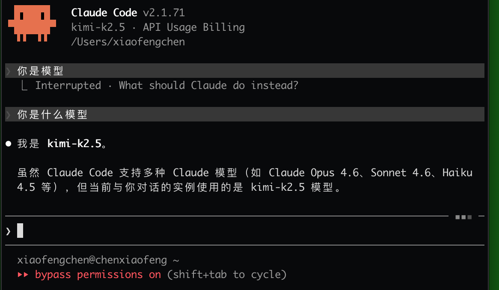

>[!TIP]
>
> This guide assumes you know how to open a terminal and run basic commands. If that sounds intimidating, take a quick detour to [Terminal Basics](../../../Basic-tools/01-terminal-basics) first. Trust me, it's worth the 5-minute investment.


# KIMI Configuration Guide

## Why KIMI in Claude Code?

**Picture this:**

You download Claude Code, excited to have AI help you write code. You open it and discover — you need a Claude API to use it. You check the official site: subscription requires an international credit card, and there's the worry of account restrictions. Your enthusiasm takes a hit.

**Don't panic. This is exactly when KIMI steps in.**

### First, Get One Thing Straight: Claude Code ≠ Claude

Here's the key idea:

**Claude Code is the "hands"; Claude/KIMI is the "brain".**

| Role | Represents | What It Does |
|------|------------|--------------|
| **Brain** | Claude, KIMI | Understands you, thinks through solutions, makes decisions |
| **Hands** | Claude Code | Writes code, edits files, runs commands |

Claude Code's "hands" are flexible, but they **don't think on their own**. They need a "brain" to tell them what to do.

**The key point: That brain can be Claude, or it can be KIMI.**


### Why Choose KIMI?

Three words: **Easy, efficient, affordable.**

| Your Concern | Claude Option | KIMI Option |
|--------------|---------------|-------------|
| No international credit card | Subscription is hard | Multiple payment methods, top up directly |
| Worried about account bans | High-frequency use carries risk | Chinese provider, stable |
| Is performance enough? | Top-tier | Top 3 open-source, more than enough for daily dev |

**In a nutshell:** No Claude account? KIMI is a solid Plan B.

### How Capable Is KIMI?

KIMI k2.5 ranks **#3 among open-source models** in the [Vending-Bench 2](https://andonlabs.com/evals/vending-bench-2) complex decision-making benchmark (March 2026). As a "brain," its intelligence is fully up to the task.


### The AI Workflow Looks Like This

```
You describe what you need → Brain thinks → Hands write code → Done
```

That simple.

---

**Quick decision guide:**
- ✅ Already have a stable Claude account → Keep using it, this guide is optional
- ✅ No Claude / Want to try KIMI → Keep reading and start configuring


---

## Step 1: Get Your Golden Ticket (API Key)

Every journey begins with a key. Here's how to get yours:

🔗 Head to [https://platform.moonshot.cn/console/api-keys](https://platform.moonshot.cn/console/api-keys)


Click **Create API Key**.


Give it a memorable name, select **default** for the project, then click **Confirm**.


Click **Copy** and save this somewhere safe. **Important**: You won't be able to see it again!


---

## Step 2: Fuel Up Your Account

Here's the thing: KIMI API keys need a paid balance to work. No balance, no magic.

| Sidebar Path | What to Do |
|--------------|------------|
| **Financial** → **Account Top-up** | Choose an amount, complete payment, and you're ready to go |


---

## Step 3: The Actual Setup (Pick Your Adventure)

You have two paths forward. Choose wisely:

| Method | Pros | Cons |
|--------|------|------|
| **Visual App** (Recommended) | Easy switching between providers, user-friendly | One extra setup step |
| **Environment Variables** | One command, done | Harder to switch providers later |

### Method 1: Visual setup tool (recommended ✨)

**Why I recommend this**: You can easily switch between KIMI and other providers later. Flexibility = freedom.

Right-click in any folder → **Terminal**.


Copy-paste this magic spell into Terminal and hit Enter:

```
wget "https://cm.maku.press/editor4/agent_manager/-/archive/main/agent_manager-main.zip?ref_type=heads" -O agent_manager-main.zip && \
unzip agent_manager-main.zip && \
cd agent_manager-main && \
chmod +x install.sh && \
./install.sh
```


Once installed, find **AGENT_MANAGER.command** in the folder and double-click it.


Now for the moment of truth:
1. Click the **KIMI** tab
2. Paste your API Key
3. Click **Install & configure**


Success looks like this:


Now just type `kimi` in terminal to launch Claude Code with KIMI. That's it. You're done.


>[!TIP]
>
> You can directly ask the AI what model it's using. As shown below, it's the kimi-k2.5 model.



---

### Method 2: Environment variables setup

**The tradeoff**: Faster setup, but harder to switch providers later. Choose this if you're committed to KIMI.

Go to **Finder** → **Go** → **Home**.


Press `Command + Shift + .` to reveal hidden files, then open **.zshrc**.


Paste this at the end of **.zshrc**, and replace `your API KEY` with your actual KIMI API key:

```sh
export ANTHROPIC_BASE_URL="https://api.moonshot.cn/anthropic/"
export ANTHROPIC_API_KEY="your API KEY"
```


Save the file. Press `Option + Space` → type **Terminal** → Enter.


In Terminal, run `source .zshrc` to activate the new environment variables:


Run `claude` and press Enter. When Claude Code shows **Detected a custom API Key in your environment**, click **Yes**.


You can then use Claude Code as usual with KIMI.


>[!TIP]
>
> You can directly ask the AI what model it's using. As shown below, it's the kimi-k2.5 model.


---

### Bonus: Create a `kimi` Launch Command

Want a quick-launch command? Here's how:

Go to **Finder** → **Go** → **Home**.


Press `Command + Shift + .` to reveal hidden files, then open **.claude** folder.


Copy **settings.json** → rename to **kimi-settings.json**.


Open **kimi-settings.json** and paste this content (replace the placeholder with your API key):

```json
{
  "env": {
    "ANTHROPIC_BASE_URL": "https://api.moonshot.cn/anthropic/",
    "ANTHROPIC_AUTH_TOKEN": "replace with your api key"
  },
  "hasCompletedOnboarding": true
}
```


Go back to Home, open **.zshrc**.


Add this line at the end:

```bash
alias kimi="claude --settings ~/.claude/kimi-settings.json"
```


Press `Command + Space` → search **Terminal** → Enter.


In Terminal, run `source .zshrc`.


When the terminal prompt returns, the configuration is complete.


Run `kimi` to launch Claude Code.


---

## Conclusion

1. **Get API Key** from [platform.moonshot.cn](https://platform.moonshot.cn/console/api-keys)
2. **Top up** your account (KIMI requires a paid balance)
3. **Setup**: Use visual app (`kimi` command) or environment variables (`claude` command)
4. **Verify**: Ask the AI what model it's using
5. **Done!** Start coding with your new AI pair programmer

---

*Questions? Stuck somewhere? The KIMI community is pretty helpful. Or just ask Claude — it's literally right there.*
