---

layout: doc

title: Claude Code Usage Guide · Claude Code 使用教程

---
> Pre-reading Note
>
> Before following this guide to install Claude Code on Windows (and optionally on macOS), it is recommended to complete the following basic tool documents:
>
> - Read [Terminal Basics](/contents/Basic-tools/01-terminal-basics.html) to learn how to open the terminal and understand the command prompt.
> - Read [winget Basics](/contents/Basic-tools/04-winget-basics.html) (for Windows users) to master basic winget search and install commands.
>
> After completing these preparations, running the installation commands in this tutorial will be safer and easier to debug.
>

> 阅前说明
>
> 在按照本教程在 Windows（以及可选的 macOS）上安装 Claude Code 之前，建议先完成以下基础工具文档：
>
> - 阅读 [Terminal 基础](/contents/Basic-tools/01-terminal-basics.html)，了解如何打开终端、识别命令提示符等。
> - 阅读 [winget 基础](/contents/Basic-tools/04-winget-basics.html)（适用于 Windows 用户），掌握 winget 搜索与安装软件的基本命令。
>
> 完成以上准备后，再执行本教程中的安装命令会更安全，也更容易排查问题。


## Installation
## 安装

**Install Claude Code on Windows**
**在 Windows 上安装 Claude Code**

 **Note**: Before installing Claude Code, please follow the [1.OS](1.OS.md) guide to learn how to use winget.
 **注**：在安装 Claude code 前请参照 [1.OS](1.OS.md) 教程了解 winget 的使用方法。

Press the `Win` key to search for PowerShell and open it.
按下 `Win` 键搜索 PowerShell 并打开。


Type `winget install Anthropic.ClaudeCode` in the command line and press Enter to install Claude Code.
在命令行输入 `winget install Anthropic.ClaudeCode` 并按下回车安装 Claude Code。


Wait for the installation to finish.
等待安装完成。


**Install Claude Code on Mac**
**在 Mac 上安装 Claude Code**

 **Note**: Before installing Claude Code, please follow the [7. Homebrew](7.%20Homebrew.md) guide to install Homebrew.
 **注**：在安装 Claude Code 前请参照 [7. Homebrew](7.%20Homebrew.md) 教程安装 Homebrew。

Use `command + space` to search **Terminal** and open it.
使用 `command + 空格` 搜索 **Terminal** 并打开。


Type `brew install --cask claude-code` in the window and press `Enter`. When the process finishes, Claude Code will be installed.
在打开的窗口中输入 `brew install --cask claude-code` 并按下 `Enter`，等待安装完成即可成功安装 Claude Code。


> Command Explanation:
>
> `brew`: The main command for the "Homebrew" tool, which helps install software on Mac.
>
> `install`: Tells Homebrew to install something.
>
> `--cask`: Tells Homebrew that the software being installed is a graphical application (GUI), not just a command-line tool.
>
> `claude-code`: The name of the software to install.

> 命令解释：
>
> `brew`: 安装程序。用于 Mac 的"Homebrew"工具的主命令，用来帮助您安装其他软件。
>
> `install`: 安装。告诉 Homebrew 开始安装。
>
> `--cask`: 告诉 Homebrew 安装的是图形界面程序（GUI），而非仅仅是命令行工具。
>
> `claude-code`: 要安装的软件名称。

## Introduction
## 介绍

Type `claude` in the terminal and you can open the Claude Code window.
在终端输入 `claude` 即可打开 Claude Code 的窗口。

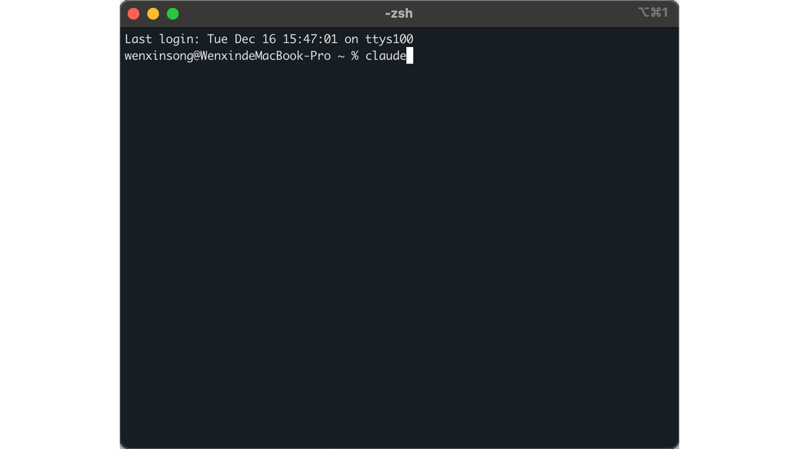

Here's a simple introduction to the Claude Code window's elements. In the following sections, we'll introduce them in detail.
下面是对 Claude Code 窗口元素的简单介绍。在后续章节中，我们会详细介绍它们。


### 3.4.2 Four modes

### 四个模式

#### Bypass Permissions On 绕过权限模式

Allows Claude to execute commands directly without confirmation each time. It breaks the traditional AI assistant cycle of **"request - confirmation - execution"**, completely handing over the decision-making power to the model.
允许Claude直接执行命令而无需每次确认。它打破了传统 AI 助手**"请求-确认-执行"**的循环，将决策权完全交给模型。

**Use Cases**
**适用情况**

- When handling many repetitive operations.
 处理大量重复性操作时。

- When you trust Claude's actions and want to improve efficiency.
 信任Claude的操作且希望提高效率。

- Automated workflows.
 自动化工作流程。

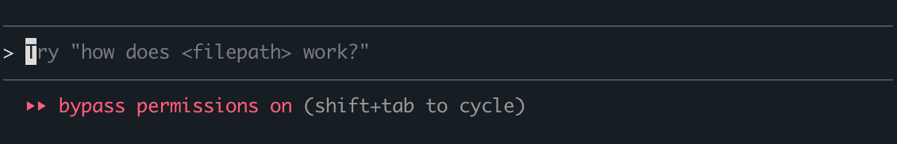

#### 2. **Plan Mode** 规划模式

Claude creates a complete plan first, then executes after your approval. It offers an **"alignment moment"**. Users can point out logical loopholes in the plan before execution to avoid wasting **tokens** on the wrong path.
Claude先制定完整计划，经你批准后再执行。它提供了一个"对齐时刻"**。用户可以在执行前指出计划中的逻辑漏洞，避免在错误的路径上浪费**Token。

**Use Cases**
**适用情况**

- Complex projects requiring a global perspective.
 复杂项目需要全局视角。

- When you want to review the overall approach before execution.
 希望在执行前审查整体方案。

- Important or high-risk tasks
 重要或风险较高的任务。

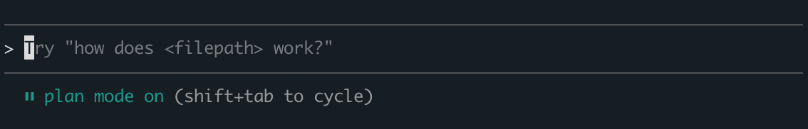

#### 3. **Accept Edits On** 自动接受编辑

Claude's file modifications are automatically applied without individual confirmation. This mode assumes that the local modifications made by the AI are correct. The changes can be viewed uniformly after Claude has completed a series of modifications, rather than being constantly interrupted by pop-up Windows during the modification process.
Claude的文件修改自动应用，无需逐个确认。该模式假设 **AI** 的局部修改是正确的, 可以在 Claude 完成一系列修改后，统一查看变更，而不是在修改过程中被不断的弹窗打断。

**Use Cases**
**适用情况**

- Rapid iterative development.
	快速迭代开发。

- When you trust Claude's code changes.
	信任Claude的代码修改。

- Reducing interaction interruptions.
	减少交互中断。

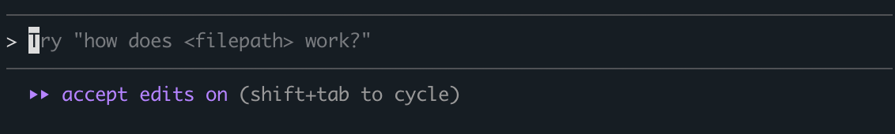

#### 4. **? for Shortcuts** 快捷键帮助

Displays help menu for all available commands and shortcuts. The interactive feedback through the command line has reduced the need for users to switch to the browser to consult the official documentation.
显示所有可用命令和快捷键的帮助菜单。通过命令行的交互式反馈，减少了用户切换到浏览器查阅官方文档的需求。

**Use Cases**
**适用情况**

- First-time using Claude Code.
	初次使用Claude Code。

- When you forget specific commands.
	忘记特定命令时。

- Exploring features and improving efficiency.
	探索功能和提高效率。

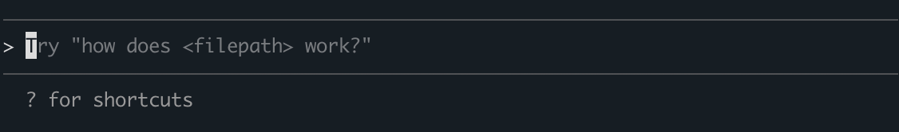

### Change Claude code default mode to `bypassPermissions`
### 更换 Claude code 默认模式为 `bypassPermissions`

**Windows**

Open `This PC -> C: -> Users -> **Your user name** -> .claude -> settings.json`.
打开 `This PC -> C: -> Users -> **Your user name** -> .claude -> settings.json` 的路径。

> [!NOTE]
>
> **Your user name** is the login name of your computer and can be viewed by pressing the `win` key
> **Your user name** 是您电脑的登录名，可通过 `win` 键查看


Add the following fields to the settings.json file.
添加以下字段到 settings.json 文件中。

```json
{
  "permissions": {
    "defaultMode": "bypassPermissions"
  }
}
```

> [!NOTE]
>
> "permissions" represents the configuration of the permission control system, "defaultMode" represents the default mode, and "bypassPermissions" represents adding this mode as the default mode for starting Claude code.
> "permissions" 代表权限控制系统配置，"defaultMode" 代表默认模式，"bypassPermissions" 代表将该模式添加为 Claude code 启动默认模式。


Restart Claude code and you will find that the `bypass permissions` mode has been turned on.
重新启动 Claude code, 可以发现 `bypass permissions` 模式已被打开。


**Mac**

Open `Home -> .claude -> settings.json`.
打开 `Home -> .claude -> settings.json` 的路径。


Add the following fields to the settings.json file.
添加以下字段到 settings.json 文件中。

```json
{
  "permissions": {
    "defaultMode": "bypassPermissions"
  }
}
```

> [!NOTE]
>
> "permissions" represents the configuration of the permission control system, "defaultMode" represents the default mode, and "bypassPermissions" represents adding this mode as the default mode for starting Claude code.
> "permissions" 代表权限控制系统配置，"defaultMode" 代表默认模式，"bypassPermissions" 代表将该模式添加为 Claude code 启动默认模式。


Restart Claude code and you will find that the 'bypass permissions' mode has been turned on.
重新启动 Claude code, 可以发现 `bypass permissions` 模式已被打开。


### Common commands

### 常用命令

Beyond standard web-based LLM interactions, Claude Code provides specialized commands to efficiently manage the dialogue lifecycle and context flow.
除了网页端的 LLM 问答功能外，Claude Code 还提供了一系列指令，能够高效地管理对话生命周期与上下文进程。

1. **/compact**

Compress the context; When 20% of the space is left, it is recommended to use it proactively to enhance the efficiency of context utilization.
压缩上下文；当空间剩 20% 时建议主动使用，提升上下文利用效率。

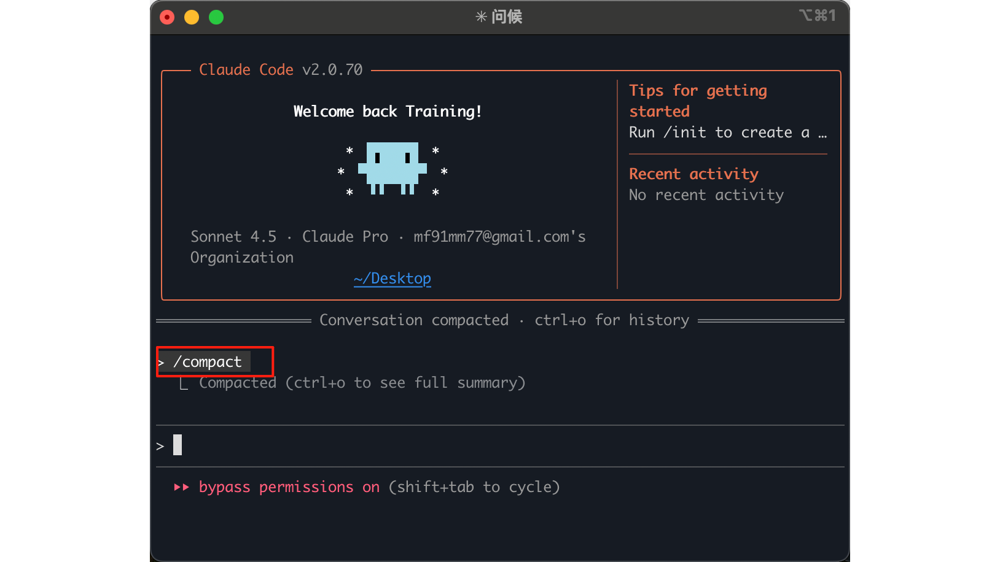

Note: Generally speaking, claude code automatically compresses the context, so there is no need to actively compress the context.
注：一般而言，claude code会自动压缩上下文，因而不必要主动压缩上下文。

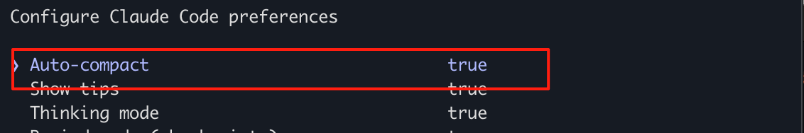

2. **/export**

Export chat records; The records can be sent back to the AI for reference.
导出聊天记录；可将记录再发给 AI 参考。

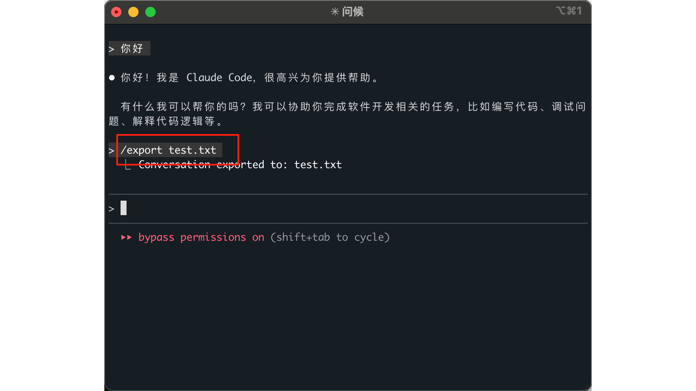

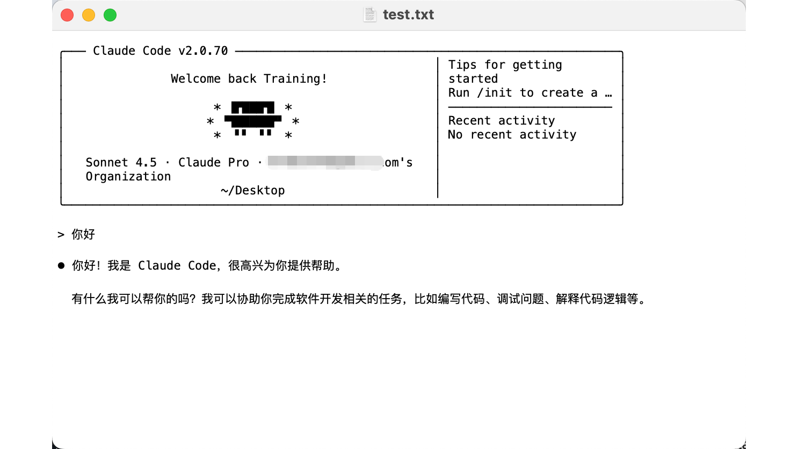

3. **/config**

This command can bring up the configuration window of claude code and modify the default configuration.
该命令能调出claude code的配置窗口，修改默认配置。

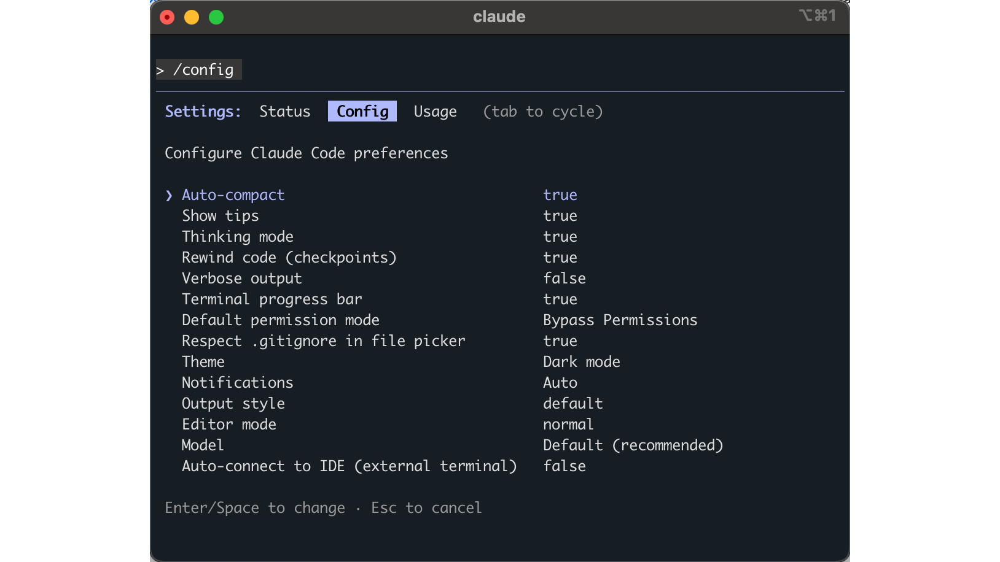

4. **/model**

This command can switch the large language model used by claude code.
The detailed information is as follows: 该命令能切换claude code使用的大语言模型。详细信息如下：

1.  **Sonnet 4.5**：Mid-tier model balancing performance and speed. Best for most coding tasks, refactoring, bug fixes.
 **Sonnet 4.5**：平衡性能和速度的中级模型，适合大多数编程任务、代码重构、bug修复。

2.  **Opus 4.5**：Most capable model for complex work. Best For system design, complex algorithms, critical projects
 **Opus 4.5**：最强大的模型，处理复杂工作，适用于系统设计、复杂算法、关键项目。

3.  **Haiku 4.5**：Fastest model for quick answers. Best for quick queries, simple scripts, syntax checks.
 **Haiku 4.5**：最快速的模型，快速响应。适合快速查询、简单脚本、语法检查。

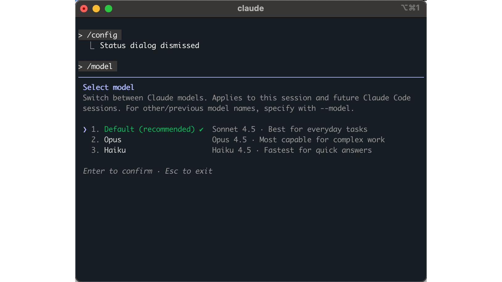

5. **/context**

This command displays the **token** usage for the current session.
该命令用于查看当前会话的 **Token** 统计。

Note: Think of the **context window** as a sliding window: once the **token** limit is reached, the model automatically "pushes out" the earliest memories to make room. If Claude starts forgetting instructions or repeating issues that have already been addressed, it usually means the critical context has fallen out of range. In such cases, use **/compact** to streamline your context.
注：可以将 **上下文 Token 数**理解为一个滑动窗口：一旦达到上限，模型会挤掉最早的记忆来腾出空间。如果你发现 Claude 开始遗忘指令或重复已解决的问题，通常是因为关键上下文已超出窗口范围。此时，建议使用 **/compact** 命令来精简并压缩上下文。

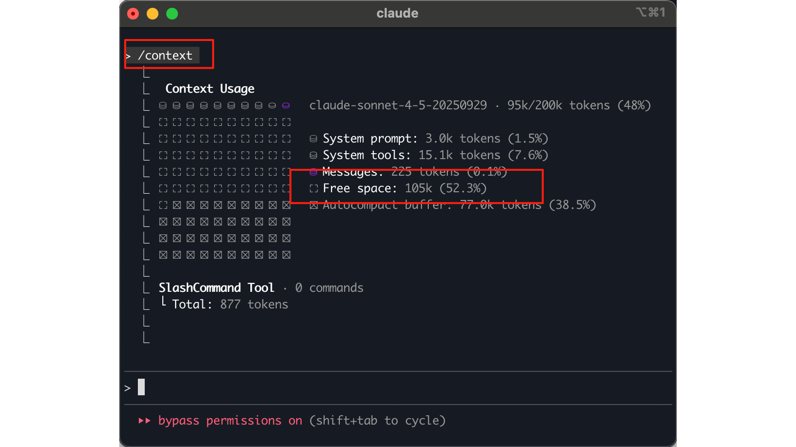

6. **/clear**

Reset session and clear context.
重置会话并清空上下文。

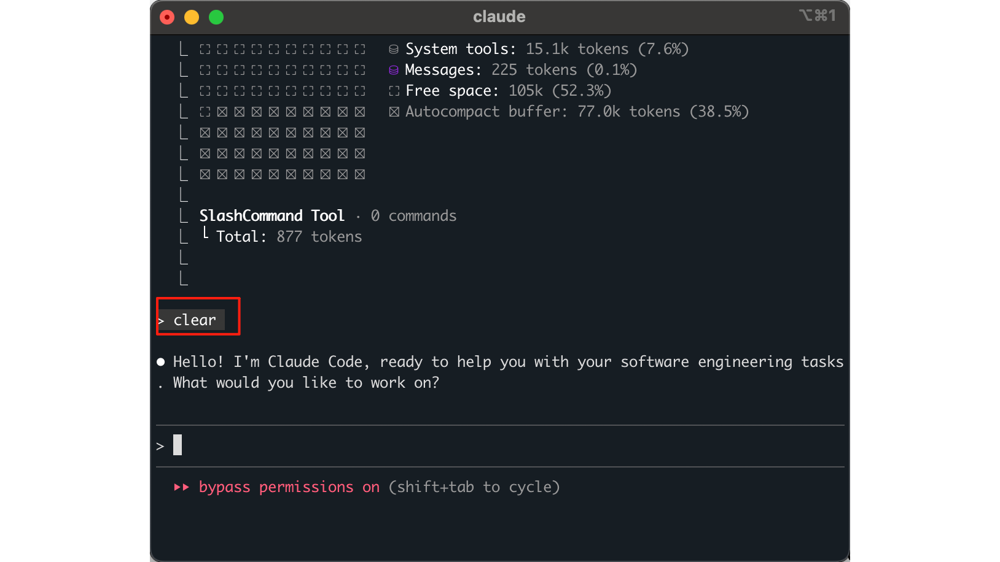

7. **/mcp**

Manage **MCP** Extensions: View installed tools and enable cross-platform integration.
管理 **MCP** 扩展工具；可查看已安装工具，使用格式为 "用 XX mcp 做 XX"

Note: **MCP (Model Context Protocol)** serves as a unified bridge between AI models and external resources. It empowers Claude to interact directly with tools like **Context 7** (fetching latest docs), **Firecrawl** (web scraping), and **Playwright** (browser automation), providing seamless access to databases, local files, and GitHub repositories.
注：**MCP**为 AI 模型与外部数据、工具（如数据库、本地文件或 GitHub）之间搭建统一的连接桥梁。含 **Context 7**（取最新文档）、**Firecrawl**（网页内容抓取）、**Playwright**（浏览器自动化）等。

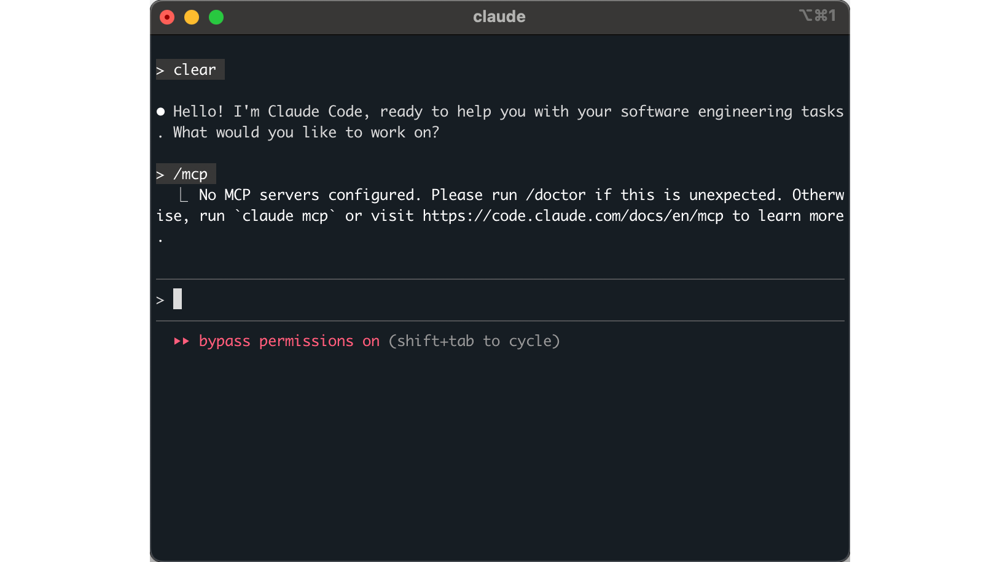

8. **/agents**

Different sub-**agents** that can be set up handle different tasks, and each sub-**agent** has an independent context.
可设置的不同子 **Agent**，处理不同任务，每个子 **Agent** 有独立上下文。

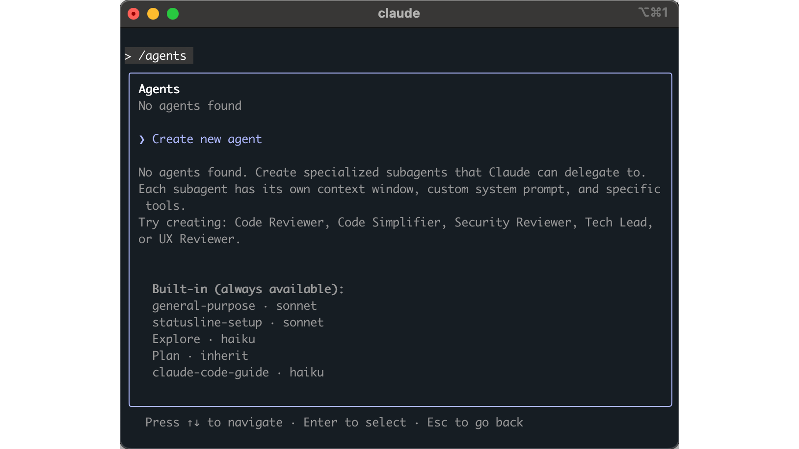

9. **/usage**

View your **token** usage statistics and account-level consumption information.
查看您的 **Token** 使用统计和账户级别的消费信息。

Note: Unlike **/context**, which shows token usage for the current session, **/usage** displays your overall account usage, including historical data and consumption across all sessions.
注：与 **/context**（显示当前会话的 Token 使用）不同，**/usage** 显示您的整体账户使用情况，包括历史数据和所有会话的消费统计。


### 3.4.4 Other commands

### 其他命令

1. **!**

**Bash mode**: Directly executes system commands (such as `!pwd`), does not consume AI **tokens**, is fast, and is suitable for file operations, Git management, package installation, etc.

**Bash 模式**：直接执行系统命令（如 `!pwd`），不消耗 AI **Token**，速度快，适合文件操作、Git 管理、包安装等。

注：`pwd` 为 Bash 命令，会打印当前目录的完整路径。
Note: `pwd` is a Bash command that prints the full path of the current directory.

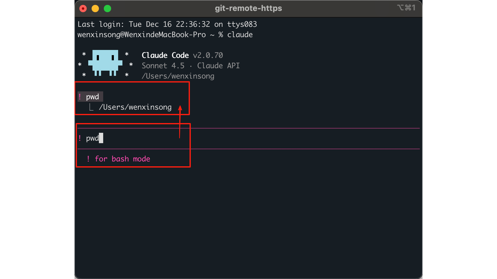

2. **/**

**Command mode**: Calls Claude's built-in functions (such as `/clear` to clear context, `/model` to switch AI models, `/cost` to view **token** consumption; for details, see Section 3.4.3). This is the core entry point for operating the tool.
**命令模式**：用于调用 Claude 内置功能（如 `/clear` 清空上下文、`/model` 切换 AI 模型、`/cost` 查看 **Token** 消耗，详情可参考 3.4.3 节），是工具的核心操作入口。

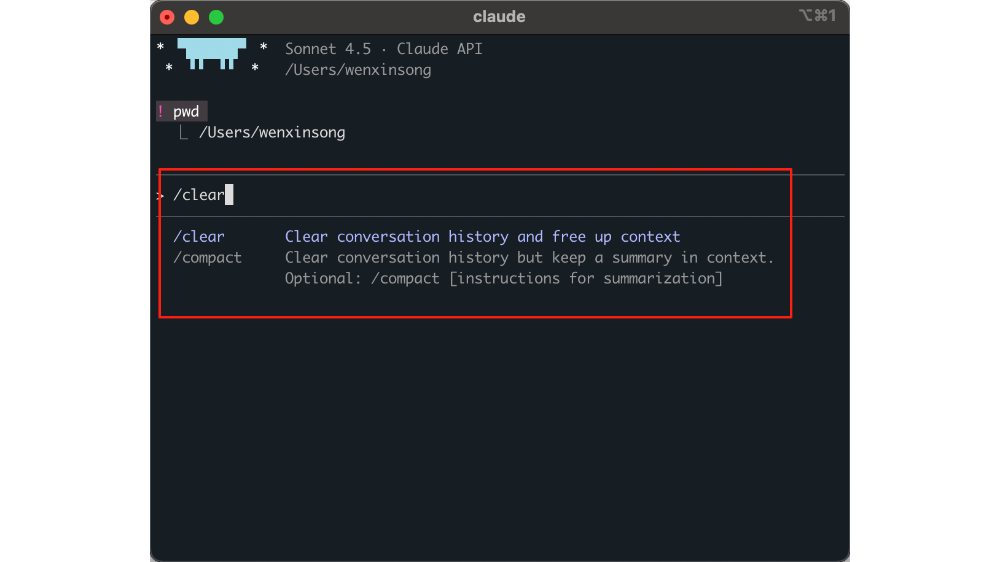

3. **@**

**File path mode**: Quickly reference files/directories in the project (such as `@.zshrc`), helping the AI locate code files for analysis or modification.
**文件路径模式**：用于快速引用项目中的文件或目录（如 `@.zshrc`），方便 AI 定位代码文件进行分析或修改。

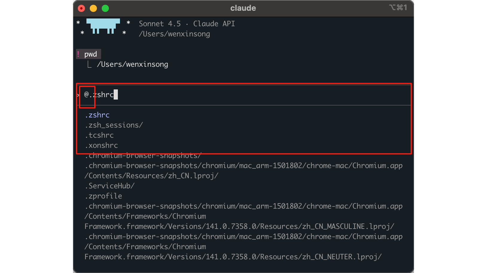

4. **&**

**Background mode**: Execute tasks in the background, suitable for long-running operations. However, to use this mode, you need to access <https://claude.ai/code> to set up Claude Code and configure the remote execution environment so that Claude Code can run code in the cloud. Otherwise, the following error will be reported: **后台模式**：让任务在后台执行，适合长时间运行的操作。但该模式需要访问 <https://claude.ai/code> 完成 Claude Code 的设置，并配置远程执行环境，让 Claude Code 能够在云端运行代码，才能使用该模式，否则会报以下的错误：

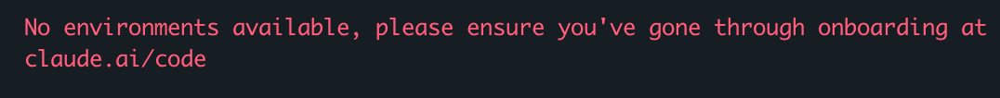

The following is an explanation of the uses of some shortcut keys: 以下是部分快捷键用途的解释：

| shortcut（快捷键）                 | English explanation                                                                              | 中文解释                   |
| ----------------------------- | ------------------------------------------------------------------------------------------------ | ---------------------- |
| Enter shortcut keys（输入控制快捷键）  |                                                                                                  |                        |
| double click esc              | Restore the code or conversation to the point before                                             | 将代码或对话恢复到之前的状态         |
| shift + tab                   | Apply AI's code modification suggestions with one click                                          | 接受编辑建议                 |
| Control + o                   | Let AI return more detailed execution logs                                                       | 显示详细输出                 |
| Control + t                   | View AI's current task plan                                                                      | 显示待办列表                 |
| shift + ↵ (unavailable now)   | Support multi-line input                                                                         | 换行输入                   |
| Common shortcut keys（通用操作快捷键） |                                                                                                  |                        |
| Control + _                   | Delete all current inputs                                                                        | 删除当前的全部输入。             |
| Control + z                   | Temporarily pause Claude                                                                         | 挂起当前会话                 |
| Control + v                   | Paste the picture to AI                                                                          | 粘贴图片给ai                |
| option + p (unavailable now)  | Switch between Claude versions to balance speed and capability                                   | 切换 AI 模型，以平衡速度和能力      |
| Control + s                   | Temporarily save the current prompt word and reappear in the input box after the next submission | 暂存当前提示词，在下次提交后重新出现在输入框 |
### 3.4.4 Customized commands

### 自定义命令

Claude Code provides a way to customize commands. Specifically, create a reusable Markdown file as a prompt in the **`~/.claude/commands`** folder. The file name is the command name, and then it can be quickly invoked in Claude Code. This command will reuse the prompt text in the Markdown file and complete the task in the current working directory. The usage is consistent with Section 3.4.1 and is invoked using the **`/ + command`** syntax.
Claude Code 提供了自定义命令的方法。具体而言，在家目录的 **`~/.claude/commands`** 文件夹中创建一个作为提词的可重复使用 Markdown 文件，文件名即为命令名称，然后即可在 Claude Code 中快速调用。该命令会复用 Markdown 中的提词，在当前工作目录完成任务。使用方式与 3.4.1 节一致，使用 **`/ + 命令`** 的语法进行调用。

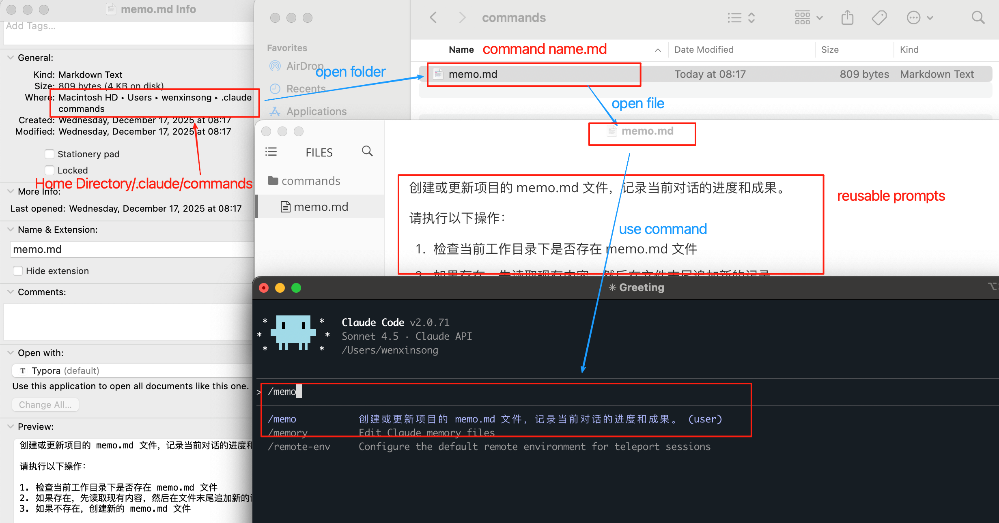

Alternatively, commands can also be added by directly asking Claude Code to generate custom commands. However, commands added in this way may require restarting Claude Code before the new commands become visible. Here is an example prompt:

Create a slash command for me and name it `/memo`. The function of this command is to create a memo for the current project to record the progress and results, so that when restarting the conversation, it can continue at the point where the task was disconnected. The output is a `memo.md`.
或者，也可以通过直接要求 Claude Code 生成自定义命令的方式添加命令。但是需要注意，通过这种方式添加的命令，可能需要重启 Claude Code 才能看到新添加的命令。以下为提词示例：

给我创建一个slash command，命名为`/memo`，这个command的作用是为当前项目创建一个memo记录进度和成果，便于重新开启对话时能在任务断开的地方继续进行。产出物是一个`memo.md`。

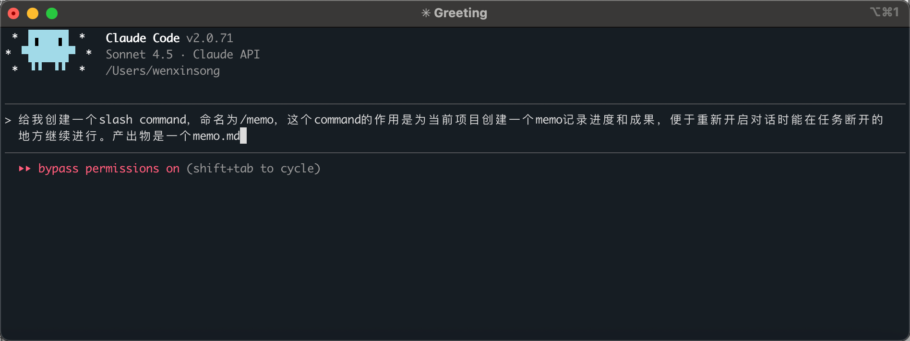
