>[!TIP]
>
> This guide assumes you know how to open a terminal and run basic commands. If that sounds intimidating, take a quick detour to [Terminal Basics](../../../Basic-tools/01-terminal-basics) first. Trust me, it's worth the 5-minute investment.


# Claude Code Usage Guide

## Installation

### Install Claude Code on Windows

>[!NOTE]
>
> Before installing Claude Code, please follow the [winget Basics](../../../Basic-tools/04-winget-basics) guide to learn how to use winget.

Press the `Win` key to search for PowerShell and open it.

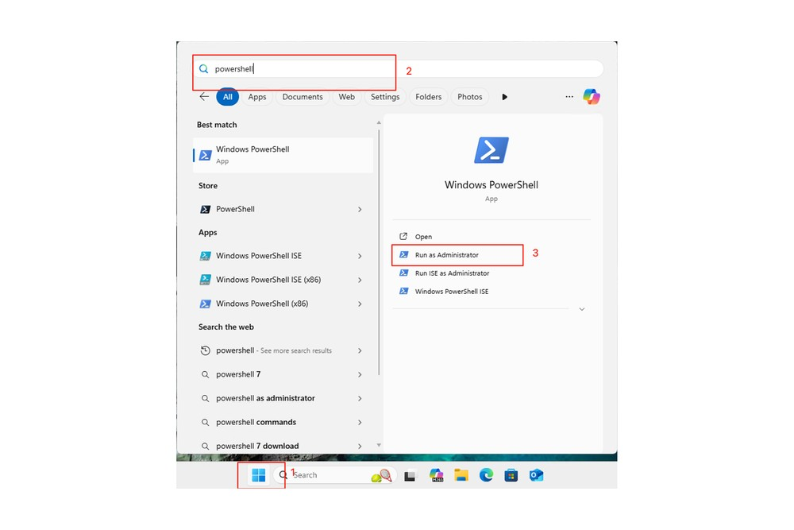

Type `winget install Anthropic.ClaudeCode` in the command line and press Enter to install Claude Code.

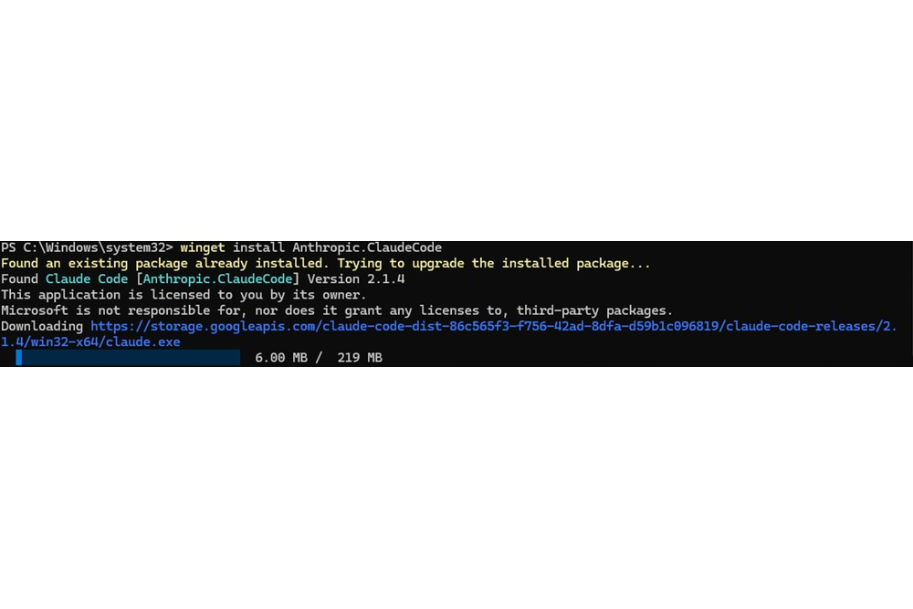

Wait for the installation to finish.

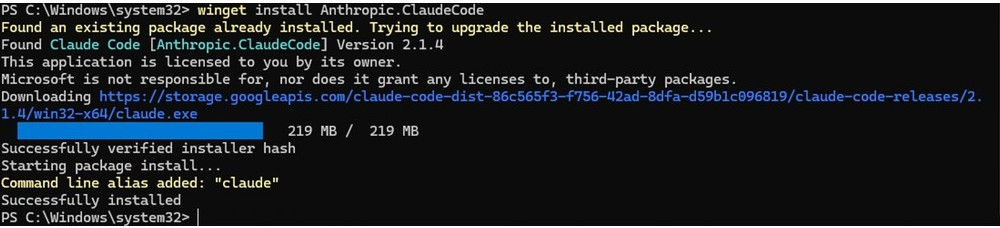

---

### Install Claude Code on Mac

>[!NOTE]
>
> Before installing Claude Code, please follow the [Homebrew](../../../Basic-tools/05-homebrew-install) guide to install Homebrew.

Press `Command + Space` to search **Terminal** and open it.

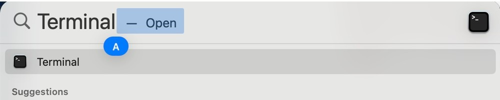

Type `brew install --cask claude-code` in the window and press `Enter`. When the process finishes, Claude Code will be installed.

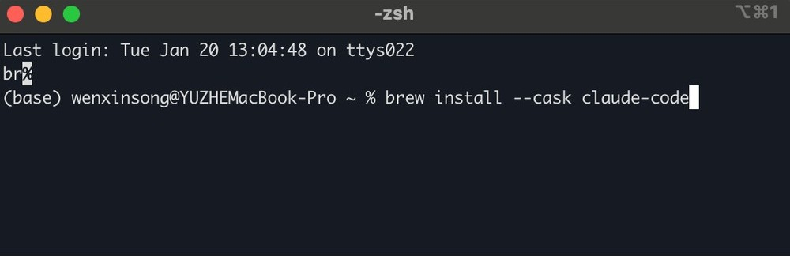

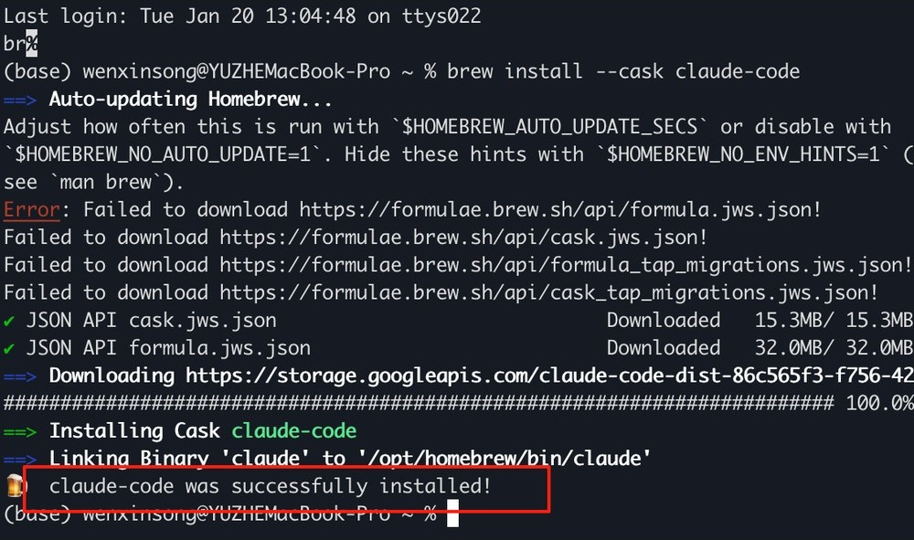

> **Command Explanation:**
>
> - `brew`: The main command for the "Homebrew" tool, which helps install software on Mac.
> - `install`: Tells Homebrew to install something.
> - `--cask`: Tells Homebrew that the software being installed is a graphical application (GUI), not just a command-line tool.
> - `claude-code`: The name of the software to install.

---

## Interface Overview

Type `claude` in the terminal and you can open the Claude Code window.

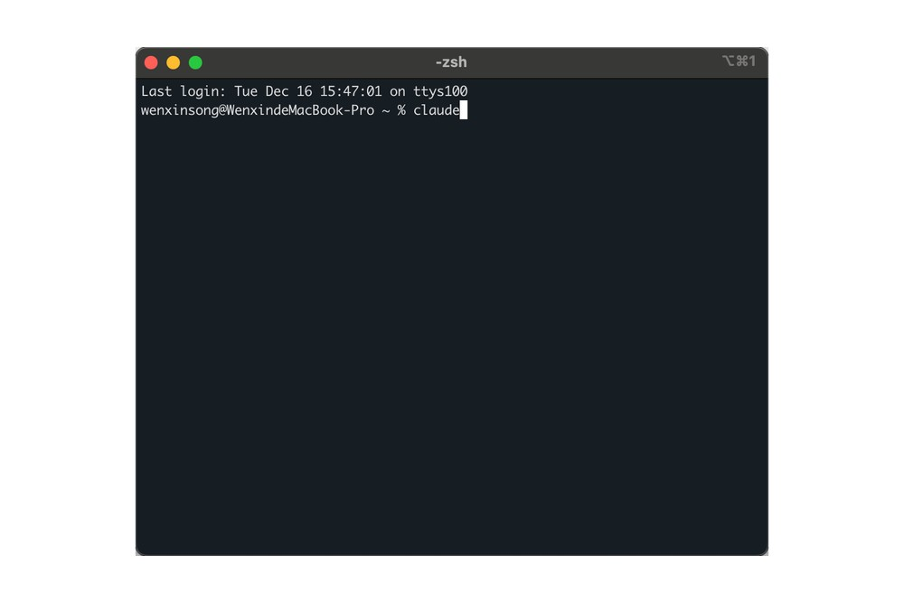

Here's a simple introduction to the Claude Code window's elements. In the following sections, we'll introduce them in detail.

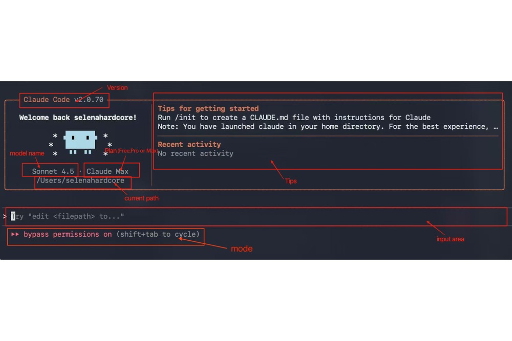

---

## Four Modes

Here's the deal: Claude Code offers four different modes to match your workflow. Think of them as different "gears" for different situations.

| Mode | What It Does | Best For |
|------|--------------|----------|
| **Bypass Permissions** | Auto-execute without confirmation | Repetitive tasks, trusted workflows |
| **Plan Mode** | Plan first, execute after approval | Complex projects, high-risk tasks |
| **Accept Edits On** | Auto-apply file modifications | Fast iteration, trusted changes |
| **? for Shortcuts** | Show all commands and shortcuts | First-time users, exploring features |

### 1. Bypass Permissions On

Allows Claude to execute commands directly without confirmation each time. It breaks the traditional AI assistant cycle of **"request - confirmation - execution"**, completely handing over the decision-making power to the model.

**Use Cases:**

- ✅ Handling many repetitive operations
- ✅ Trust Claude's actions and want to improve efficiency
- ✅ Automated workflows

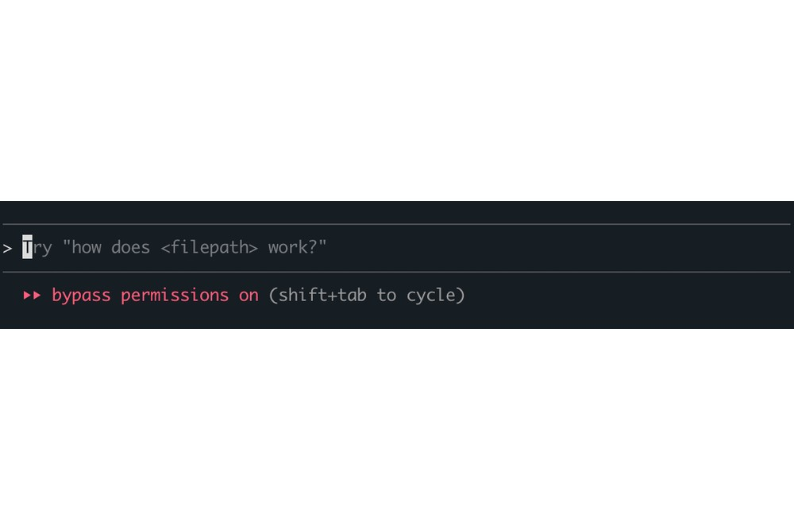

---

### 2. Plan Mode

Claude creates a complete plan first, then executes after your approval. It offers an **"alignment moment"**. Users can point out logical loopholes in the plan before execution to avoid wasting **tokens** on the wrong path.

**Use Cases:**

- ✅ Complex projects requiring a global perspective
- ✅ Review the overall approach before execution
- ✅ Important or high-risk tasks

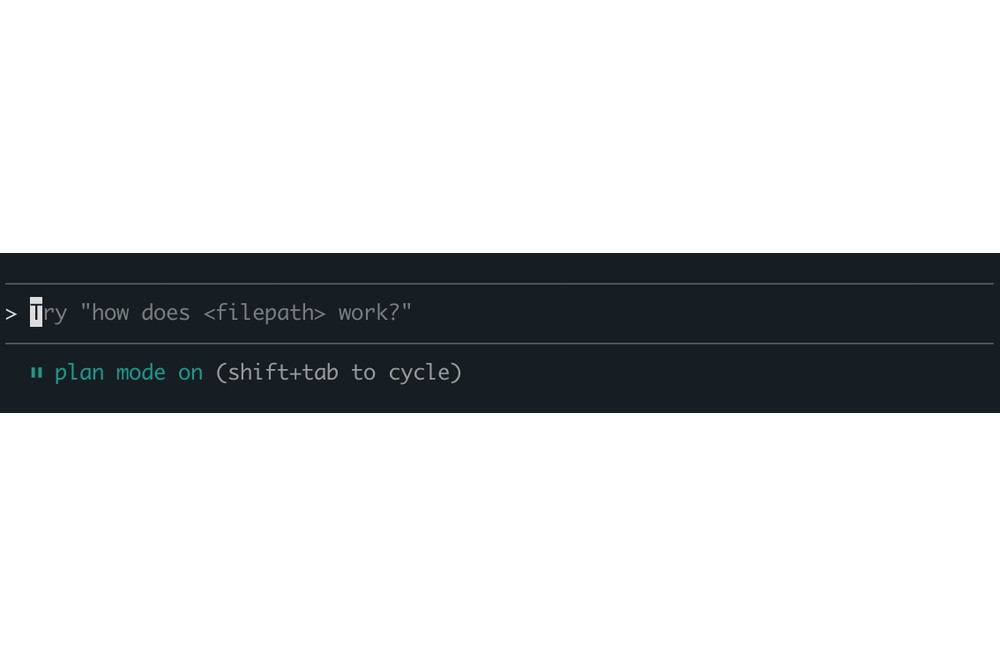

---

### 3. Accept Edits On

Claude's file modifications are automatically applied without individual confirmation. This mode assumes that the local modifications made by the AI are correct. The changes can be viewed uniformly after Claude has completed a series of modifications, rather than being constantly interrupted by pop-up Windows during the modification process.

**Use Cases:**

- ✅ Rapid iterative development
- ✅ Trust Claude's code changes
- ✅ Reducing interaction interruptions

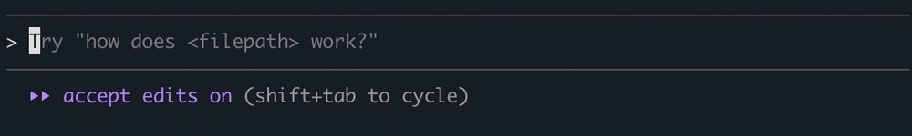

---

### 4. ? for Shortcuts

Displays help menu for all available commands and shortcuts. The interactive feedback through the command line has reduced the need for users to switch to the browser to consult the official documentation.

**Use Cases:**

- ✅ First-time using Claude Code
- ✅ Forget specific commands
- ✅ Exploring features and improving efficiency

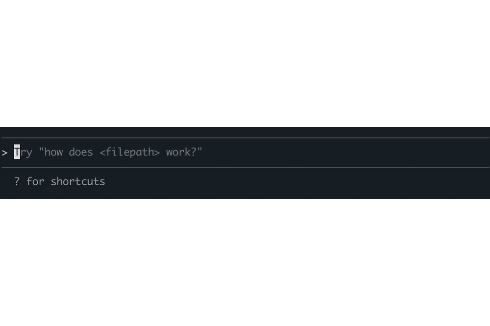

---

## Set Default Mode to Bypass Permissions

### Windows

Open `This PC → C: → Users → **Your user name** → .claude → settings.json`.

>[!NOTE]
>
> **Your user name** is the login name of your computer and can be viewed by pressing the `win` key.

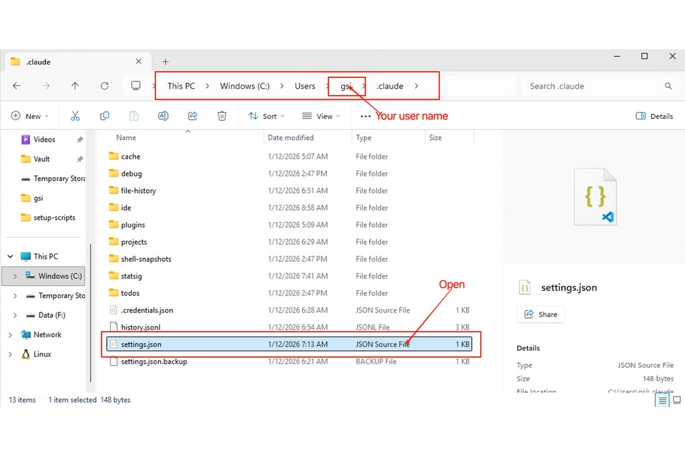

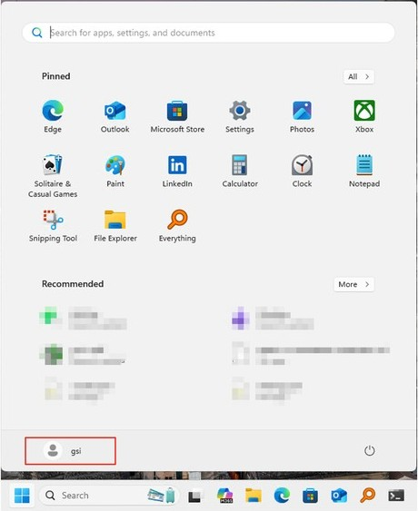

Add the following fields to the settings.json file:

```json
{
  "permissions": {
    "defaultMode": "bypassPermissions"
  }
}
```

> **Field Explanation**:
> - `"permissions"`: Configuration of the permission control system
> - `"defaultMode"`: Default mode setting
> - `"bypassPermissions"`: Set bypass permissions mode as default

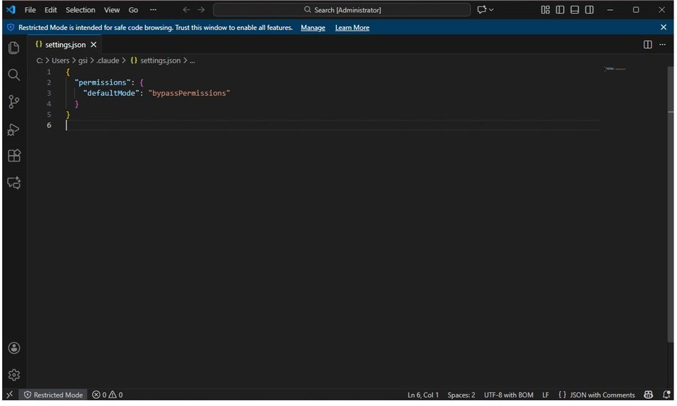

Restart Claude Code and you will find that the `bypass permissions` mode has been turned on.

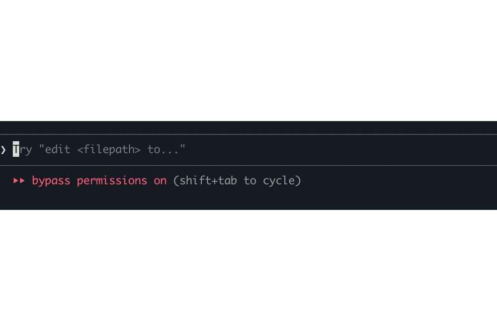

---

### Mac

Open `Home → .claude → settings.json`.

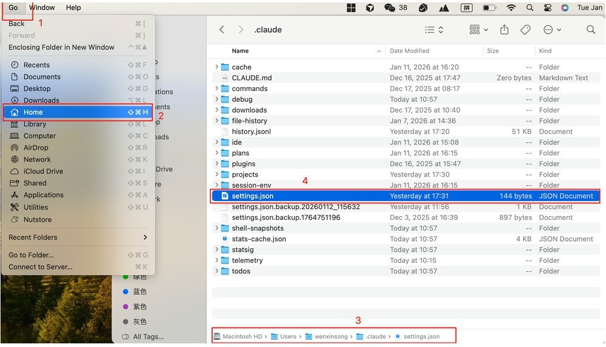

Add the following fields to the settings.json file:

```json
{
  "permissions": {
    "defaultMode": "bypassPermissions"
  }
}
```

> **Field Explanation**:
> - `"permissions"`: Configuration of the permission control system
> - `"defaultMode"`: Default mode setting
> - `"bypassPermissions"`: Set bypass permissions mode as default


Restart Claude Code and you will find that the `bypass permissions` mode has been turned on.


---

## Common Commands

Beyond standard web-based LLM interactions, Claude Code provides specialized commands to efficiently manage the dialogue lifecycle and context flow.

| Command | What It Does | When to Use |
|---------|--------------|-------------|
| `/compact` | Compress context | When 20% space remains |
| `/export` | Export chat records | For reference or sharing |
| `/config` | Open configuration | Modify default settings |
| `/model` | Switch AI model | Change model capabilities |
| `/context` | Show token usage | Monitor context usage |
| `/clear` | Reset session | Start fresh |
| `/mcp` | Manage MCP extensions | View installed tools |
| `/agents` | Manage sub-agents | Independent context tasks |
| `/usage` | View usage stats | Account-level consumption |

### 1. `/compact`

Compress the context; When 20% of the space is left, it is recommended to use it proactively to enhance the efficiency of context utilization.

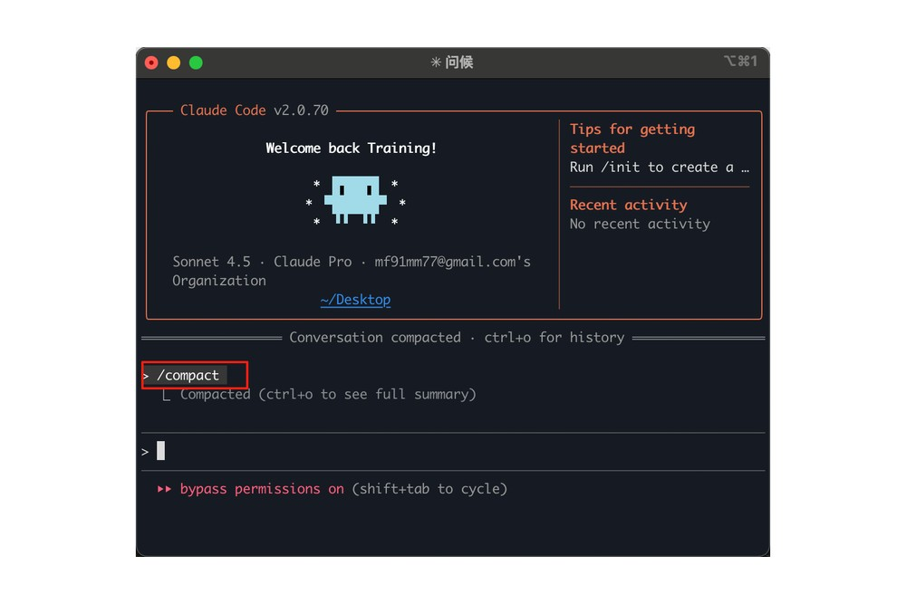

>[!TIP]
>
> Generally speaking, Claude Code automatically compresses the context, so there's no need to actively compress it.

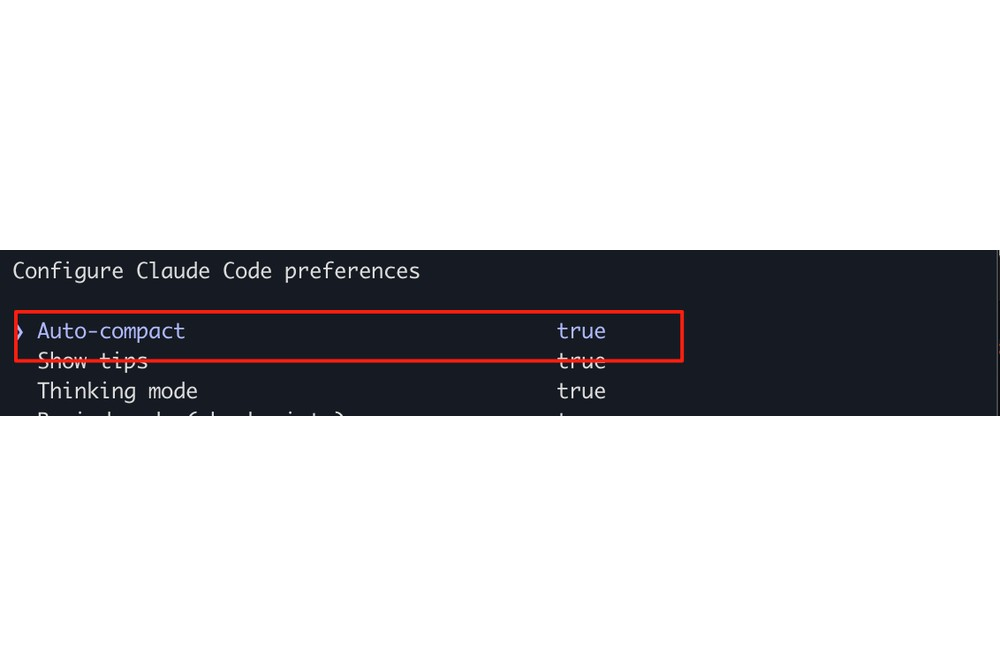

---

### 2. `/export`

Export chat records; The records can be sent back to the AI for reference.

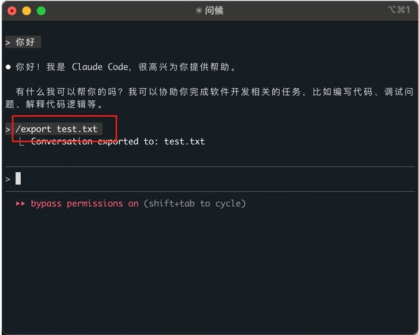

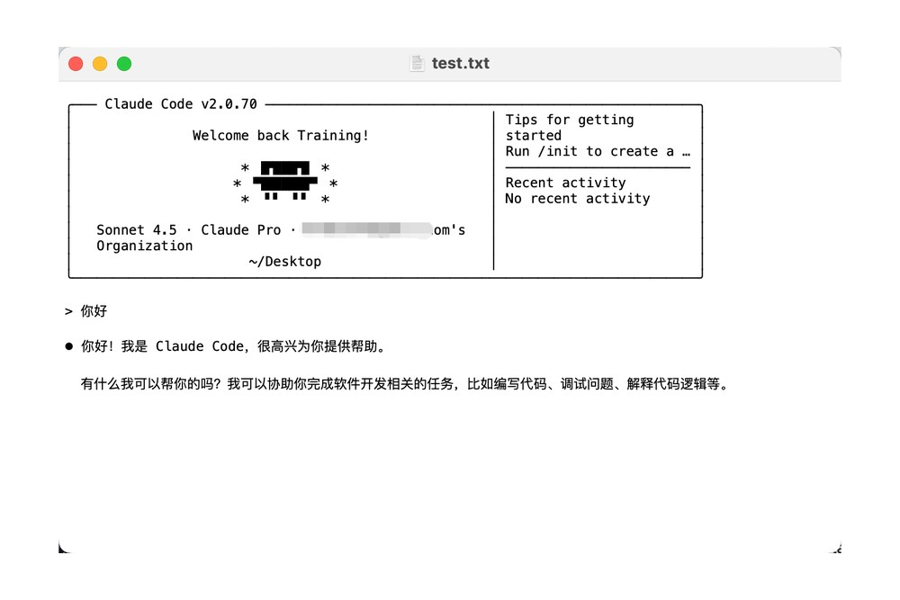

---

### 3. `/config`

This command can bring up the configuration window of Claude Code and modify the default configuration.

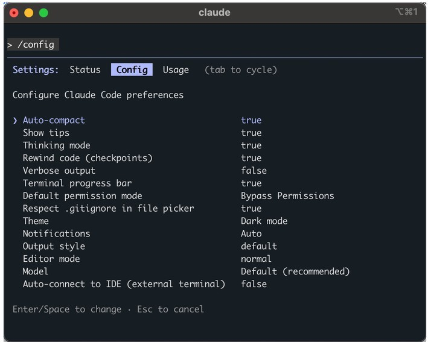

---

### 4. `/model`

This command can switch the large language model used by Claude Code.

**Model Options:**

| Model | Capabilities | Best For |
|-------|--------------|----------|
| **Sonnet 4.5** | Mid-tier model balancing performance and speed | Most coding tasks, refactoring, bug fixes |
| **Opus 4.5** | Most capable model for complex work | System design, complex algorithms, critical projects |
| **Haiku 4.5** | Fastest model for quick answers | Quick queries, simple scripts, syntax checks |

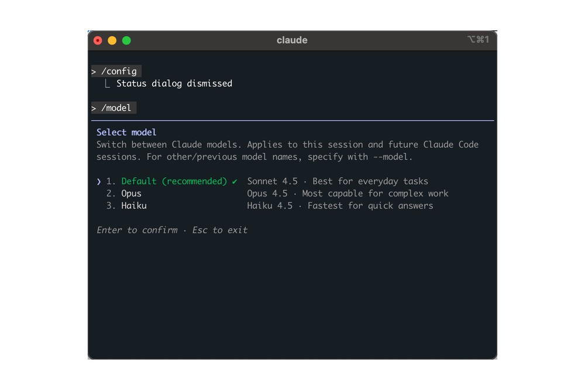

---

### 5. `/context`

This command displays the **token** usage for the current session.

>[!TIP]
>
> Think of the **context window** as a sliding window: once the **token** limit is reached, the model automatically "pushes out" the earliest memories to make room. If Claude starts forgetting instructions or repeating issues that have already been addressed, it usually means the critical context has fallen out of range. In such cases, use **/compact** to streamline your context.

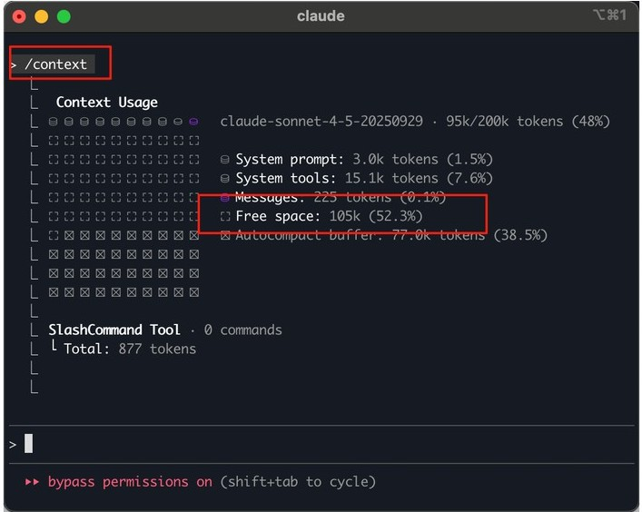

---

### 6. `/clear`

Reset session and clear context.

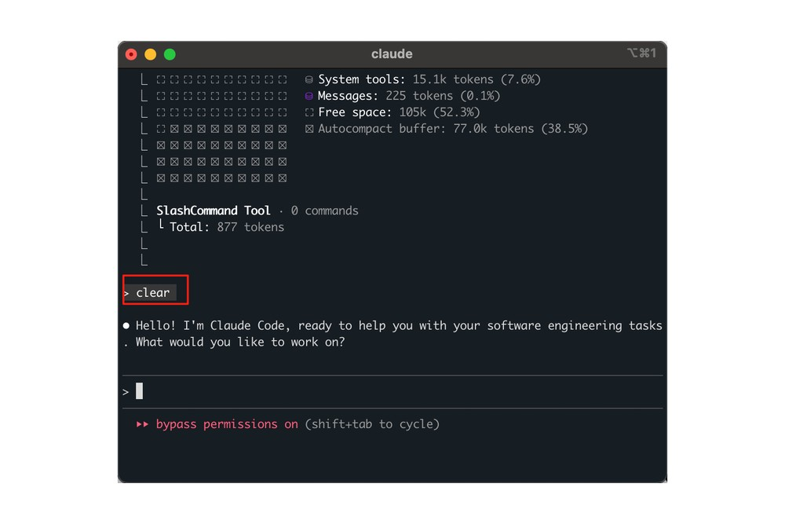

---

### 7. `/mcp`

Manage **MCP** Extensions: View installed tools and enable cross-platform integration.

>[!TIP]
>
> **MCP (Model Context Protocol)** serves as a unified bridge between AI models and external resources. It empowers Claude to interact directly with tools like **Context 7** (fetching latest docs), **Firecrawl** (web scraping), and **Playwright** (browser automation), providing seamless access to databases, local files, and GitHub repositories.

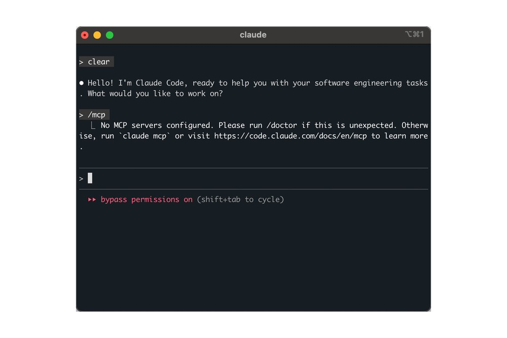

---

### 8. `/agents`

Different sub-**agents** that can be set up handle different tasks, and each sub-**agent** has an independent context.

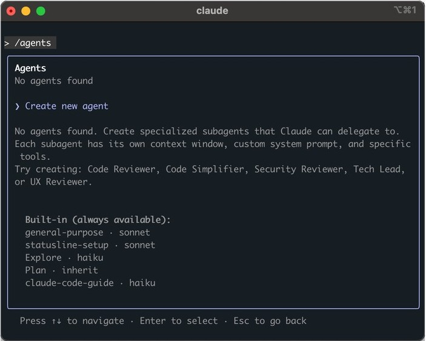

---

### 9. `/usage`

View your **token** usage statistics and account-level consumption information.

>[!TIP]
>
> Unlike **/context**, which shows token usage for the current session, **/usage** displays your overall account usage, including historical data and consumption across all sessions.

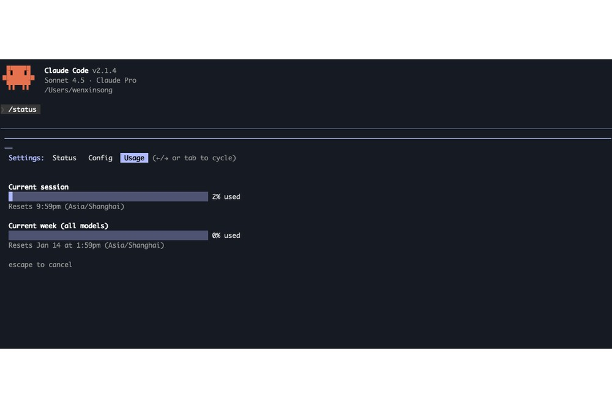

---

## Special Input Modes

Here's the deal: Beyond standard commands, Claude Code offers three special input prefixes for different use cases.

| Prefix | What It Does | Best For |
|--------|--------------|----------|
| **!** | Execute system commands directly | File operations, Git, package management |
| **/** | Call Claude's built-in functions | Core tool operations |
| **@** | Reference files/directories | Code analysis or modification |
| **&** | Background execution | Long-running operations |

### 1. **!** (Bash Mode)

**Bash mode**: Directly executes system commands (such as `!pwd`), does not consume AI **tokens**, is fast, and is suitable for file operations, Git management, package installation, etc.

>[!TIP]
>
> `pwd` is a Bash command that prints the full path of the current directory.

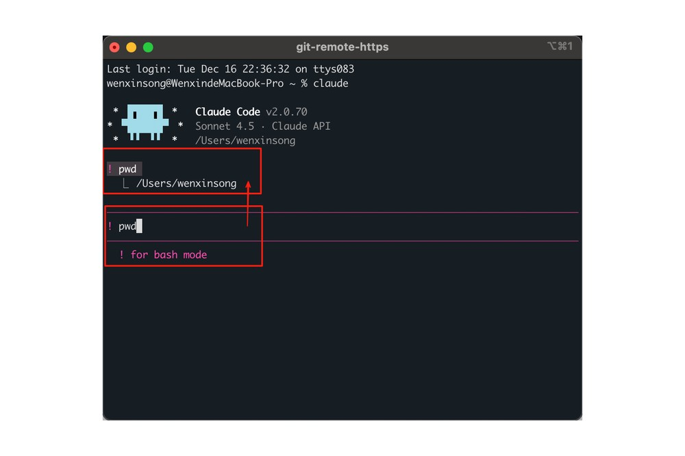

---

### 2. **/** (Command Mode)

**Command mode**: Calls Claude's built-in functions (such as `/clear` to clear context, `/model` to switch AI models, `/cost` to view **token** consumption). This is the core entry point for operating the tool.

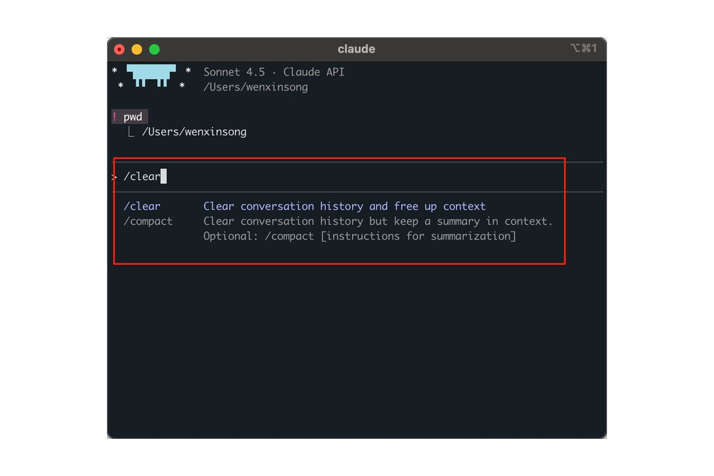

---

### 3. **@** (File Path Mode)

**File path mode**: Quickly reference files/directories in the project (such as `@.zshrc`), helping the AI locate code files for analysis or modification.

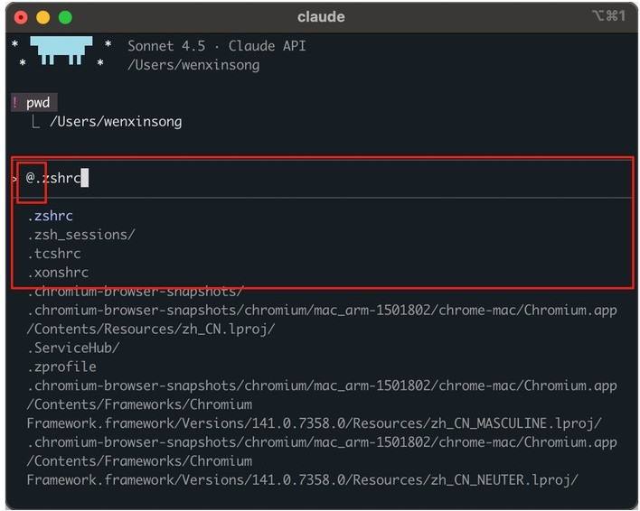

---

### 4. **&** (Background Mode)

**Background mode**: Execute tasks in the background, suitable for long-running operations. However, to use this mode, you need to access <https://claude.ai/code> to set up Claude Code and configure the remote execution environment so that Claude Code can run code in the cloud. Otherwise, the following error will be reported:

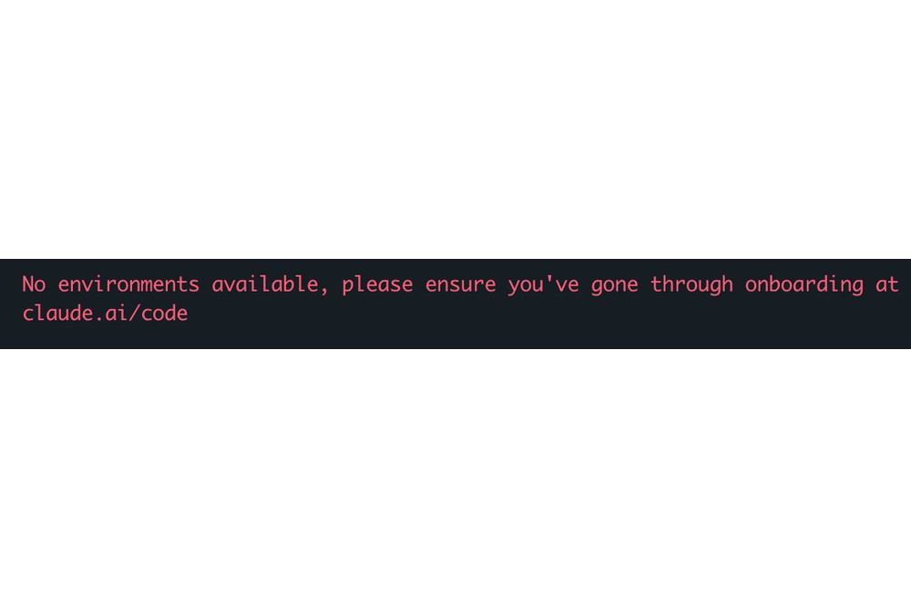

---

## Keyboard Shortcuts

| Shortcut | English Explanation |
|----------|---------------------|
| **Input Shortcuts** | |
| `double esc` | Restore the code or conversation to the point before |
| `shift + tab` | Apply AI's code modification suggestions with one click |
| `Control + o` | Let AI return more detailed execution logs |
| `Control + t` | View AI's current task plan |
| `shift + ↵` | Support multi-line input (unavailable now) |
| **General Shortcuts** | |
| `Control + _` | Delete all current inputs |
| `Control + z` | Temporarily pause Claude |
| `Control + v` | Paste the picture to AI |
| `option + p` | Switch between Claude versions (unavailable now) |
| `Control + s` | Temporarily save the current prompt and reappear after next submit |

---

## Custom Commands

Here's the deal: Claude Code lets you create reusable custom commands. Think of them as your personal shortcuts for repetitive tasks.

### Method 1: Create Markdown Files

Create a reusable Markdown file as a prompt in the **`~/.claude/commands`** folder. The file name is the command name, and then it can be quickly invoked in Claude Code. This command will reuse the prompt text in the Markdown file and complete the task in the current working directory. The usage is consistent with Section 3.4.1 and is invoked using the **`/ + command`** syntax.

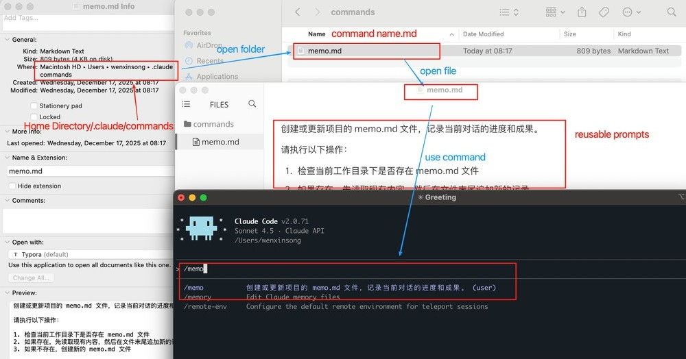

---

### Method 2: Ask Claude to Create Commands

Alternatively, commands can also be added by directly asking Claude Code to generate custom commands. However, commands added in this way may require restarting Claude Code before the new commands become visible. Here is an example prompt:

**Example Prompt:**

```
Create a slash command for me and name it `/memo`. The function of this command is to create a memo for the current project to record the progress and results, so that when restarting the conversation, it can continue at the point where the task was disconnected. The output is a `memo.md`.
```

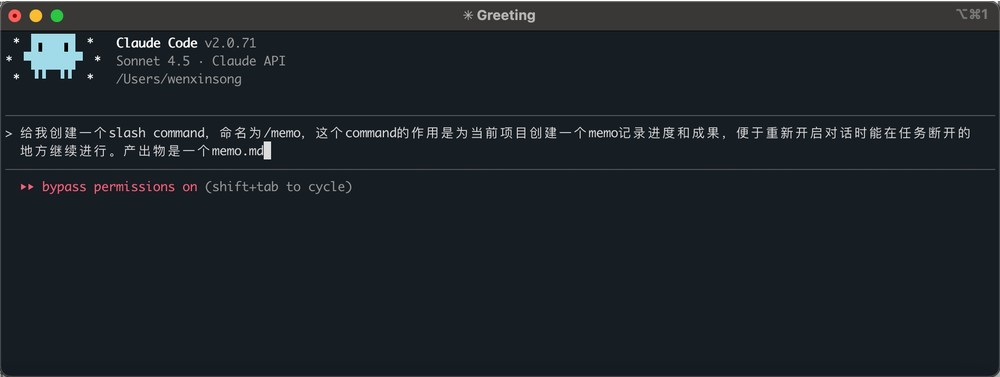

---

*Questions? Stuck somewhere? Check out the official documentation. Or just ask Claude — it's literally right there.*
