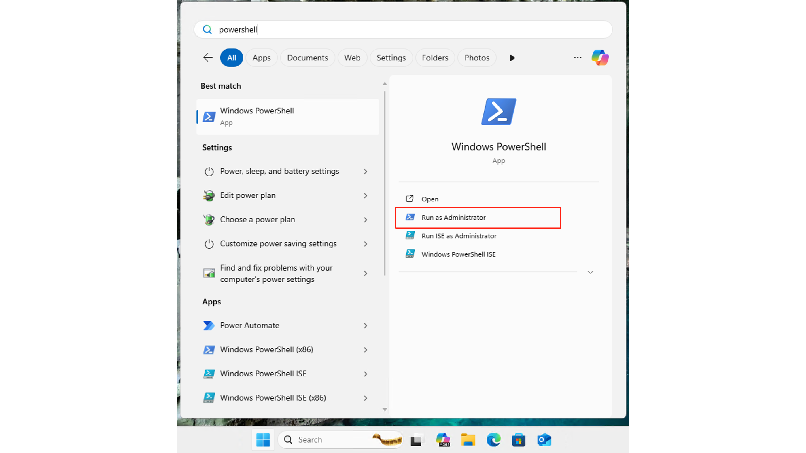
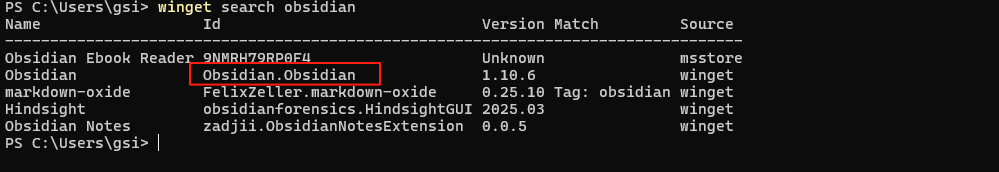
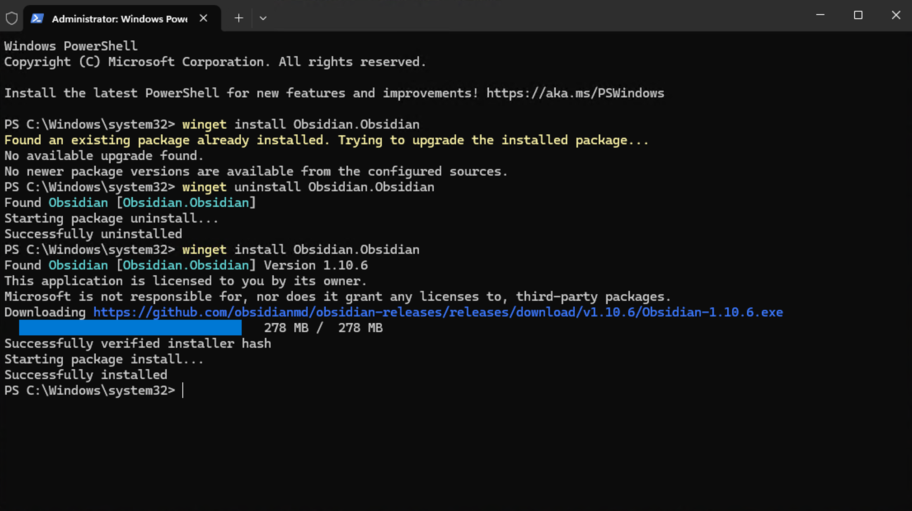
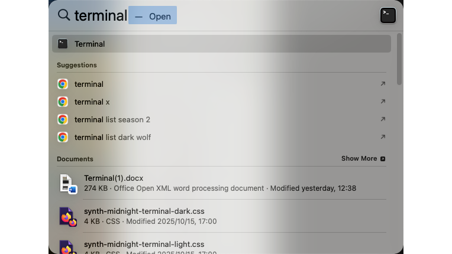
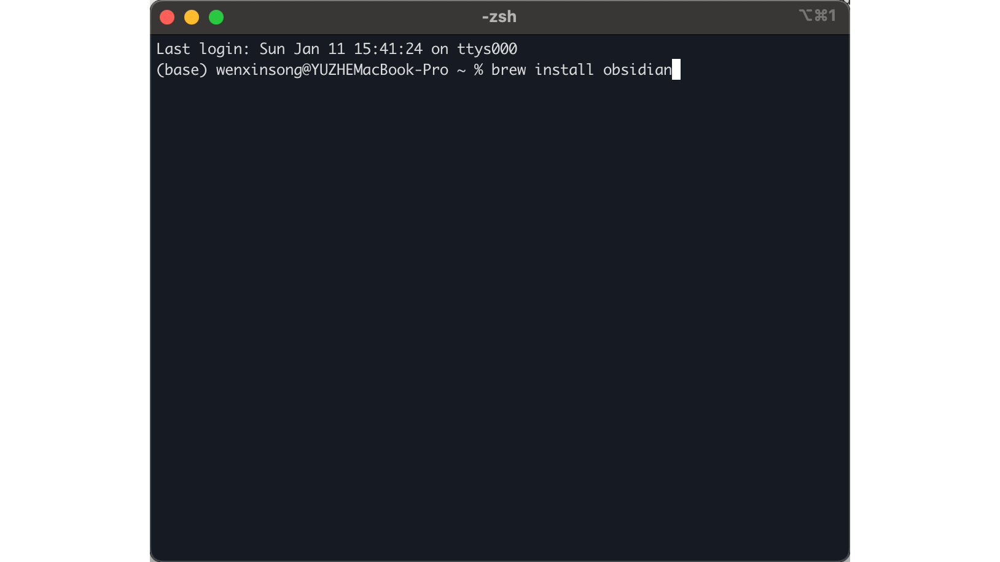
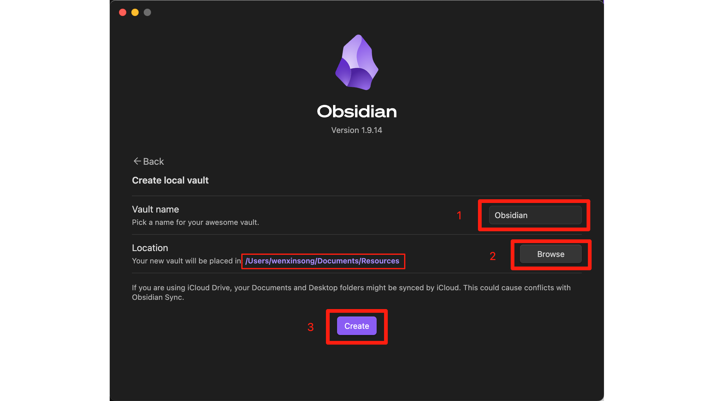
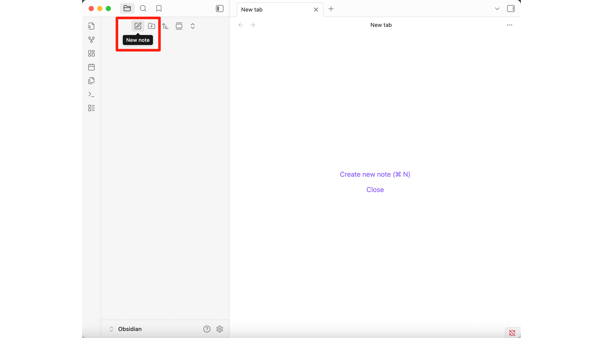
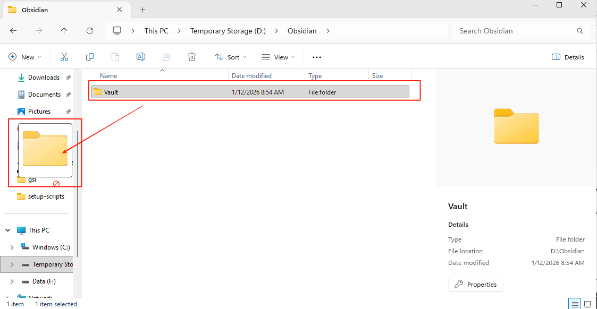
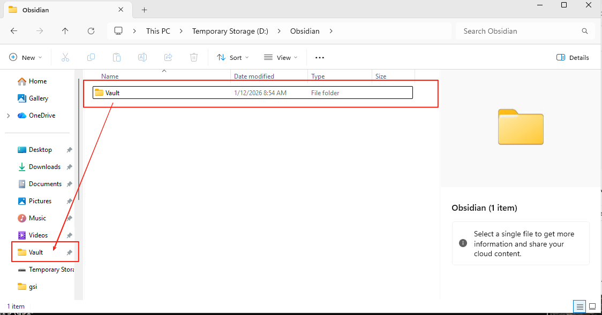

---

layout: doc

title: Obsidian Usage Guide · Obsidian 使用指南

---

## Download and install Obsidian
## 下载并安装 Obsidian

### Windows
### Windows 系统

Open PowerShell (press `win + powershell` to search for and open PowerShell).
打开 PowerShell（按 `win + powershell` 搜索并打开 PowerShell）。

**Note**: To avoid issues with insufficient permissions, it is recommended to select `Run as Administrator` to open PowerShell.
**注**：为避免权限不足的问题，建议选择 `Run as Administrator` 打开 PowerShell。



Type `winget search obsidian` in the PowerShell and press Enter.
在 PowerShell 输入 `winget search obsidian` 并按下回车。




Type `winget install Obsidian.Obsidian` in the command line and press Enter to install Obsidian.
在命令行输入 `winget install Obsidian.Obsidian` 并按下回车安装 Obsidian。


Wait for the installation to finish.
等待安装完成。



### Mac
### Mac 系统

Open your Terminal by using `command + space`.
使用 `command + space` 打开您的命令行窗口（Terminal）。



Type `brew install obsidian` in the terminal and press Enter.
在终端输入 `brew install obsidian` 并按下回车。



Wait for the installation to finish.
等待安装完成。


---
## Understanding Markdown Language
## 理解 Markdown 语言

### Why AI uses Markdown?
### 为什么 AI 使用 Markdown？

Markdown is a lightweight markup language with plain-text-formatting syntax. AI assistants like Claude use it because:
Markdown 是一种轻量级标记语言，它允许人们使用易读易写的纯文本格式编写文档。像 Claude 这样的 AI 助手使用它是因为：

- **Clear Structure**: It uses simple symbols to define headers, lists, and bold text, making the content easy for both humans and machines to read.
- **结构清晰**：它使用简单的符号来定义标题、列表和加粗文本，使内容对人类和机器都易于阅读。

- **Standard Format**: It is a universal standard that can be easily converted to other formats like PDF, Word, or HTML.
- **标准格式**：它是一个通用标准，可以轻松转换为 PDF、Word 或 HTML 等其他格式。

- **Rich Content**: It supports images, tables, and even checkboxes, which is perfect for structured research reports.
- **内容丰富**：它支持图片、表格甚至复选框，非常适合结构化的研究报告。

### Why trainees need to understand Markdown
### 为什么学员需要理解 Markdown？

You don't need to know how to write it, but understanding its basic syntax will help you:
你不需要学会如何编写它，但了解其基本语法将帮助你：

- **Read AI Outputs**: Better understand the structure of the reports generated by Claude Code.
- **阅读 AI 输出**：更好地理解 Claude Code 生成的报告结构。

- **Navigate Obsidian**: Know how your notes are organized and displayed.
- **在 Obsidian 中导航**：了解你的笔记是如何组织和显示的。

### Basic Markdown Examples
### Markdown 基础示例

Here is the content of the example file `Untitled.md` in its raw Markdown format, followed by an explanation of its elements:
下面是示例文件 `Untitled.md` 的原始 Markdown 格式内容，以及对其元素的说明：

```markdown
# Ghana
## Ghana
### Ghana
*Ghana*
**Ghana** Ghana
- Ghana
- [ ] 待办事项1
- [x] 已完成事项1
- [ ] 待办事项2
- [ ] 

```

**Explanation of the elements (元素说明):**
- **Headers (标题)**: `#`, `##`, and `###` represent level 1, 2, and 3 headers respectively.
- **Headers (标题)**：`#`、`##` 和 `###` 分别代表一级、二级和三级标题。

- **Italic and Bold (斜体与加粗)**: `*Text*` for italic, and `**Text**` for bold.
- **斜体与加粗**：`*文本*` 表示斜体，`**文本**` 表示加粗。

- **Lists (列表)**: `-` followed by a space creates a bullet point.
- **列表**：`-` 后接空格可创建无序列表点。

- **Checkboxes (复选框)**: `- [ ]` creates an empty checkbox, and `- [x]` creates a completed one.
- **复选框**：`- [ ]` 创建未完成的复选框，`- [x]` 创建已完成的复选框。

- **Images (图片)**: `` is the syntax to display an image stored at a specific location.
- **图片**：`` 是显示存储在特定位置的图片的语法。

---
### Choose a Vault Option
### 选择库选项


Open the Obsidian, and you'll find **3 options**.
打开 Obsidian，你会看到 **3 个选项**。

This is what Obsidian prompts you with "How to Get Started" when you launch it for the first time. Simply put, a **Vault** is your note library, which corresponds to **a local folder** where all Markdown (.md) files are stored. You can choose the appropriate usage method based on the following three scenarios:
这是 Obsidian 在首次启动时的引导页面。简单来说，**Vault（库）** 是你的笔记仓库，对应于 **一个本地文件夹**，其中存放着所有的 Markdown (.md) 文件。你可以根据以下三种情况选择合适的启动模式：

- **Create new vault (创建新库)**
	If you want to start from scratch, create a new note folder, and Obsidian will help you manage all your notes in that folder.
	如果你想从零开始，创建一个新的笔记文件夹，Obsidian 会帮你在该文件夹中管理所有笔记。
	
- **Open folder as vault (将文件夹作为库打开)**
	If you already have a folder with Markdown files and want to use it directly as your Obsidian note library.
	如果你已经有一个包含 Markdown 文件的文件夹，并希望直接将其作为 Obsidian 的笔记库。
	
- **Open vault from Obsidian Sync (从 Obsidian Sync 打开库)**
	If you have used Obsidian Sync (Obsidian's paid sync feature) on another device and now want to pull that synced note library down to your local machine.
	如果你在其他设备上使用过 Obsidian Sync（Obsidian 的付费同步功能），现在想把同步的笔记库下载到本地。
	
	If you haven't subscribed to Sync, you can ignore this option.
	如果你没有订阅 Sync，可以忽略此选项。

**Notes**：Although Obsidian allows you to switch vaults via **File -> Open Vault**, it is better to use a single vault to take full advantage of its note-management capabilities. In addition, Obsidian cannot open a single md file by right-clicking, unlike the office series.
**注意**：虽然 Obsidian 允许你通过 **File -> Open Vault** 切换库，但通常建议使用单一库，以便更好地利用其笔记管理功能。此外，Obsidian无法和 office 系列一样通过右键打开单一 md 文件。

In this document, we'll use **Create new vault** as an example.
在本文档中，我们将以 **Create new vault（创建新库）** 为例。


### Create a New Vault
### 创建新库



Enter a **Vault name** (e.g., "Obsidian"), click **Browse** to select a folder, and then click **Create**.
输入一个 **Vault 名称**（例如 “Obsidian”），点击 **Browse** 选择文件夹，然后点击 **Create**。


### View the Empty Vault
### 查看空白库


An empty vault will be created, as shown above.
一个空白的库就会被创建，如上所示。


---
## Creating Your First Note
## 创建你的第一篇笔记

### Step 1: Click "New Note"
### 第一步：点击 “New Note”



Click the **New Note** Button at the top of the left sidebar(it shows "New note" when hovered).
点击左侧边栏顶部的 **New Note（新建笔记）** 按钮（鼠标悬停时会显示 “New note”）。


### Step 2: Enter the Note Name
### 第二步：输入笔记名称


Enter the Note Name
输入笔记名称。

The system will automatically fill in a file name, such as **"Untitled"**. You can change it to, for example, **"My First Note"**, and press Enter to confirm.
系统会自动生成一个文件名，例如 **“Untitled”**。你可以修改这个标题，如 **“My First Note”**，然后按回车键确认。

**Note**: In Obsidian, the file you create is a **Markdown file** by default. As you type, Obsidian will automatically render the Markdown syntax to display a live preview of the formatted text.
**提示**：在 Obsidian 中，你创建的文件默认是 **Markdown 文件**。当你输入内容时，Obsidian 会实时渲染 Markdown 语法并显示格式化的预览效果。


---
## Import and Examples
## 导入与示例

### Step 1: Import Notes
### 第一步：导入笔记


You can import a folder of notes into Obsidian by copying it into your designated vault folder.
你可以通过将笔记文件夹复制到指定的 Vault 文件夹中，将其导入 Obsidian。


### Step 2: Find the Imported Notes
### 第二步：查找导入的笔记


You can then find it in Obsidian.
然后你可以在 Obsidian 中找到它。

## Pin vault to the taskbar
## 将库固定到任务栏

You can pin the Obsidian vault to the taskbar for quick access.
你可以将 Obsidian 的 vault 固定到任务栏以便快速访问。



