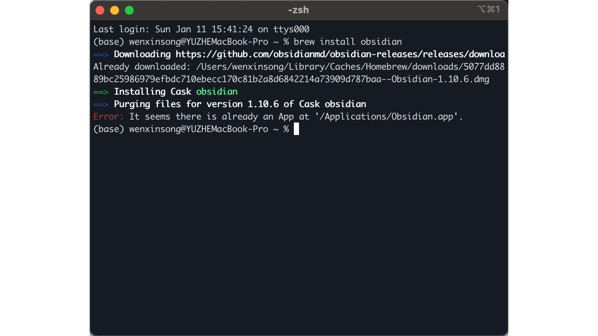
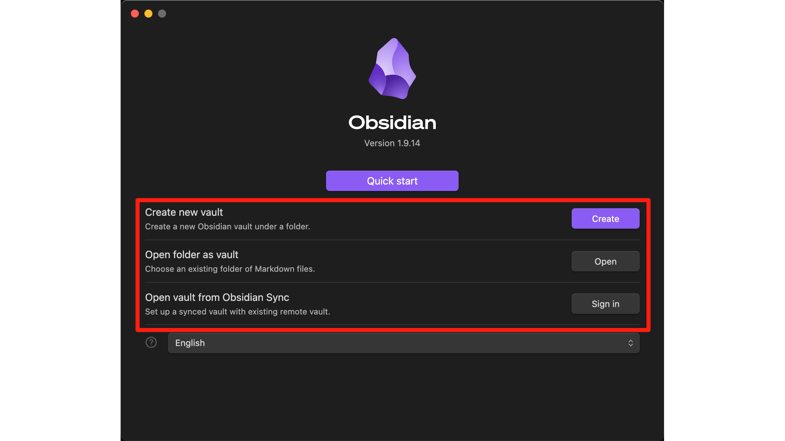
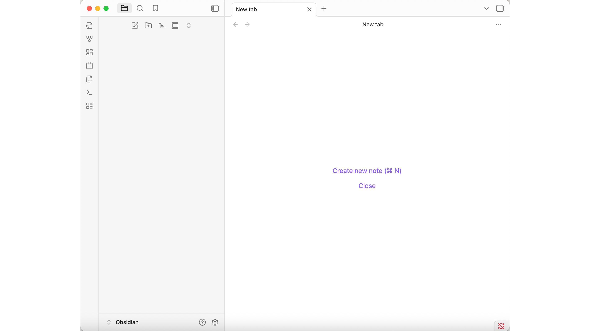
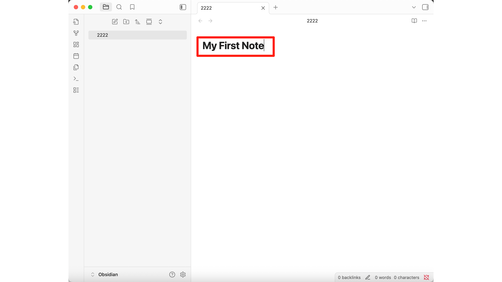
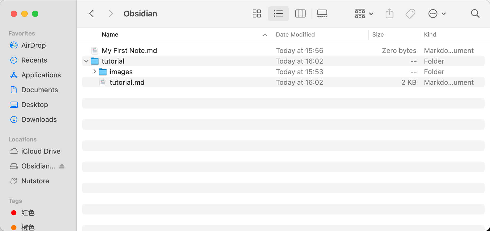
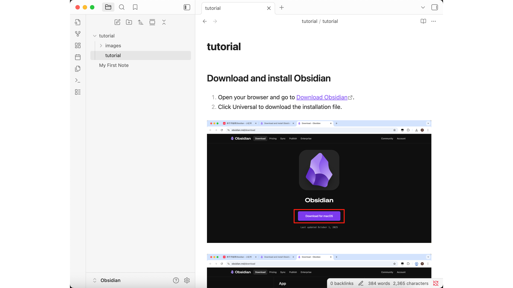

> **阅前说明**
>
> 本教程假设你知道怎么打开终端、运行基本命令。如果听起来有点慌，先花5分钟看看 [Terminal 基础](../../../Basic-tools/01-terminal-basics/zh) 和 [Homebrew 安装](../../../Basic-tools/05-homebrew-install/zh)，绝对物超所值。


# Obsidian 使用指南

**大局观：为什么选 Obsidian？**

**Obsidian 是你的个人知识库，所有内容都以纯 Markdown 文件存储在你的设备上。相当于一个你完全掌控的「第二大脑」：**

| 功能 | 你能得到什么 | 为什么重要 |
|------|-------------|-----------|
| **本地优先** | 所有笔记存储在你的设备上 | 你的数据，你做主 |
| **基于 Markdown** | 通用、面向未来的格式 | 任何文本编辑器都能用 |
| **链接系统** | 像神经元一样连接想法 | 构建你的知识网络 |
| **可扩展** | 丰富的插件生态 | 自定义你的工作流 |
| **个人使用免费** | 核心功能免费 | 无需订阅 |

---

## 第一部分：Obsidian 安装

**Windows 安装**

按下 `Win` 键搜索 PowerShell 并打开。

⚠️ **注**：为避免权限不足的问题，建议选择 `Run as Administrator` 打开 PowerShell。


Type `winget search obsidian` in the PowerShell and press Enter.
在 PowerShell 输入 `winget search obsidian` 并按下回车。


在命令行输入 `winget install Obsidian.Obsidian` 并按下回车安装 Obsidian。


等待安装完成。


---

**Mac 安装**

按 `Command + 空格` 搜索 **Terminal** 并打开。


在终端输入 `brew install obsidian` 并按下回车。


等待安装完成。



---

## 第二部分：理解 Markdown

**为什么 AI 使用 Markdown？**
Markdown 是一种轻量级标记语言，它允许人们使用易读易写的纯文本格式编写文档。像 Claude 这样的 AI 助手使用它是因为：

| 原因 | 意味着什么 |
|------|-----------|
| **结构清晰** | 使用简单的符号来定义标题、列表和加粗文本，使内容对人类和机器都易于阅读 |
| **标准格式** | 通用标准，可以轻松转换为 PDF、Word 或 HTML 等其他格式 |
| **内容丰富** | 支持图片、表格甚至复选框，非常适合结构化的研究报告 |

---

**为什么你需要理解 Markdown**
你不需要学会如何编写它，但了解其基本语法将帮助你：

- ✅ **阅读 AI 输出**：更好地理解 Claude Code 生成的报告结构
- ✅ **在 Obsidian 中导航**：了解你的笔记是如何组织和显示的

---

**Markdown 基础示例**

下面是示例文件 `Untitled.md` 的原始 Markdown 格式内容，以及对其元素的说明：

```markdown
# Ghana
## Ghana
### Ghana
*Ghana*
**Ghana** Ghana
- Ghana
- [ ] 待办事项1
- [x] 已完成事项1
- [ ] 待办事项2
- [ ]

```

**元素说明**

| 符号 | 创建什么 | 示例 |
|------|---------|------|
| `#` | 一级标题 | `# 标题` |
| `##` | 二级标题 | `## 章节` |
| `###` | 三级标题 | `### 小节` |
| `*文本*` | 斜体文本 | *加纳* |
| `**文本**` | 加粗文本 | **加纳** |
| `-` | 无序列表项 | `- 项目` |
| `- [ ]` | 未完成的复选框 | `- [ ] 待办` |
| `- [x]` | 已完成的复选框 | `- [x] 完成` |
| `` | 图片 | `` |

---

## 第三部分：设置你的库

**选择库选项**

打开 Obsidian，你会看到 **3 个选项**。



**什么是库？** 简单来说，**Vault（库）** 是你的笔记仓库，对应于 **一个本地文件夹**，其中存放着所有的 Markdown (.md) 文件。你可以根据以下三种情况选择合适的启动模式：

| 选项 | 适合谁 | 会发生什么 |
|------|--------|-----------|
| **创建新库** | 从零开始 | 创建一个新文件夹来存放所有笔记 |
| **将文件夹作为库打开** | 已有 Markdown 文件 | 使用现有文件夹作为笔记库 |
| **从 Obsidian Sync 打开库** | 付费同步用户 | 从 Obsidian 云端拉取同步的库 |

**快速决策指南：**
- ✅ 想从零开始？→ **创建新库**
- ✅ 已有笔记在文件夹里？→ **将文件夹作为库打开**
- ✅ 在其他设备上使用 Obsidian Sync？→ **从 Obsidian Sync 打开库**

⚠️ **注意**：虽然 Obsidian 允许你通过 **File → Open Vault** 切换库，但通常建议使用单一库，以便更好地利用其笔记管理功能。此外，Obsidian 无法和 Office 系列一样通过右键打开单一 .md 文件。

在本文档中，我们将以 **Create new vault（创建新库）** 为例。

---

**创建新库**

输入一个 **Vault 名称**（例如 "Obsidian"），点击 **Browse** 选择文件夹，然后点击 **Create**。


---

**查看空白库**

一个空白的库就会被创建，如上所示。



---

## 第四部分：创建你的第一篇笔记

**第一步：点击「New Note」**

点击左侧边栏顶部的 **New Note（新建笔记）** 按钮（鼠标悬停时会显示 "New note"）。


---

**第二步：输入笔记名称**

系统会自动生成一个文件名，例如 **"Untitled"**。你可以修改这个标题，如 **"My First Note"**，然后按回车键确认。



💡 **小贴士**：在 Obsidian 中，你创建的文件默认是 **Markdown 文件**。当你输入内容时，Obsidian 会实时渲染 Markdown 语法并显示格式化的预览效果。

---

## 第五部分：导入笔记

**第一步：导入笔记**

你可以通过将笔记文件夹复制到指定的 Vault 文件夹中，将其导入 Obsidian。



---

**第二步：查找导入的笔记**

然后你可以在 Obsidian 中找到它。



---

## 第六部分：快速访问

**将库固定到任务栏**

你可以将 Obsidian 的 vault 固定到任务栏以便快速访问。


---

## 总结

现在你已经准备好使用 Obsidian 作为你的个人知识管理工具了：

1. 在你喜欢的平台上**安装** Obsidian
2. **理解**基本的 Markdown 语法
3. **创建**你的第一个库和笔记
4. 如果有现有笔记，可以**导入**
5. **固定** Obsidian 以便快速访问

---

*有问题？卡住了？Obsidian 社区非常有帮助。或者直接探索这个应用——一半的乐趣在于自己发现新功能。*
