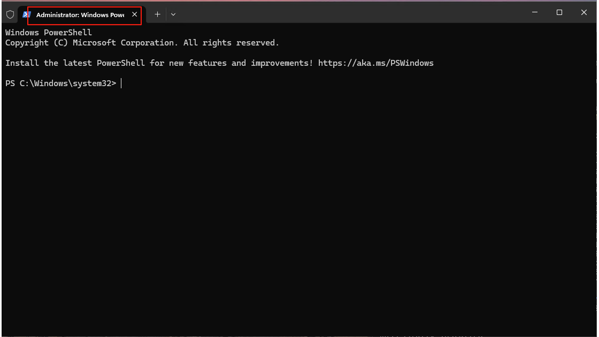
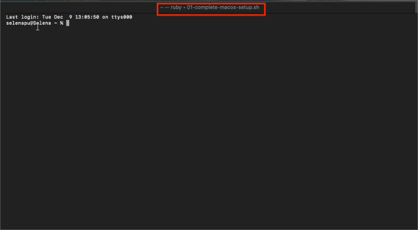
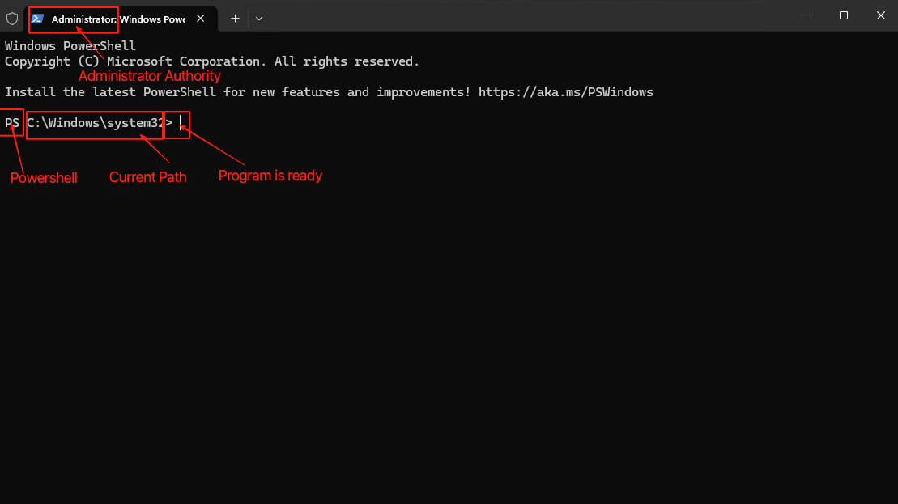
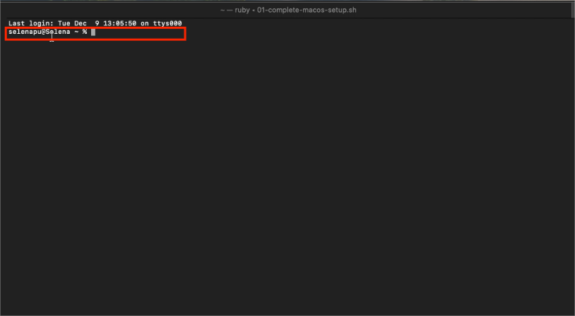
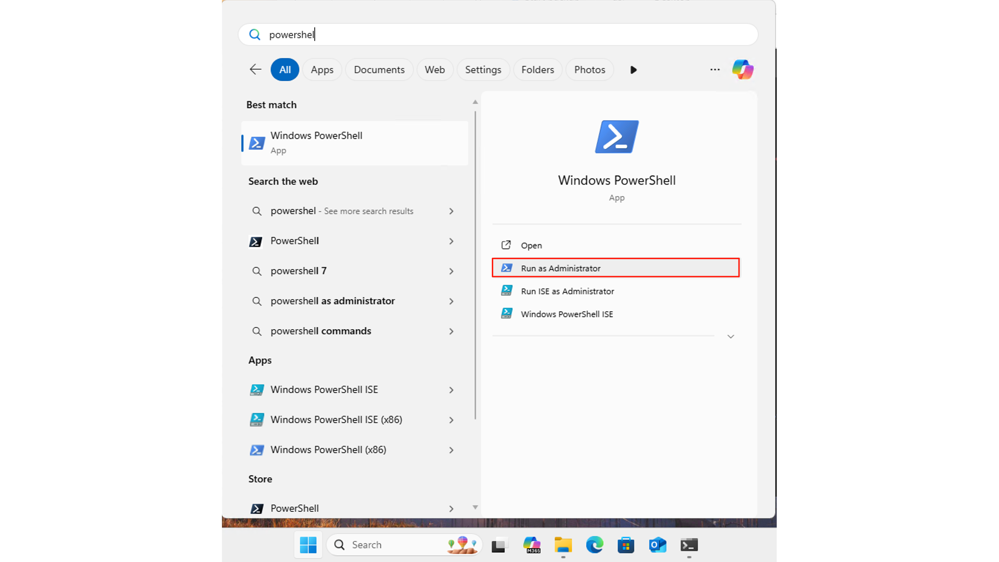
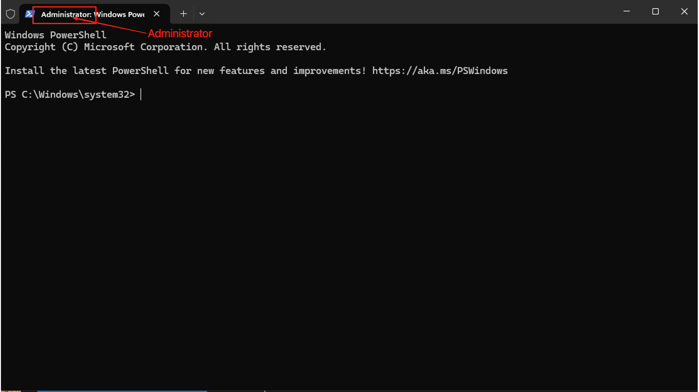
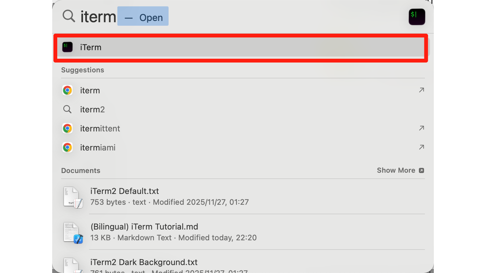

# Terminal Basics
**Terminal 基础**

## What Even Is a Terminal?
**终端到底是什么？**

Think of a terminal as a direct hotline to your computer's brain. While you're used to clicking icons and dragging windows, the terminal lets you type commands that your computer executes immediately. No clicking, no menus — just you and your machine, having a conversation.
终端就是你电脑的「直通热线」。平时你习惯点击图标、拖动窗口，但终端让你直接输入命令，电脑立刻执行。没有点击，没有菜单 —— 只有你和你的电脑，直接对话。

Why does this matter? Because tools like Claude Code live in the terminal. If you want to use AI to help you code, you'll need to make friends with this black (or white) window first.
为什么这很重要？因为像 Claude Code 这样的工具就住在终端里。如果你想用 AI 帮你写代码，你得先和这个黑色（或白色）窗口搞好关系。

---

## The Anatomy of Your Terminal Window
**终端窗口解剖学**

Before you start typing commands, let's understand what you're looking at. The terminal might look intimidating at first — all that text, no buttons — but it's actually quite logical once you know the pieces.
在开始输入命令之前，让我们先搞清楚你在看什么。终端乍一看可能有点吓人 —— 全是文字，没有按钮 —— 但一旦你了解了各个部分，它其实很有逻辑。

### Title Bar: What's This Window Up To?
**标题栏：这个窗口在干什么？**

#### Windows

**Windows PowerShell Example**: The title bar shows "Windows PowerShell" or "Administrator: Windows PowerShell".
**Windows PowerShell 示例**：标题栏显示 "Windows PowerShell" 或 "Administrator: Windows PowerShell"。

#### Mac

**Mac Terminal Example**: **ruby -- 01-complete-macos-setup.sh**
**Mac 终端示例**：**ruby -- 01-complete-macos-setup.sh**

This title bar tells you:
标题栏告诉你：

- **ruby**: The name of your current terminal session
- **ruby**：当前终端会话的名字
- **01-complete-macos-setup.sh**: The script file associated with the session
- **01-complete-macos-setup.sh**：当前关联的脚本文件名
- **.sh** means it's a shell script — something the terminal can execute
- **.sh** 表示这是一个 shell 脚本，终端可以执行它

💡 **Pro Tip**: The title doesn't mean the script is running — it just tells you what's associated with this window. Think of it like a file tab name.
💡 **小贴士**：标题不代表脚本正在运行 —— 它只是告诉你这个窗口关联了什么。把它想象成文件标签名。

---

### The Command Prompt: Your "Ready, Set, Go" Signal
**命令提示符：你的「各就各位」信号**

This line is **critical**. It tells you the system is ready for your command. Let's break it down by operating system.
这一行**非常关键**。它告诉你系统已经准备好接收你的命令了。让我们按操作系统逐一拆解。

#### Windows Command Prompt
**Windows 命令提示符**

| Symbol | What It Means | Why Care |
|--------|---------------|----------|
| **PS** | You're in PowerShell | Different from old-school CMD |
| **C:\Windows\System32** | Your current folder | Commands happen here |
| **>** | System is ready | Go ahead, type something |

| 符号 | 含义 | 为什么重要 |
|------|------|------------|
| **PS** | 你在 PowerShell 里 | 和老式 CMD 不同 |
| **C:\Windows\System32** | 你当前所在的文件夹 | 命令会在这里执行 |
| **>** | 系统准备好了 | 来吧，输入点什么 |

**Putting It All Together:**
**组合起来理解：**

- Where am I working? → `C:\Windows\System32`
- 我现在在哪？ → `C:\Windows\System32`
- Is the system ready? → `>` (yes!)
- 系统准备好了吗？ → `>`（是的！）
- Where will my typing appear? → Right after `>`, at the blinking cursor
- 我输入的内容会出现在哪里？ → `>` 后面，闪烁的光标处

---

#### Mac Command Prompt
**Mac 命令提示符**

| Symbol | What It Means | Why Care |
|--------|---------------|----------|
| **selenagupSelena** | Your username | Who's logged in |
| **~** | Home directory | Your personal folder |
| **%** | Ready for input | Type away! |

| 符号 | 含义 | 为什么重要 |
|------|------|------------|
| **selenagupSelena** | 你的用户名 | 当前登录的是谁 |
| **~** | 家目录 | 你的个人文件夹 |
| **%** | 准备接受输入 | 输吧！ |

**The `~` Symbol Explained:**
**`~` 符号解释：**

The tilde `~` is a shortcut for your home directory. Instead of typing `/Users/yourname`, you just see `~`. Clean and simple.
波浪号 `~` 是你家目录的快捷方式。不用输入 `/Users/你的名字`，你只需要看到 `~`。干净利落。

Other paths you might encounter:
其他你可能遇到的路径：

| Path | What It Is | Chinese |
|------|------------|---------|
| `~/Desktop` | Your desktop | 桌面 |
| `~/Documents` | Your documents | 文档 |
| `/usr/local/bin` | System programs | 系统程序目录 |

**The Prompt Symbol:**
**提示符符号：**

| Symbol | Shell Type | Translation |
|--------|------------|-------------|
| `%` | zsh (default on modern macOS) | zsh（新版 macOS 默认） |
| `$` | bash | bash |
| `#` | root/administrator | 超级管理员 |

⚠️ **Warning**: If you ever see `#` as your prompt symbol, proceed with caution. You have full system access, which means you can accidentally break things.
⚠️ **警告**：如果你看到 `#` 作为提示符，请格外小心。你拥有完整的系统权限，意味着你可能不小心搞坏东西。

**Putting It All Together:**
**组合起来理解：**

- Who's operating? → `selenagupSelena` (that's you!)
- 是谁在操作？ → `selenagupSelena`（就是你自己！）
- Where am I? → `~` (home sweet home)
- 我现在在哪？ → `~`（家，甜蜜的家）
- Is the system ready? → `%`
- 系统准备好了吗？ → `%`
- Where do I type? → Blinking cursor, right here
- 我在哪输入？ → 闪烁的光标，就在这儿

---

## How to Open Terminal
**如何打开终端**

Now that you know what you're looking at, let's actually open one.
既然你知道了你在看什么，让我们来打开一个终端。

### Windows: Getting PowerShell
**Windows：打开 PowerShell**

Press the `Windows key` (or `Win`), type "PowerShell", and hit Enter.
按 `Windows 键`（或 `Win`），输入 "PowerShell"，然后按回车。

⚠️ **Important**: To avoid permission headaches later, I recommend selecting **Run as Administrator**. Future you will thank present you.
⚠️ **重要**：为了避免之后的权限问题，我建议选择 **以管理员身份运行**。未来的你会感谢现在的你。

Wait for the window to appear. You'll know you're in admin mode when you see "Administrator" in the title bar.
等待窗口出现。当你在标题栏看到 "Administrator" 时，你就知道你处于管理员模式了。

---

### Mac: Summoning Terminal
**Mac：召唤终端**

Press `Command + Space`, type "Terminal", and hit Enter.
按 `Command + 空格`，输入 "Terminal"，然后按回车。

That's it. You're in.
就这么简单。你进来了。

💡 **Pro Tip**: On Mac, you can also right-click any folder and select "New Terminal at Folder" to open a terminal already navigated to that location. Super handy.
💡 **小贴士**：在 Mac 上，你也可以右键点击任意文件夹，选择「在文件夹中新建终端」，这样打开的终端就已经在那个位置了。超级方便。

---

## Summary

1. **Terminal** = direct text-based communication with your computer
2. **Command prompt** = the "I'm ready" signal (look for `>`, `%`, or `$`)
3. **Windows**: Open PowerShell as Administrator
4. **Mac**: `Command + Space` → "Terminal"
5. **You're ready** to use command-line tools like Claude Code!

**总结**

1. **终端** = 与电脑直接进行基于文字的交流
2. **命令提示符** = 「我准备好了」的信号（找 `>`、`%` 或 `$`）
3. **Windows**：以管理员身份打开 PowerShell
4. **Mac**：`Command + 空格` → "Terminal"
5. **你准备好了** 使用像 Claude Code 这样的命令行工具！

---

*Still nervous? Don't worry. The best way to learn the terminal is to use it. Every command you run makes you a little more comfortable. You've got this.*
*还是很紧张？别担心。学习终端最好的方式就是使用它。每运行一个命令，你就会更自在一点。你可以的。*
