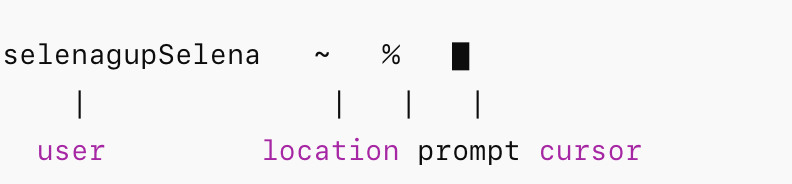
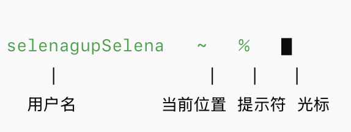
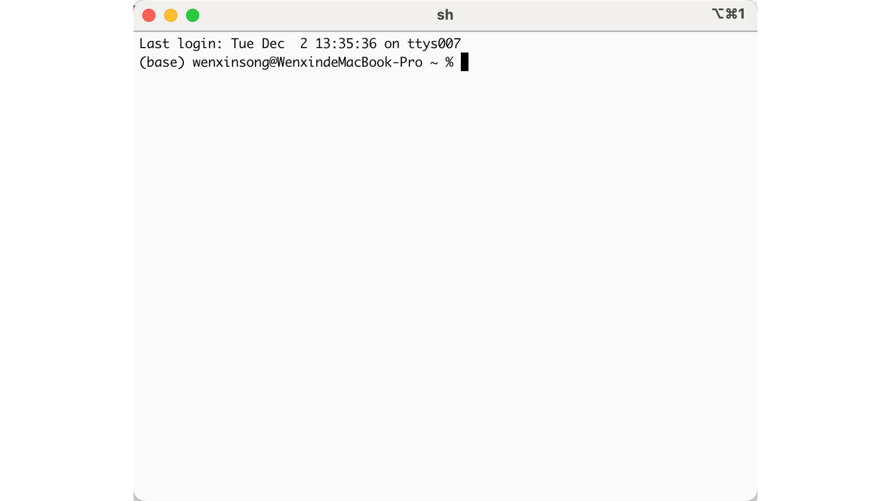

# Terminal Basics

## What Even Is a Terminal?

Think of a terminal as a direct hotline to your computer's brain. While you're used to clicking icons and dragging windows, the terminal lets you type commands that your computer executes immediately. No clicking, no menus — just you and your machine, having a conversation.

Why does this matter? Because tools like Claude Code live in the terminal. If you want to use AI to help you code, you'll need to make friends with this black (or white) window first.

---

## The Anatomy of Your Terminal Window

Before you start typing commands, let's understand what you're looking at. The terminal might look intimidating at first — all that text, no buttons — but it's actually quite logical once you know the pieces.

### Title Bar: What's This Window Up To?

#### Windows

**Windows PowerShell Example**: The title bar shows "Windows PowerShell" or "Administrator: Windows PowerShell".

#### Mac

**Mac Terminal Example**: **ruby -- 01-complete-macos-setup.sh**

This title bar tells you:

- **ruby**: The name of your current terminal session
- **01-complete-macos-setup.sh**: The script file associated with the session
- **.sh** means it's a shell script — something the terminal can execute

>[!TIP]
>
> The title doesn't mean the script is running — it just tells you what's associated with this window. Think of it like a file tab name.

---

### The Command Prompt: Your "Ready, Set, Go" Signal

This line is **critical**. It tells you the system is ready for your command. Let's break it down by operating system.

#### Windows Command Prompt

| Symbol | What It Means | Why Care |
|--------|---------------|----------|
| **PS** | You're in PowerShell | Different from old-school CMD |
| **C:\Windows\System32** | Your current folder | Commands happen here |
| **>** | System is ready | Go ahead, type something |

**Putting It All Together:**

- Where am I working? → `C:\Windows\System32`
- Is the system ready? → `>` (yes!)
- Where will my typing appear? → Right after `>`, at the blinking cursor

---

#### Mac Command Prompt

| Symbol | What It Means | Why Care |
|--------|---------------|----------|
| **selenagupSelena** | Your username | Who's logged in |
| **~** | Home directory | Your personal folder |
| **%** | Ready for input | Type away! |

**The `~` Symbol Explained:**

The tilde `~` is a shortcut for your home directory. Instead of typing `/Users/yourname`, you just see `~`. Clean and simple.

Other paths you might encounter:

| Path | What It Is |
|------|------------|
| `~/Desktop` | Your desktop |
| `~/Documents` | Your documents |
| `/usr/local/bin` | System programs |

**The Prompt Symbol:**

| Symbol | Shell Type |
|--------|------------|
| `%` | zsh (default on modern macOS) |
| `$` | bash |
| `#` | root/administrator |

>[!WARNING]
>
> If you ever see `#` as your prompt symbol, proceed with caution. You have full system access, which means you can accidentally break things.

**Putting It All Together:**

- Who's operating? → `selenagupSelena` (that's you!)
- Where am I? → `~` (home sweet home)
- Is the system ready? → `%`
- Where do I type? → Blinking cursor, right here

---

## How to Open Terminal

Now that you know what you're looking at, let's actually open one.

### Windows: Getting PowerShell

Press the `Windows key` (or `Win`), type "PowerShell", and hit Enter.

>[!WARNING]
>
> To avoid permission headaches later, I recommend selecting **Run as Administrator**. Future you will thank present you.

Wait for the window to appear. You'll know you're in admin mode when you see "Administrator" in the title bar.

---

### Mac: Summoning Terminal

Press `Command + Space`, type "Terminal", and hit Enter.

That's it. You're in.

>[!TIP]
>
> On Mac, you can also right-click any folder and select "New Terminal at Folder" to open a terminal already navigated to that location. Super handy.

---

## Summary

1. **Terminal** = direct text-based communication with your computer
2. **Command prompt** = the "I'm ready" signal (look for `>`, `%`, or `$`)
3. **Windows**: Open PowerShell as Administrator
4. **Mac**: `Command + Space` → "Terminal"
5. **You're ready** to use command-line tools like Claude Code!

---

*Still nervous? Don't worry. The best way to learn the terminal is to use it. Every command you run makes you a little more comfortable. You've got this.*
