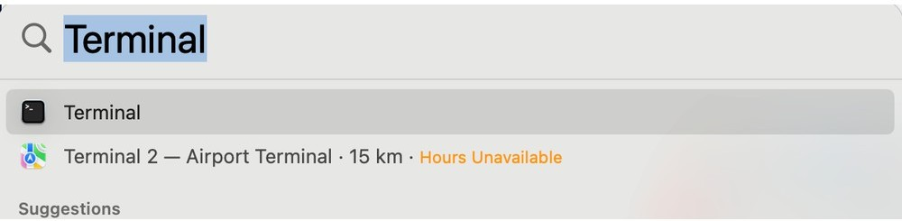
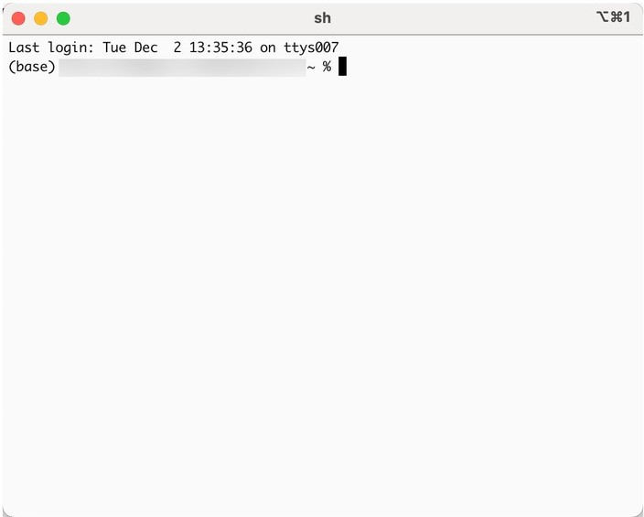
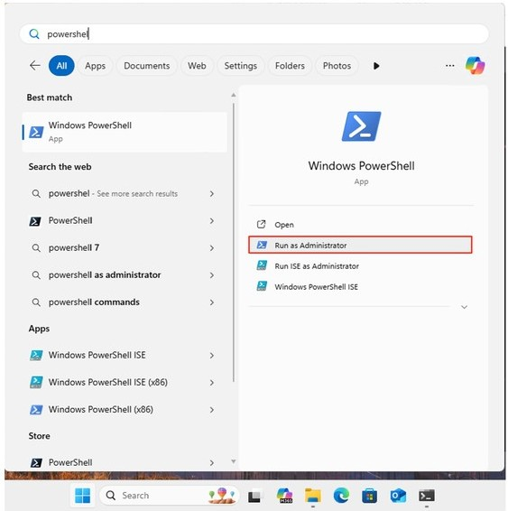
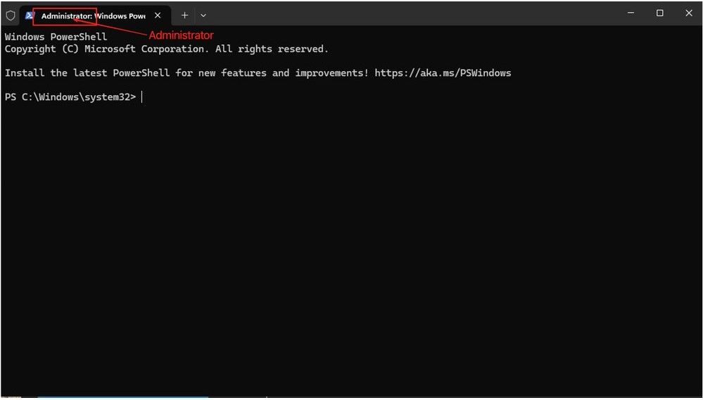
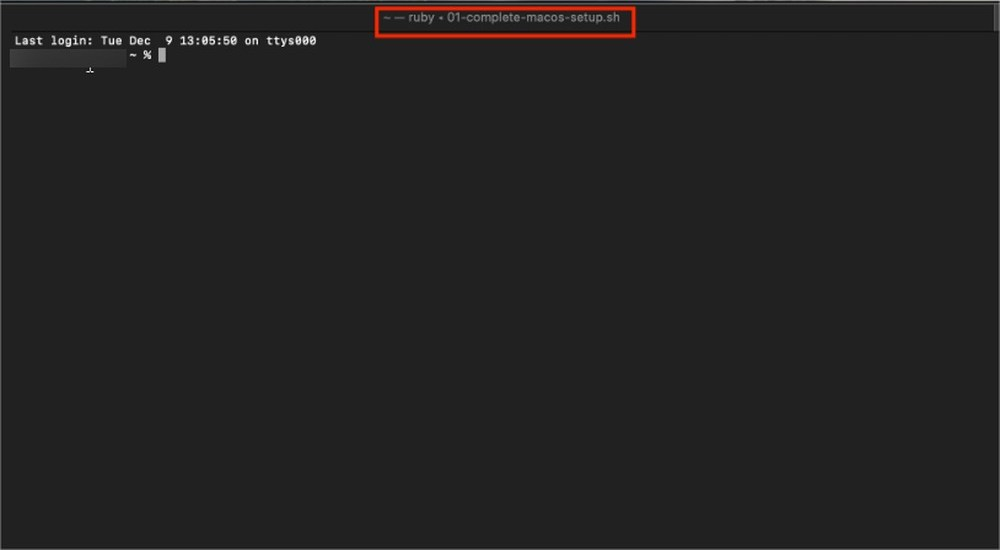
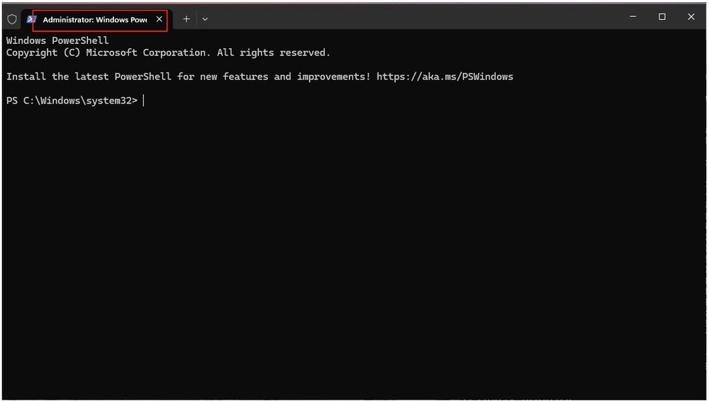
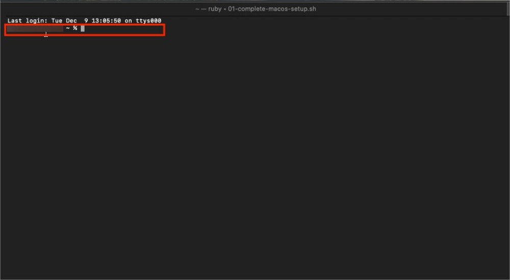
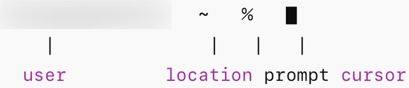
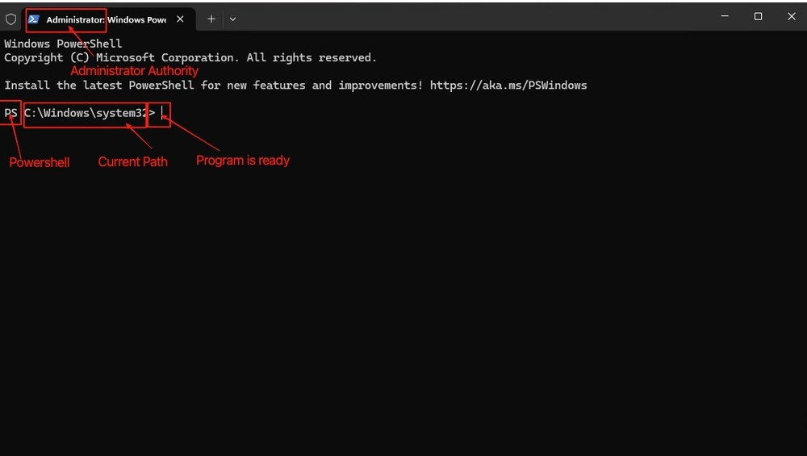

# Terminal 基础

**终端到底是什么？**

终端就是你电脑的「直通热线」。平时你习惯点击图标、拖动窗口，但终端让你直接输入命令，电脑立刻执行。没有点击，没有菜单，只有你和你的电脑，直接对话。

为什么这很重要？因为像 Claude Code 这样的工具就住在终端里。如果你想用 AI 帮你写代码，你得先和这个黑色（或白色）窗口搞好关系。

---

## 如何打开终端

### Mac：召唤终端

按 `Command + 空格`，输入 "Terminal"，然后按回车。

就这么简单。你进来了。

>[!TIP]
>
> 在 Mac 上，你也可以右键点击任意文件夹，选择「在文件夹中新建终端」，这样打开的终端就已经在那个位置了。超级方便。

既然你知道了你在看什么，让我们来打开一个终端。

### Windows：打开 PowerShell

按 `Windows 键`（或 `Win`），输入 "PowerShell"，然后按回车。

>[!WARNING]
>
> 为了避免之后的权限问题，我建议选择 **以管理员身份运行**。未来的你会感谢现在的你。

等待窗口出现。当你在标题栏看到 "Administrator" 时，你就知道你处于管理员模式了。

## 终端窗口解剖学

在开始输入命令之前，让我们先搞清楚你在看什么。终端乍一看可能有点吓人，全是文字，没有按钮，但一旦你了解了各个部分，它其实很有逻辑。

### 标题栏：这个窗口在干什么？

#### Mac

**Mac 终端示例**：**ruby -- 01-complete-macos-setup.sh**

标题栏告诉你：

- **ruby**：当前终端会话的名字
- **01-complete-macos-setup.sh**：当前关联的脚本文件名
- **.sh** 表示这是一个 shell 脚本，终端可以执行它

>[!TIP]
>
> 标题不代表脚本正在运行，它只是告诉你这个窗口关联了什么。把它想象成文件标签名。

#### Windows

**Windows PowerShell 示例**：标题栏显示 "Windows PowerShell" 或 "Administrator: Windows PowerShell"。

### 命令提示符：你的「各就各位」信号

这一行**非常关键**。它告诉你系统已经准备好接收你的命令了。让我们按操作系统逐一拆解。

#### Mac 命令提示符

| 符号 | 含义 | 为什么重要 |
|------|------|------------|
| **User** | 你的用户名 | 当前登录的是谁 |
| **~** | 家目录 | 你的个人文件夹 |
| **%** | 准备接受输入 | 输吧！ |

波浪号 `~` 是你家目录的快捷方式。不用输入 `/Users/你的名字`，你只需要看到 `~`。干净利落。

**组合起来理解：**

- 是谁在操作？ → `User`（就是你自己！）
- 我现在在哪？ → `~`（家，甜蜜的家）
- 系统准备好了吗？ → `%`
- 我在哪输入？ → 闪烁的光标，就在这儿

#### Windows 命令提示符

| 符号 | 含义 | 为什么重要 |
|------|------|------------|
| **PS** | 你在 PowerShell 里 | 和老式 CMD 不同 |
| **C:\Windows\System32** | 你当前所在的文件夹 | 命令会在这里执行 |
| **>** | 系统准备好了 | 来吧，输入点什么 |

**组合起来理解：**

- 我现在在哪？ → `C:\Windows\System32`
- 系统准备好了吗？ → `>`（是的！）
- 我输入的内容会出现在哪里？ → `>` 后面，闪烁的光标处

**总结**

1. **终端** = 与电脑直接进行基于文字的交流
2. **Mac**：`Command + 空格` → "Terminal"
3. **Windows**：以管理员身份打开 PowerShell
4. **命令提示符** = 「我准备好了」的信号（找 `>`、`%` 或 `$`）
5. **你准备好了** 使用像 Claude Code 这样的命令行工具！

---

*还是很紧张？别担心。学习终端最好的方式就是使用它。每运行一个命令，你就会更自在一点。你可以的。*
