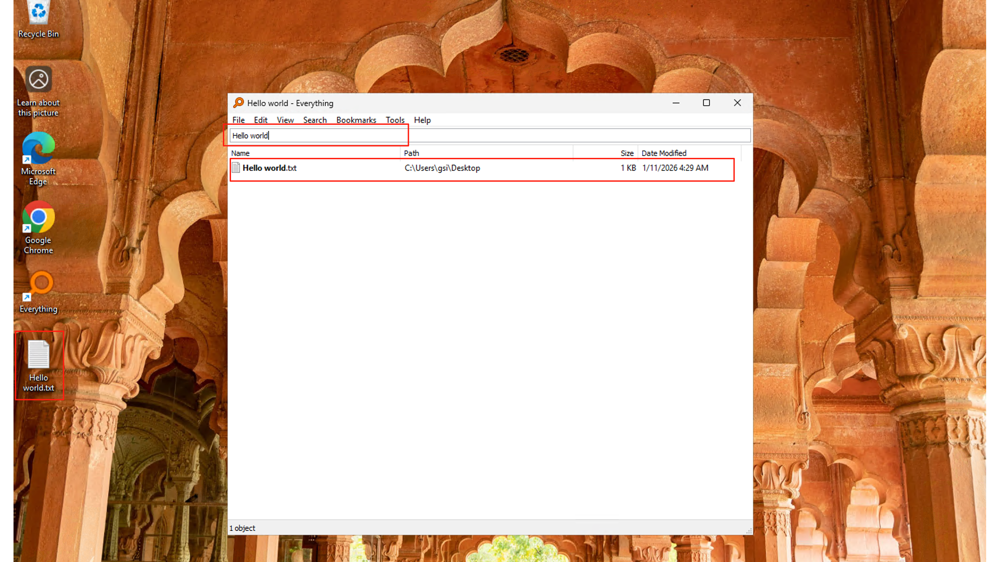
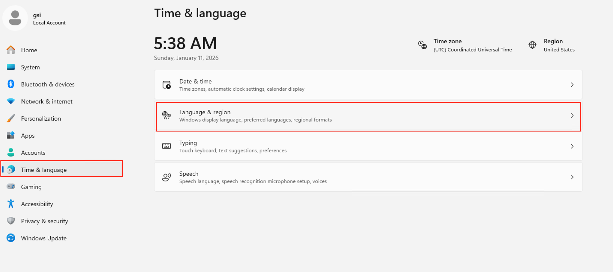
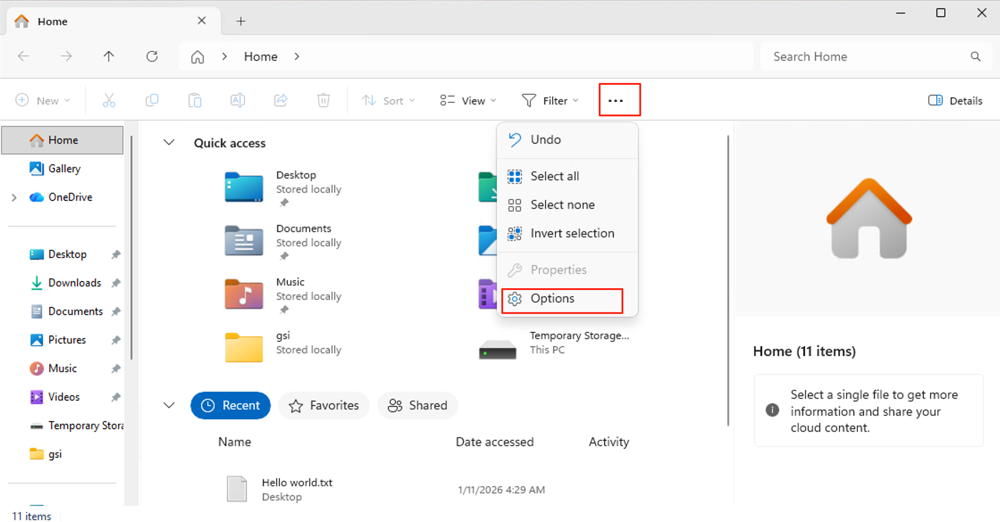
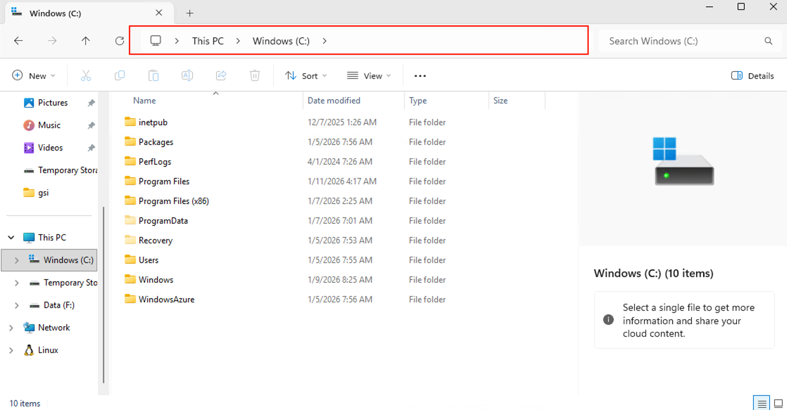
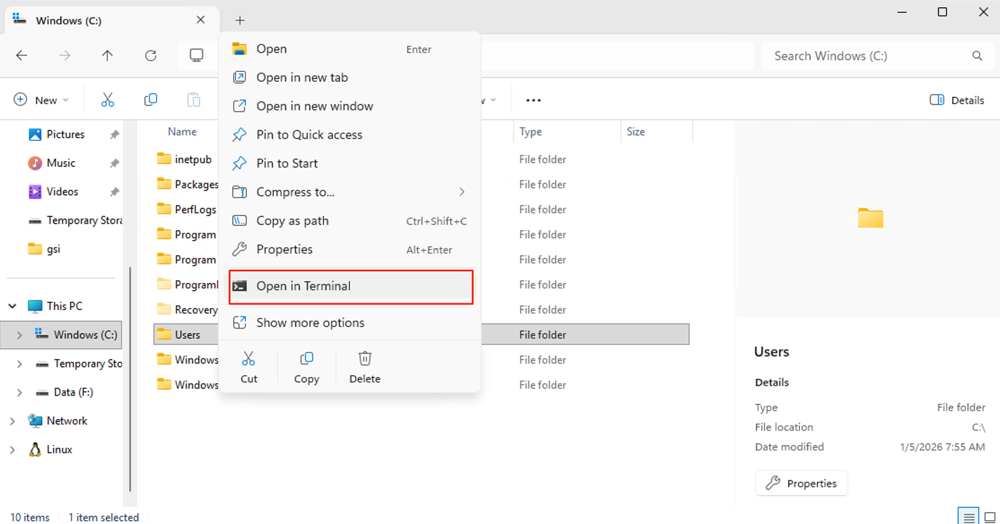
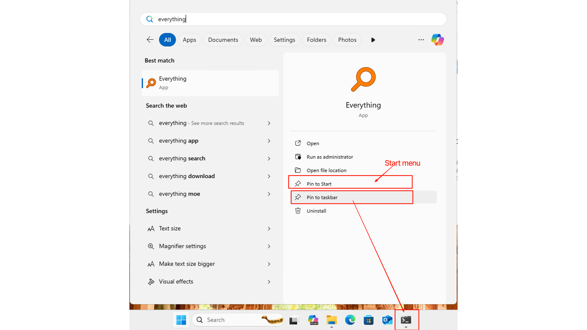

# Windows OS Basics
**Windows 操作系统基础**

## The Big Picture: Why Configure Windows?
**大局观：为什么要配置 Windows？**

Out of the box, Windows is designed for general users — not developers. Hidden files are invisible, file extensions are masked, and the built-in search is... let's just say it's not winning any speed awards. This guide will transform Windows into a developer-friendly environment in just a few minutes.
开箱即用的 Windows 是为普通用户设计的 —— 不是为开发者。隐藏文件看不见，文件扩展名被遮蔽，内置搜索……只能说不怎么快。这篇指南能在几分钟内把 Windows 变成对开发者友好的环境。

---

## Quick Search: Meet Everything
**快速搜索：认识 Everything**

### The Problem with Windows Search
**Windows 搜索的问题**

Let's be honest: Windows' built-in search is slow, resource-heavy, and honestly kind of useless for finding actual files. It's fine for launching apps, but try finding a specific `.json` file somewhere on your drive? Good luck.
老实说：Windows 的内置搜索又慢又吃资源，找实际文件基本没用。启动应用还行，但试试在你硬盘某处找一个特定的 `.json` 文件？祝你好运。

**Everything** is the solution. It's a lightning-fast search tool that indexes your entire drive by filename. We're talking *milliseconds* to find any file.
**Everything** 就是解决方案。它是一个闪电般快速的搜索工具，按文件名索引你的整个驱动器。找任何文件只需要*毫秒*。

### Step 1: Install Everything
**步骤一：安装 Everything**

Open PowerShell and run:
打开 PowerShell，运行：

```powershell
winget install voidtools.Everything
```

> **What this does**:
> - `winget`: Windows' built-in package manager
> - `install`: The action to perform
> - `voidtools.Everything`: The unique ID for Everything (found via `winget search everything`)
>
> **命令解释**：
> - `winget`：Windows 内置的包管理器
> - `install`：要执行的动作
> - `voidtools.Everything`：Everything 的唯一 ID（可通过 `winget search everything` 找到）


### Step 2: Launch and Search
**步骤二：启动并搜索**

After installation, you'll find an **Everything** shortcut on your desktop. Double-click to open it.
安装后，桌面上会出现 **Everything** 快捷方式。双击打开。


Type anything in the search box — a filename, a partial name, even content inside files (if you enable content search). Results appear instantly.
在搜索框输入任何内容 —— 文件名、部分名称，甚至文件内容（如果启用内容搜索）。结果立刻出现。



💡 **Pro Tip**: Press `Ctrl + Space` (or your custom shortcut) to bring up Everything from anywhere. It's like having a search superpower.
💡 **小贴士**：按 `Ctrl + Space`（或你设置的自定义快捷键）可以在任何地方调出 Everything。就像拥有了搜索超能力。

---

## System Language Settings
**系统语言设置**

If your Windows is in Chinese and you want to switch to English (or vice versa), here's how:
如果你的 Windows 是中文的，想切换成英文（或反过来），操作如下：

### Step 1: Open Settings
**步骤一：打开设置**

Press `Win`, type "settings", and hit Enter.
按 `Win`，输入 "settings"，然后按回车。


### Step 2: Navigate to Language Settings
**步骤二：进入语言设置**

Go to **Time & language** → **Language & region**.
依次点击 **Time & language** → **Language & region**。



### Step 3: Add or Change Language
**步骤三：添加或更改语言**

Here you can add new languages and set your preferred one as default. Windows will download the language pack and apply it after you sign out and back in.
在这里你可以添加新语言并将你喜欢的设为默认。Windows 会下载语言包，在你注销并重新登录后生效。


---

## File Management Essentials
**文件管理要点**

### File Explorer: Your File Command Center
**文件资源管理器：你的文件指挥中心**

Windows uses **File Explorer** for file management. Quick access: press `Win + E` or click the folder icon in your taskbar.
Windows 使用**文件资源管理器**进行文件管理。快速访问：按 `Win + E` 或点击任务栏中的文件夹图标。

---

### Show File Extensions & Hidden Files
**显示文件扩展名和隐藏文件**

⚠️ **Critical for Developers**: By default, Windows hides file extensions (so `script.sh` appears as just `script`) and hides system files. This is a nightmare when you're working with config files like `.gitignore`, `.env`, or trying to distinguish `.json` from `.js`.
⚠️ **开发者必读**：默认情况下，Windows 隐藏文件扩展名（所以 `script.sh` 只显示为 `script`）并隐藏系统文件。当你处理 `.gitignore`、`.env` 等配置文件，或区分 `.json` 和 `.js` 时，这简直是噩梦。

Let's fix this:
让我们修复这个问题：

**Step 1**: Open File Explorer, click the **...** icon in the top-right corner, and select **Options**.
**步骤一**：打开文件资源管理器，点击右上角的 **...** 图标，选择 **Options**。



**Step 2**: Switch to the **View** tab. Make these changes:
**步骤二**：切换到 **View** 标签。进行以下更改：

- ✅ Check **Show hidden files, folders, and drives**
- ✅ 勾选 **Show hidden files, folders, and drives**
- ❌ Uncheck **Hide extensions for known file types**
- ❌ 取消勾选 **Hide extensions for known file types**


**Step 3**: Click **Apply** → **OK**.
**步骤三**：点击 **Apply** → **OK**。


💡 **Pro Tip**: Now you'll see files like `.gitignore`, `.env`, and every file will show its true extension. Much better.
💡 **小贴士**：现在你能看到 `.gitignore`、`.env` 等文件，每个文件都会显示真实的扩展名。好多了。

---

### The File Path Bar
**文件路径栏**

At the top of File Explorer, you'll see the path bar showing your current location. Click any folder in the path to jump there instantly.
在文件资源管理器顶部，你会看到显示当前位置的路径栏。点击路径中的任何文件夹可以立即跳转。



💡 **Pro Tip**: Right-click any folder in File Explorer and select **Open in Terminal** to launch a terminal already navigated to that location. Super handy for running scripts.
💡 **小贴士**：在文件资源管理器中右键点击任何文件夹，选择 **Open in Terminal** 可以启动一个已经导航到该位置的终端。运行脚本时超级方便。



---

## Keep Your Desktop Clean
**保持桌面整洁**

A cluttered desktop is a cluttered mind. Let's organize your apps properly.
杂乱的桌面等于杂乱的大脑。让我们好好整理你的应用。

### Pin Apps to Start Menu or Taskbar
**将应用固定到开始菜单或任务栏**

Press `Win`, search for an app (like Everything), then:
按 `Win`，搜索一个应用（比如 Everything），然后：

- **Pin to Start** → Adds it to your Start menu tiles
- **Pin to Start** → 添加到开始菜单磁贴
- **Pin to taskbar** → Adds it to your bottom taskbar for one-click access
- **Pin to taskbar** → 添加到底部任务栏，一键访问



Now press `Win` again — you'll see your pinned apps ready to launch.
再按一次 `Win` —— 你会看到固定的应用随时可以启动。


| Location | Best For |
|----------|----------|
| **Taskbar** | Daily essentials (Terminal, VS Code, Browser) |
| **Start Menu** | Occasional apps (Settings, specific tools) |
| **Desktop** | Temporary files only — keep it clean! |

| 位置 | 最适合 |
|------|--------|
| **任务栏** | 每日必用（终端、VS Code、浏览器）|
| **开始菜单** | 偶尔使用的应用（设置、特定工具）|
| **桌面** | 仅限临时文件 —— 保持干净！|

---

## Summary

1. **Install Everything** for lightning-fast file search
2. **Change system language** in Settings → Time & language → Language & region
3. **Show file extensions** in File Explorer options (critical for developers!)
4. **Show hidden files** to see config files like `.gitignore`
5. **Use the path bar** to navigate and open terminals quickly
6. **Pin apps** to Start or taskbar — keep your desktop clean

**总结**

1. **安装 Everything** 获得闪电般快速的文件搜索
2. **更改系统语言** 在设置 → 时间和语言 → 语言和区域
3. **显示文件扩展名** 在文件资源管理器选项中（开发者必做！）
4. **显示隐藏文件** 以看到 `.gitignore` 等配置文件
5. **使用路径栏** 快速导航和打开终端
6. **固定应用** 到开始菜单或任务栏 —— 保持桌面干净

---

*Your Windows machine is now developer-ready. These small tweaks will save you hours of frustration down the road.*
*你的 Windows 机器现在对开发者友好了。这些小调整会在未来为你节省无数小时的沮丧。*
