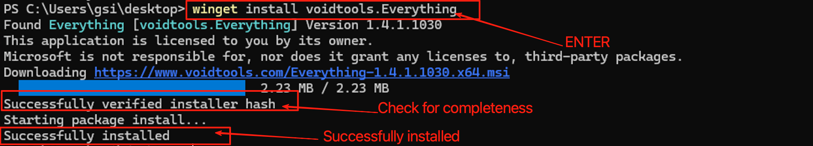
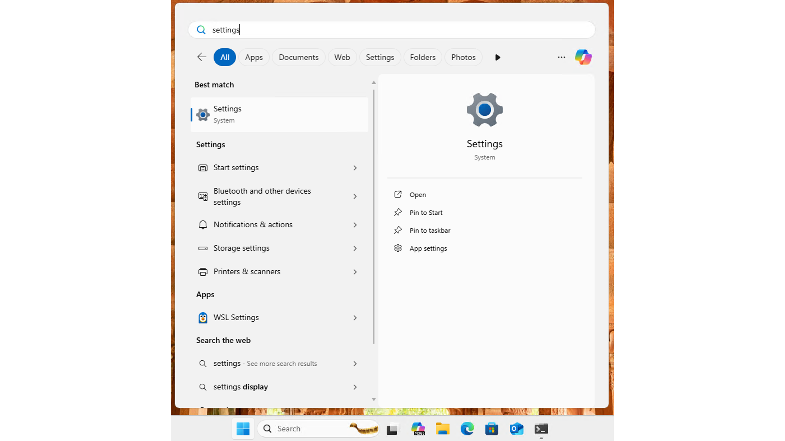
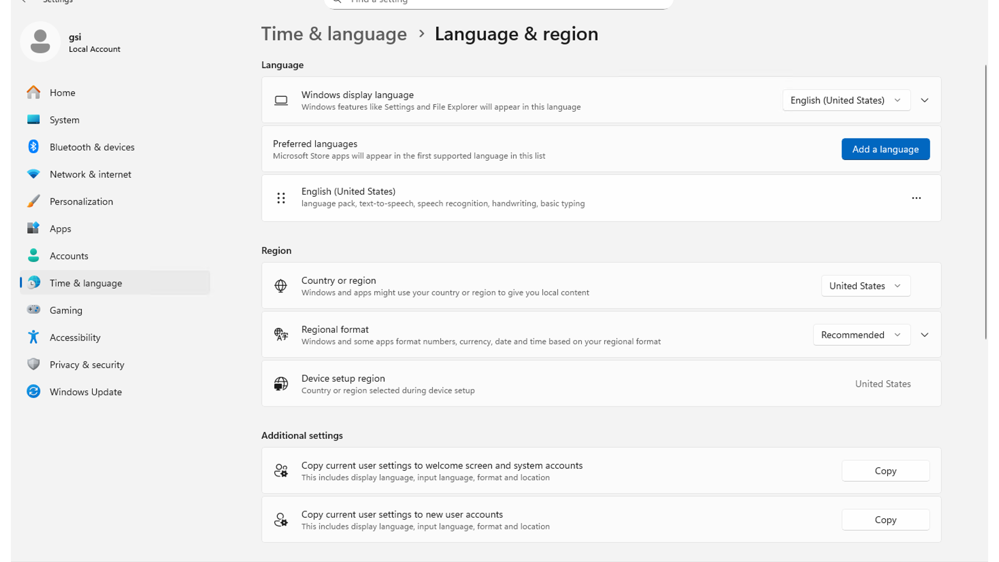
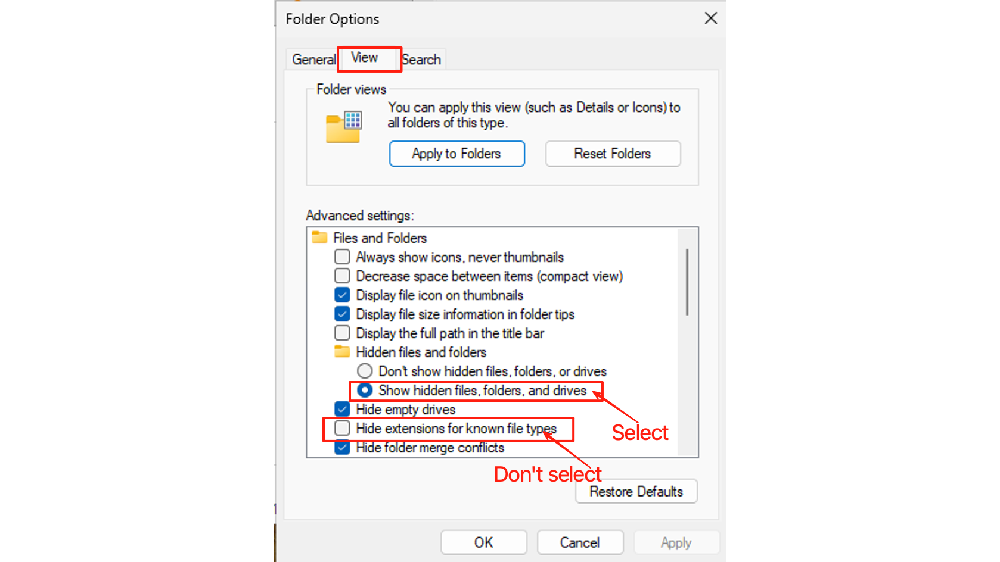
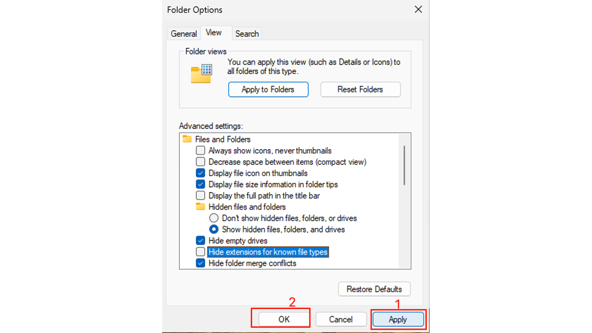
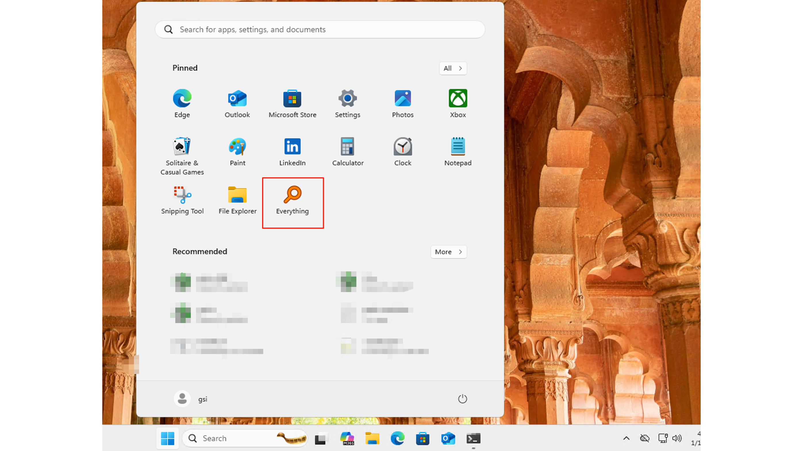

# Windows OS Basics

## Why Configure Windows?

Out of the box, Windows is designed for general users — not developers. Hidden files are invisible, file extensions are masked, and the built-in search is... let's just say it's not winning any speed awards. This guide will transform Windows into a developer-friendly environment in just a few minutes.

---

## Quick Search: Meet Everything

### The Problem with Windows Search

Let's be honest: Windows' built-in search is slow, resource-heavy, and honestly kind of useless for finding actual files. It's fine for launching apps, but try finding a specific `.json` file somewhere on your drive? Good luck.

**Everything** is the solution. It's a lightning-fast search tool that indexes your entire drive by filename. We're talking *milliseconds* to find any file.

### Step 1: Install Everything

Open PowerShell and run:

```powershell
winget install voidtools.Everything
```

> **What this does**:
> - `winget`: Windows' built-in package manager
> - `install`: The action to perform
> - `voidtools.Everything`: The unique ID for Everything (found via `winget search everything`)



### Step 2: Launch and Search

After installation, you'll find an **Everything** shortcut on your desktop. Double-click to open it.


Type anything in the search box — a filename, a partial name, even content inside files (if you enable content search). Results appear instantly.


💡 **Pro Tip**: Press `Ctrl + Space` (or your custom shortcut) to bring up Everything from anywhere. It's like having a search superpower.

---

## System Language Settings

If your Windows is in Chinese and you want to switch to English (or vice versa), here's how:

### Step 1: Open Settings

Press `Win`, type "settings", and hit Enter.



### Step 2: Navigate to Language Settings

Go to **Time & language** → **Language & region**.


### Step 3: Add or Change Language

Here you can add new languages and set your preferred one as default. Windows will download the language pack and apply it after you sign out and back in.



---

## File Management Essentials

### File Explorer: Your File Command Center

Windows uses **File Explorer** for file management. Quick access: press `Win + E` or click the folder icon in your taskbar.

---

### Show File Extensions & Hidden Files

⚠️ **Critical for Developers**: By default, Windows hides file extensions (so `script.sh` appears as just `script`) and hides system files. This is a nightmare when you're working with config files like `.gitignore`, `.env`, or trying to distinguish `.json` from `.js`.

Let's fix this:

**Step 1**: Open File Explorer, click the **...** icon in the top-right corner, and select **Options**.


**Step 2**: Switch to the **View** tab. Make these changes:

- ✅ Check **Show hidden files, folders, and drives**
- ❌ Uncheck **Hide extensions for known file types**



**Step 3**: Click **Apply** → **OK**.



💡 **Pro Tip**: Now you'll see files like `.gitignore`, `.env`, and every file will show its true extension. Much better.

---

### The File Path Bar

At the top of File Explorer, you'll see the path bar showing your current location. Click any folder in the path to jump there instantly.


💡 **Pro Tip**: Right-click any folder in File Explorer and select **Open in Terminal** to launch a terminal already navigated to that location. Super handy for running scripts.


---

## Keep Your Desktop Clean

A cluttered desktop is a cluttered mind. Let's organize your apps properly.

### Pin Apps to Start Menu or Taskbar

Press `Win`, search for an app (like Everything), then:

- **Pin to Start** → Adds it to your Start menu tiles
- **Pin to taskbar** → Adds it to your bottom taskbar for one-click access


Now press `Win` again — you'll see your pinned apps ready to launch.



| Location | Best For |
|----------|----------|
| **Taskbar** | Daily essentials (Terminal, VS Code, Browser) |
| **Start Menu** | Occasional apps (Settings, specific tools) |
| **Desktop** | Temporary files only — keep it clean! |

---

## Summary

1. **Install Everything** for lightning-fast file search
2. **Change system language** in Settings → Time & language → Language & region
3. **Show file extensions** in File Explorer options (critical for developers!)
4. **Show hidden files** to see config files like `.gitignore`
5. **Use the path bar** to navigate and open terminals quickly
6. **Pin apps** to Start or taskbar — keep your desktop clean

---

*Your Windows machine is now developer-ready. These small tweaks will save you hours of frustration down the road.*
