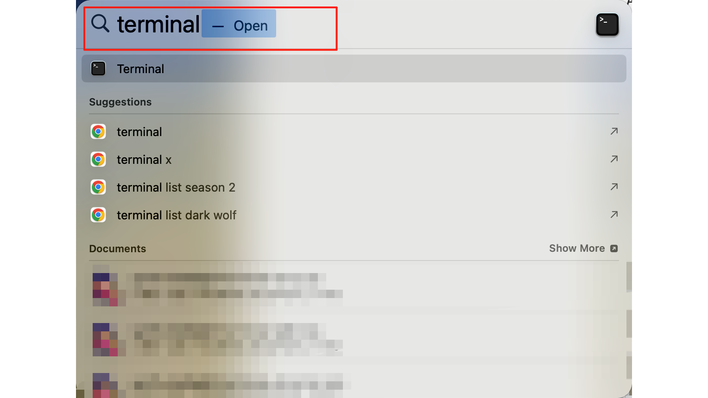
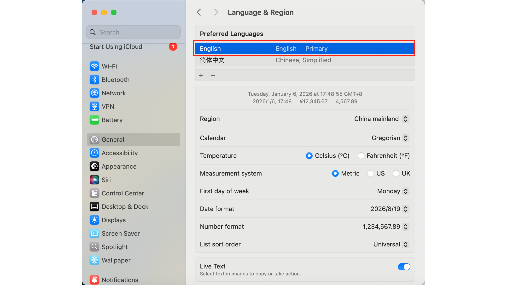
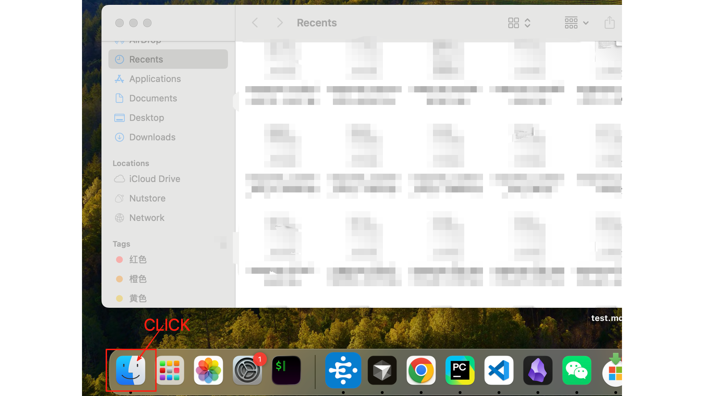
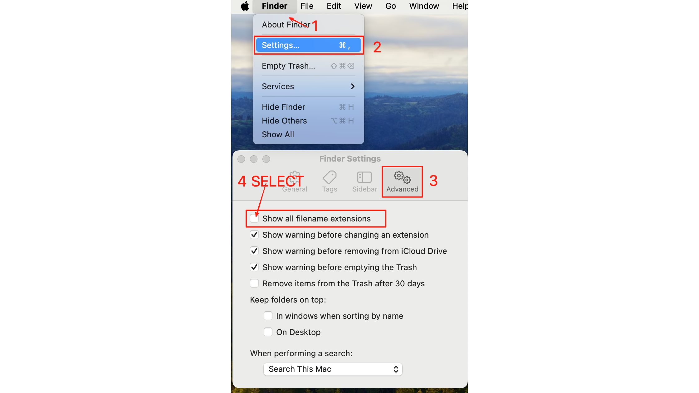
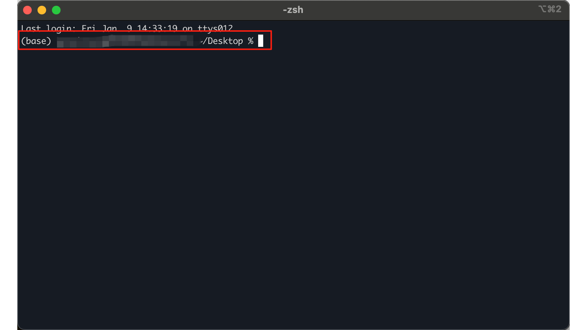
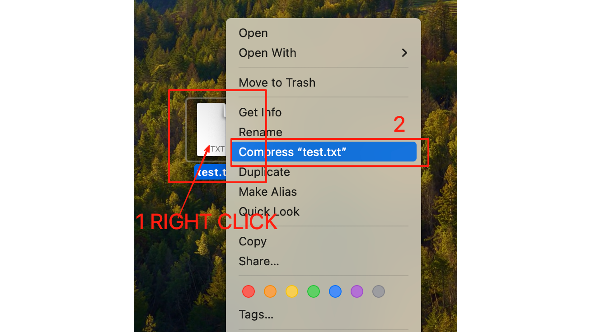
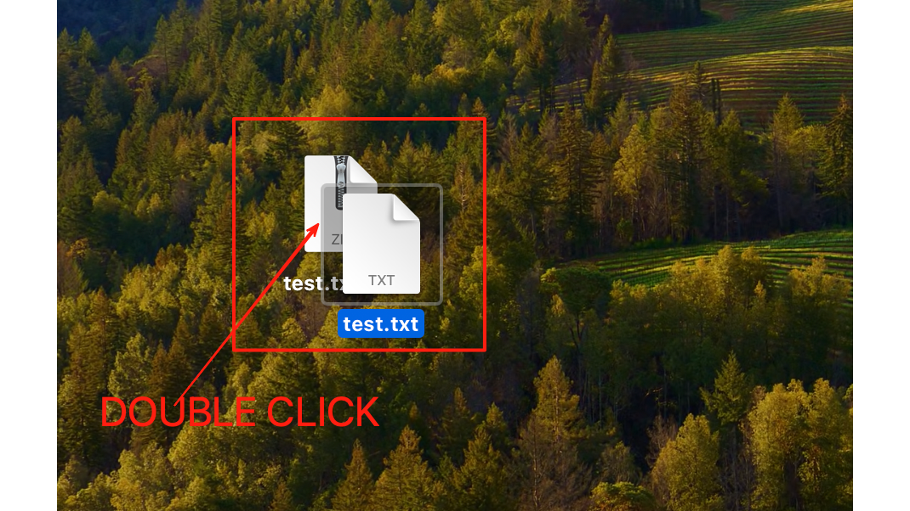
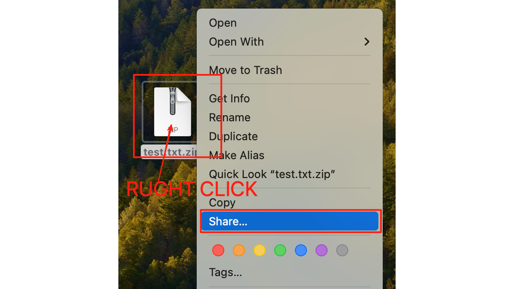
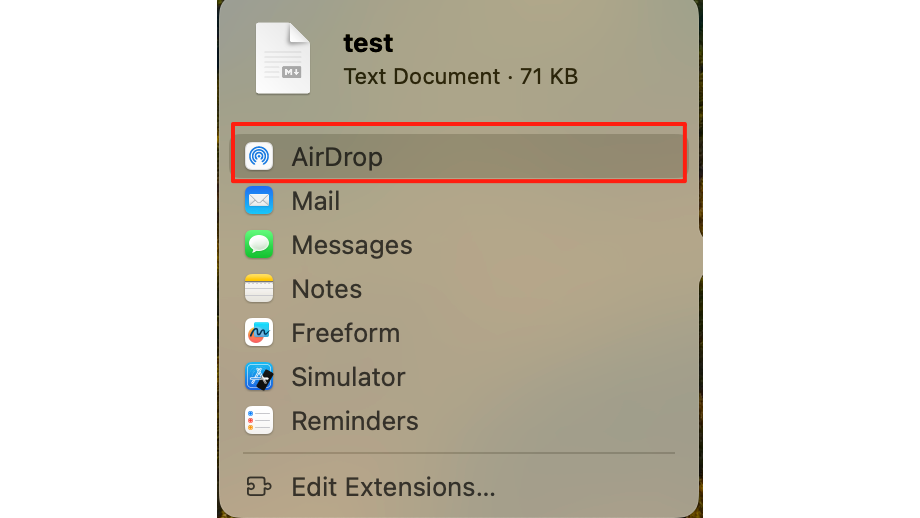
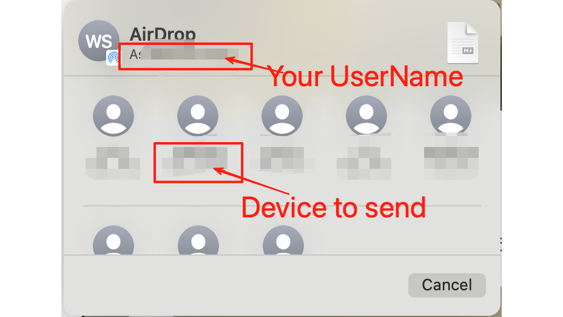

---

layout: doc

title: Mac OS Basics · Mac 操作系统基础

---

# Mac 操作系统基础

## Quick Search (快速搜索)

### Mac: Spotlight Search

Using the shortcut key `command + space` allows for quick searching of matching programs and files.
使用 `command + space` 快捷键可以快速搜索匹配的程序和文件。

## System Language Settings (系统语言设置)

Open **System Settings** -> **General** -> **Language & Region.**
打开 **System Settings（系统设置）** -> **General（通用）** -> **Language & Region（语言与区域）**。

Add **English** to "Preferred Languages" and drag it to the top.
将 **English** 添加到 "Preferred Languages" 并将其拖动到顶部。

## File Management (文件管理)

### Finder

Finder is the core of file management on macOS. Click the icon at the lower left corner of the Dock to enter Finder.
Finder 是 macOS 文件管理的核心。点击 Dock 左下角的图标即可进入 Finder 。

### Show File Extensions and hidden files (显示文件扩展名和隐藏文件)

It is critical for developers to see the exact file type (e.g., `.md`, `.sh`, `.json`).
对于开发者来说，看到确切的文件类型（如 `.md`, `.sh`, `.json`）至关重要。

Open **Finder** -> **Settings** (Command + ,).
打开 **Finder** -> **Settings** (Command + ,)。
Click **Advanced** -> Check **Show all filename extensions.**
点击 **Advanced（高级）** -> 勾选 **Show all filename extensions**。

Press `command + shift + .` to show all hidden files.
按下 `command + shift + .` 展示所有隐藏文件。

### File Path Bar (文件路径栏)

Click **View** -> **Show Path Bar** to open the file path bar, making it easy to locate and operate on files.
点击 View -> Show Path Bar 能够打开文件路径栏，方便定位文件的位置并进行操作。

For example, you can right-click the file path and select **Open in Terminal.**
例如，可右键文件路径并选择 Open in Terminal。

This allows you to quickly open the **Terminal** at the selected path.
即可在选中路径快速打开 Terminal。

### File Compression (文件压缩)

**Compression**: Right-click any file or folder and select **Compress "..."** to create a `.zip` archive.
**压缩**：右键点击任何文件或文件夹，选择 **Compress "..."** 即可创建一个 `.zip` 压缩包。

**Extraction**: Simply double-click the `.zip` compressed file to extract the contents.
**解压**：双击任何 `.zip` 压缩包即可解压文件。

## Application Organization (应用程序组织)

The Dock (the application area at the bottom of the screen) should be kept clean to improve focus and efficiency.
Dock 栏（屏幕底部的应用区）应保持整洁，以提高注意力及工作效率。

**Remove Unused Apps**: Right-click (or two-finger click) on unnecessary icons -> **Options** -> **Remove from Dock.**
**移除无用应用**：右键点击不必要的图标 -> **Options** -> **Remove from Dock**。

## System Deep Settings (系统深层设置)

### Trackpad Optimization

Maximize efficiency by enabling "Tap to Click."
通过开启"轻点点按"来提高效率。

Go to **System Settings** -> **Trackpad.**
进入 **System Settings** -> **Trackpad（触控板）**。
Enable **Tap to click.**
开启 **Tap to click（轻点点按）**。

You can also adjust the mode of the touchpad according to your own preference.
也可根据自己的习惯调整触控板的模式。

**Look up & data detectors** allow you to quickly check the meaning of words, defaulting to a three-finger click on the word.
**Look up & data detectors** 能够快速查询单词的含义，默认为三指点击单词。

**Secondary Click** allows you to modify the way the right-click is triggered.
**Secondary Click** 能够修改触发右键的方式。

## File Sharing (文件共享)

### AirDrop

AirDrop allows for the transfer of files between Mac, iPad and iPhone devices. You can open AirDrop from the status bar in the upper right corner of the Mac. It supports fast file sharing without the need for an internet connection, and can transfer a variety of files including photos, videos, documents, and more.
AirDrop能在Mac、iPad和iPhone设备之间互传文件，在Mac右上角的状态栏可打开AirDrop。它支持无需联网即可快速传输各种文件，包括照片、视频、文档等。

**Sharing**: Use the **Share** menu to quickly send files via AirDrop or other integrated apps.
**共享**：使用 **Share** 菜单通过 AirDrop 或其他集成应用快速发送文件。

Following the previous step, click `AirDrop` to transfer files.
接着上一步，点击 `AirDrop` 传输文件。

Below AirDrop is the name of the sender. There are many devices listed below; click on the avatar to send the file to the other person's device.
AirDrop 下方的是发送方的名称，下方有许多设备，点击头像即可发送给对方的设备。

Click **About This Mac** -> **More Info** to view the name of your machine, which makes it easier to confirm the specific recipient.
点击 About This Mac -> More Info 即可查看本机的名称，方便确认具体的接收方。

