## Mac 操作系统基础

## 大局观：为什么要配置 macOS？

macOS 开箱即用就已经对开发者相当友好了，但有一些隐藏设置能让你的生活轻松很多。从查找文件到管理工作空间，这篇指南涵盖了每个开发者都应该知道的基础知识。

---

## 快速搜索：Spotlight

### 内置超能力

macOS 自带 **Spotlight 搜索** —— 而且它真的很好用。不需要安装任何额外的东西。

按 `Command + 空格` 开始输入。Spotlight 可以搜索应用、文件、邮件、联系人，甚至可以做计算和货币换算。

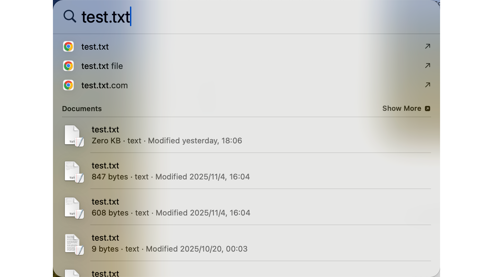

💡 **小贴士**：Spotlight 会学习你的使用习惯。你用得越多，它就越聪明，越能预测你要找什么。

---

## 系统语言设置

想在中英文之间切换？操作如下：

### 步骤一：打开语言设置

进入 **System Settings（系统设置）** → **General（通用）** → **Language & Region（语言与区域）**。

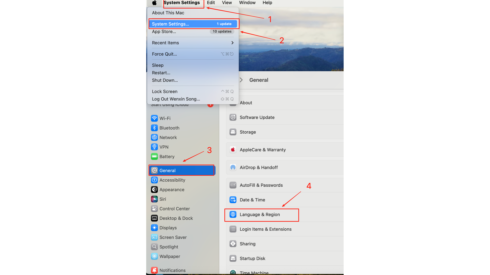

### 步骤二：添加并优先你的语言

将 **English**（或你偏好的语言）添加到"Preferred Languages"，并拖到顶部。macOS 会在重启或注销后更新。

---

## 文件管理要点

### Finder：你的文件指挥中心

**Finder** 是 macOS 文件管理的核心。点击 Dock 中的笑脸图标（默认在左下角）打开它。

---

### 显示文件扩展名和隐藏文件

⚠️ **开发者必读**：默认情况下，macOS 隐藏文件扩展名和系统文件。当你处理 `.gitignore`、`.env`、`.zshrc` 时，你需要看到这些。

#### 显示文件扩展名：

1. 打开 **Finder** → **Settings**（或按 `Command + ,`）

2. 点击 **Advanced（高级）** → 勾选 **Show all filename extensions**

#### 显示隐藏文件：

按 `Command + Shift + .` 可以切换隐藏文件的可见性。再按一次可以隐藏它们。

💡 **小贴士**：以点开头的文件（如 `.gitignore`）在基于 Unix 的系统中默认是隐藏的。这个快捷键是你最好的朋友。

---

### 路径栏

知道自己在文件系统中的位置很重要。让我们启用路径栏：

**步骤一**：在 Finder 中，进入 **View** → **Show Path Bar**

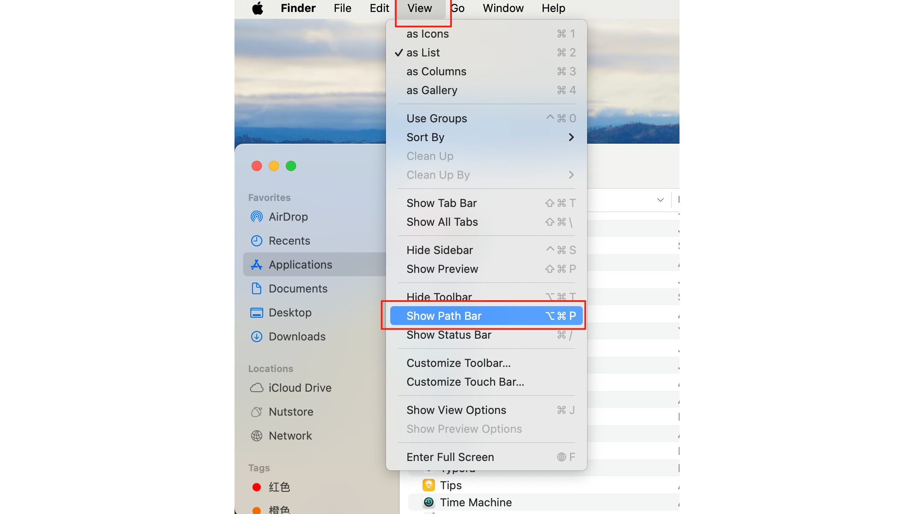

现在你会在每个 Finder 窗口底部看到当前位置。

**步骤二**：右键点击路径栏中的任意位置，在该位置打开终端

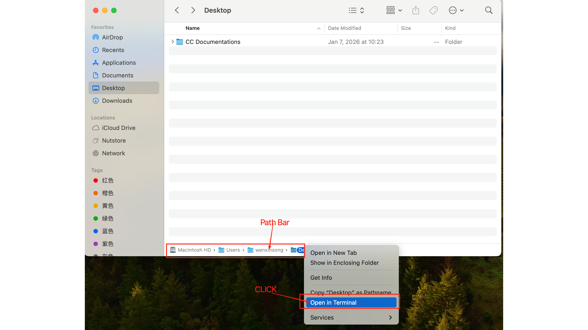

选择 **Open in Terminal**，你就可以运行命令了。

---

### 轻松压缩文件

**压缩**：右键点击任何文件或文件夹 → 选择 **Compress "..."** → 创建一个 `.zip` 文件

**解压**：双击任何 `.zip` 文件 —— macOS 原生支持

不需要额外的软件。它就是能用。

---

## 保持 Dock 整洁

Dock 是黄金地段。杂乱的 Dock 意味着杂乱的工作流。以下是如何保持整洁：

### 移除不用的应用：

右键点击（或双指点击）任何 Dock 图标 → **Options** → **Remove from Dock**

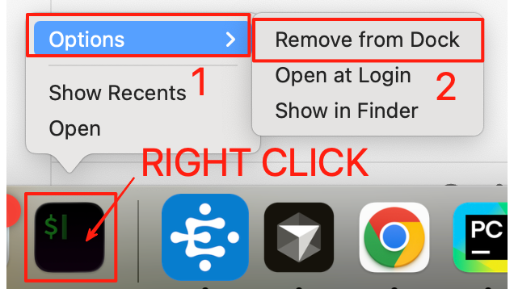

| 保留什么 | 移除什么 |
|----------|----------|
| 每日应用（终端、VS Code、浏览器）| 很少用的应用 |
| 正在学习的应用 | 重复的或替代品 |
| 沟通工具 | 安装程序、一次性工具 |

---

## 触控板优化

Mac 触控板是业界最好的。让我们让它变得更好。

### 启用轻点点按

不再需要物理按下。轻轻一点就够了。

进入 **System Settings** → **Trackpad（触控板）** → 开启 **Tap to click（轻点点按）**

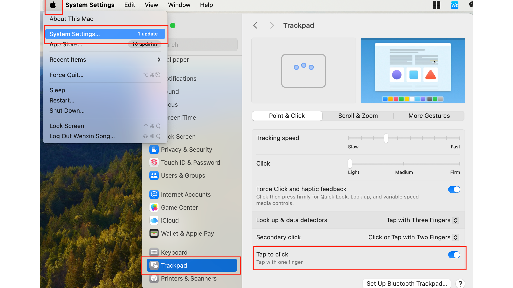

你也可以根据自己的习惯自定义其他触控板行为。

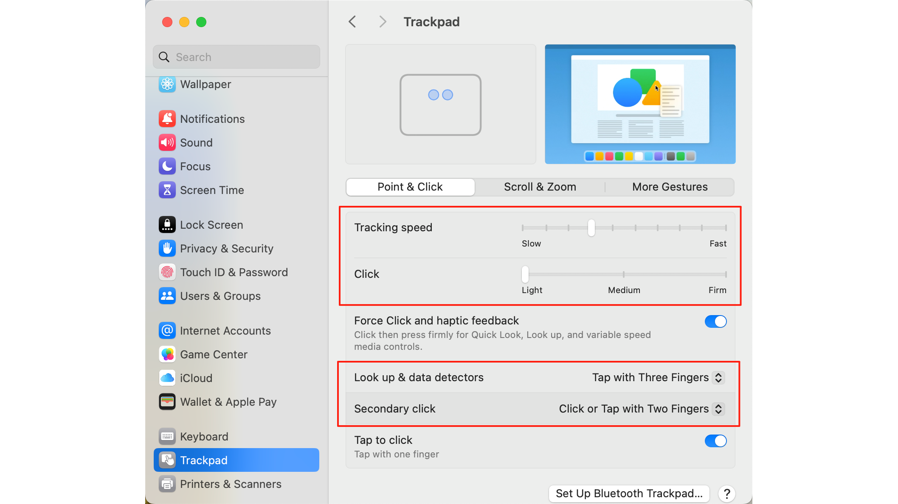

### 自定义手势

| 功能 | 作用 | 默认设置 |
|------|------|----------|
| **Look up & data detectors** | 快速查字典 | 三指轻点单词 |
| **Secondary click** | 右键功能 | 双指点按或点击角落 |

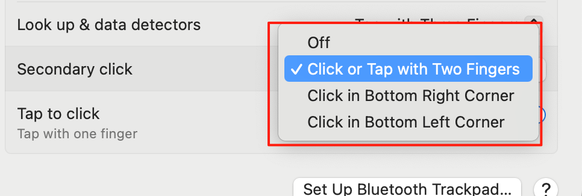

💡 **小贴士**：花 5 分钟在 System Settings → Trackpad 里探索所有手势。肌肉记忆以后会感谢你的。

---

## 用 AirDrop 共享文件

### 苹果生态超能力

**AirDrop** 让你在 Mac、iPhone 和 iPad 之间即时共享文件 —— 不需要网络，没有文件大小限制，没有麻烦。

### 如何使用 AirDrop

#### 步骤一：从控制中心打开 AirDrop（屏幕右上角）

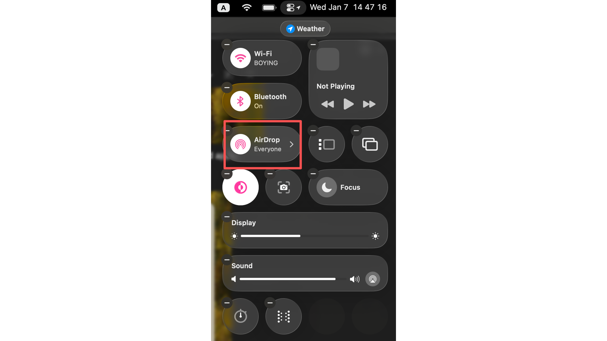

#### 步骤二：在任意应用中，点击 **Share** 按钮，选择 **AirDrop**

#### 步骤三：从附近的设备列表中选择接收者

### 找到你的 Mac 名称

确保别人能找到你，检查你的 Mac 名称：

点击 **Apple 菜单** → **About This Mac** → **More Info**

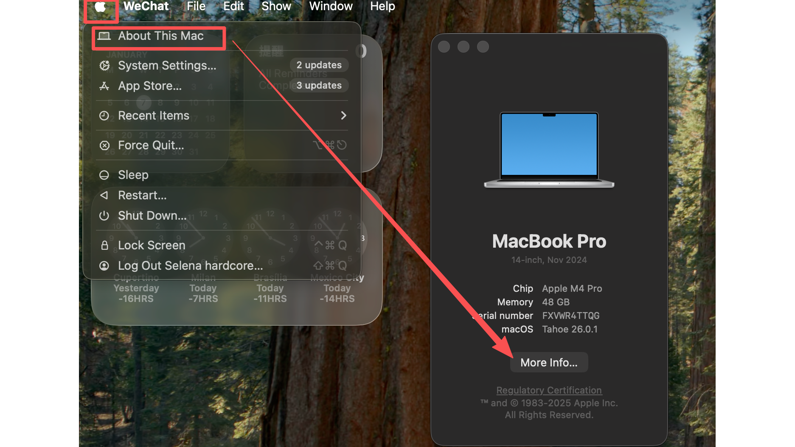

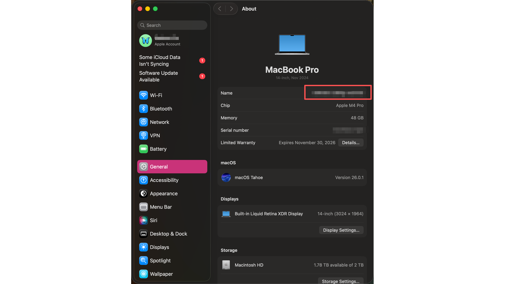

你的 Mac 名称会显示在这里。这就是别人给你 AirDrop 时会看到的名称。

---

## 总结

1. **Spotlight 搜索**：`Command + 空格` 即时搜索
2. **语言设置**：系统设置 → 通用 → 语言与区域
3. **显示文件扩展名**：Finder 设置 → 高级 → 显示所有文件扩展名
4. **显示隐藏文件**：`Command + Shift + .`
5. **路径栏**：显示 → 显示路径栏（右键可打开终端）
6. **整洁的 Dock**：移除不用的应用，只保留必要的
7. **触控板**：启用「轻点点按」提高效率
8. **AirDrop**：在苹果设备间即时共享文件

*你的 Mac 现在已经为开发者生产力调整好了。这些不仅仅是技巧 —— 它们是高效工作流的基础。*
