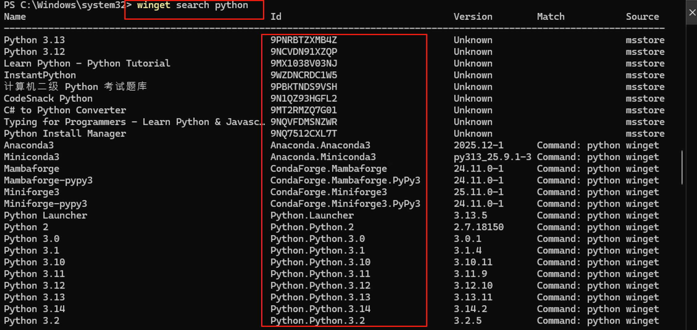
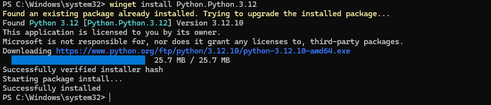

# winget Basics
**winget 基础**

## The Big Picture: Why Use a Package Manager?
**大局观：为什么要用包管理器？**

Remember how you used to install software? Go to a website, find the download button, run the installer, click "Next" seventeen times, uncheck some toolbar you didn't ask for, and hope nothing breaks. Fun times.
还记得以前怎么安装软件吗？去网站，找下载按钮，运行安装程序，点十七次「下一步」，取消勾选你不想要的工具栏，然后祈祷不出问题。真是美好的回忆。

**Package managers** are here to save you from that nightmare. Think of them as an "App Store" for your terminal. One command, and software installs automatically — no clicking, no toolbars, no drama.
**包管理器** 来把你从噩梦中拯救出来。把它想象成终端里的「应用商店」。一条命令，软件自动安装 —— 不用点击，没有工具栏，没有狗血剧情。

| Traditional Way | Package Manager Way |
|-----------------|---------------------|
| Download installer | `winget install python` |
| Run installer | Done. |
| Click through wizard | |
| Uncheck bloatware | |
| Reboot sometimes | |

| 传统方式 | 包管理器方式 |
|----------|--------------|
| 下载安装包 | `winget install python` |
| 运行安装程序 | 搞定。 |
| 点击向导 | |
| 取消勾选捆绑软件 | |
| 有时需要重启 | |

---

## What is winget?
**什么是 winget？**

**winget** (Windows Package Manager) is Microsoft's official package manager for Windows. It's like Homebrew for Mac, but built right into Windows. The software ecosystem is surprisingly rich — most popular programs are available.
**winget**（Windows 包管理器）是微软官方的 Windows 包管理器。就像 Mac 的 Homebrew，但内置于 Windows。软件生态相当丰富 —— 大多数常用程序都能找到。

💡 **Pro Tip**: winget comes pre-installed on Windows 10 (version 1809+) and Windows 11. If you're on an older version, you might need to install it from the Microsoft Store first.
💡 **小贴士**：winget 预装在 Windows 10（1809 版本以上）和 Windows 11 上。如果你用的是旧版本，可能需要先从 Microsoft Store 安装。

⚠️ **Note**: All programs installed via winget go to the default system location. If you need to install something to a specific drive (like D:), you'll need to use the traditional installer method for that program.
⚠️ **注意**：通过 winget 安装的所有程序都会放到系统默认位置。如果你需要把某个程序安装到特定盘（比如 D 盘），那就得用传统的安装程序方式。

---

## Step 1: Find What You Want (Search)
**步骤一：找到你想要的（搜索）**

Before installing, let's find the exact package name. Why? Because one program might have multiple versions, and you want the right one.
安装之前，先找到确切的包名。为什么？因为一个程序可能有多个版本，你要选对。

In your terminal, type:
在终端里输入：

```powershell
winget search python
```

> **What this does**:
> - Searches the winget repository for anything matching "python"
> - Returns a list with names, IDs, versions, and sources
>
> **命令解释**：
> - 在 winget 仓库中搜索所有匹配 "python" 的内容
> - 返回一个列表，包含名称、ID、版本和来源



💡 **Pro Tip**: Use the **ID** column for installation instead of the name. It's more precise and avoids confusion when multiple versions exist.
💡 **小贴士**：安装时用 **ID** 列而不是名称。这样更精确，能避免多个版本时的混淆。

---

## Step 2: Install It (One Command)
**步骤二：安装（一条命令）**

Found what you need? Now install it with the ID you got from the search:
找到需要的了？用搜索得到的 ID 来安装：

```powershell
winget install Python.Python.3.12
```

> **What this does**:
> - Downloads the installer automatically
> - Runs the installation silently (no clicking through wizards)
> - Handles dependencies if needed
>
> **命令解释**：
> - 自动下载安装程序
> - 静默安装（不用点击向导）
> - 如果需要的话，处理依赖关系



That's it. Python is now installed on your system.
就这样。Python 已经安装到你的系统上了。

---

## Common winget Commands Cheat Sheet
**常用 winget 命令速查表**

| Command | What It Does | Example |
|---------|--------------|---------|
| `winget search <name>` | Find a package | `winget search node` |
| `winget install <id>` | Install a package | `winget install OpenJS.NodeJS.LTS` |
| `winget list` | Show installed packages | `winget list` |
| `winget upgrade <id>` | Update a package | `winget upgrade Python.Python.3.12` |
| `winget upgrade --all` | Update everything | `winget upgrade --all` |
| `winget uninstall <id>` | Remove a package | `winget uninstall Python.Python.3.12` |

| 命令 | 作用 | 示例 |
|------|------|------|
| `winget search <名称>` | 搜索软件包 | `winget search node` |
| `winget install <id>` | 安装软件包 | `winget install OpenJS.NodeJS.LTS` |
| `winget list` | 显示已安装的软件包 | `winget list` |
| `winget upgrade <id>` | 更新软件包 | `winget upgrade Python.Python.3.12` |
| `winget upgrade --all` | 更新所有软件包 | `winget upgrade --all` |
| `winget uninstall <id>` | 卸载软件包 | `winget uninstall Python.Python.3.12` |

---

## Summary

1. **Package managers** = terminal-based app stores (no clicking, no bloatware)
2. **winget** = Microsoft's official package manager for Windows
3. **Search first**: `winget search <name>` → find the ID
4. **Install with ID**: `winget install <id>` → done!
5. **Upgrade easily**: `winget upgrade --all` keeps everything current

**总结**

1. **包管理器** = 终端版应用商店（不用点击，没有捆绑软件）
2. **winget** = 微软官方的 Windows 包管理器
3. **先搜索**：`winget search <名称>` → 找到 ID
4. **用 ID 安装**：`winget install <id>` → 搞定！
5. **轻松升级**：`winget upgrade --all` 让一切保持最新

---

*Welcome to the future of software installation. Your mouse-clicking finger will thank you.*
*欢迎来到软件安装的未来。你的鼠标点击手指会感谢你的。*
