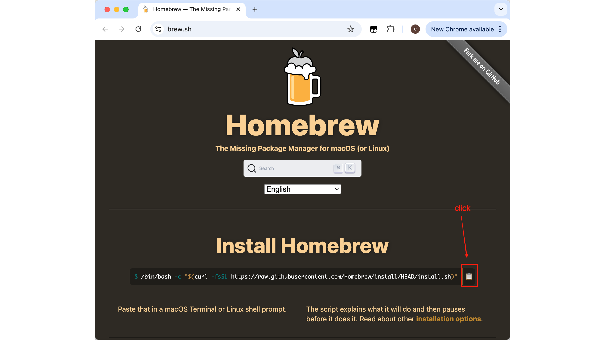
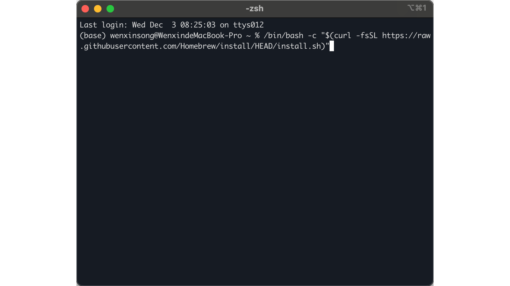
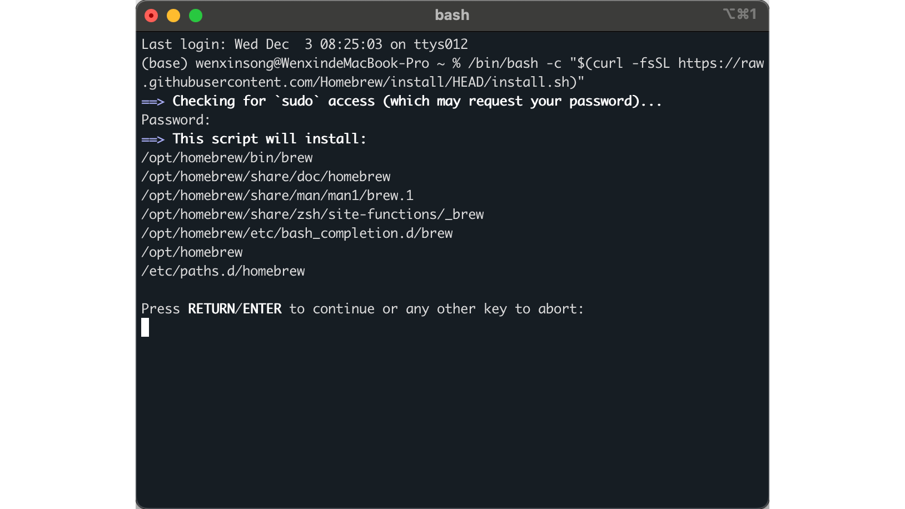
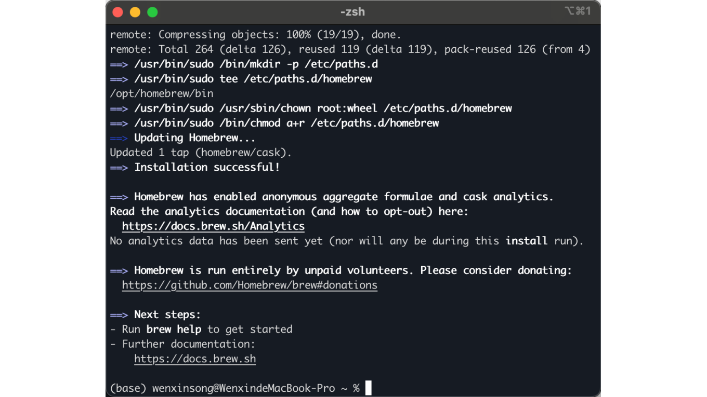

# Homebrew Installation & Basics
**Homebrew 安装与基础使用**

## The Big Picture: What is Homebrew?
**大局观：Homebrew 是什么？**

Imagine if the Mac App Store lived in your terminal — no clicking, no dragging apps to folders, just type a command and boom, software installed. That's **Homebrew** (or just `brew` for short). It's the missing package manager for macOS, and it's absolutely essential for any developer workflow.
想象一下如果 Mac App Store 住在你的终端里 —— 不用点击，不用把应用拖到文件夹，只需输入一条命令，软件就安装好了。这就是 **Homebrew**（简称 `brew`）。它是 macOS 缺失的包管理器，对于任何开发工作流来说都是绝对必备的。

| What It Does | Why You Care |
|--------------|--------------|
| Installs software via command line | No more DMG files and drag-to-Applications |
| Manages dependencies automatically | Things just work |
| Keeps software updated | One command to update everything |
| Uninstalls cleanly | No leftover files scattered around |

| 它能做什么 | 为什么你需要在 |
|------------|----------------|
| 通过命令行安装软件 | 再也不需要 DMG 文件和拖到应用程序文件夹 |
| 自动管理依赖关系 | 一切都能正常工作 |
| 保持软件更新 | 一条命令更新所有东西 |
| 干净地卸载 | 不会有残留文件到处散落 |

---

## Step 1: Get the Installation Command
**步骤一：获取安装命令**

Head over to the official Homebrew website: [https://brew.sh](https://brew.sh/)
打开 Homebrew 官网：[https://brew.sh](https://brew.sh/)



You'll see a prominent installation command on the homepage. This is your golden ticket. Click the copy button to grab it.
首页上有一个醒目的安装命令。这是你的入场券。点击复制按钮把它复制下来。

---

## Step 2: Open Your Terminal
**步骤二：打开终端**

Press `Command + Space`, type "Terminal", and hit Enter.
按 `Command + 空格`，输入 "Terminal"，然后按回车。


If you need a refresher on terminal basics, check out [Terminal Basics](/contents/Basic-tools/01-terminal-basics.html) first.
如果你需要复习终端基础知识，先看看 [Terminal 基础](/contents/Basic-tools/01-terminal-basics.html)。

---

## Step 3: Run the Magic Spell
**步骤三：运行魔法咒语**

Copy and paste this entire command into your terminal:
把这一整条命令复制粘贴到你的终端：

```bash
/bin/bash -c "$(curl -fsSL https://raw.githubusercontent.com/Homebrew/install/HEAD/install.sh)"
```

> **What this does**:
> - `curl -fsSL`: Downloads a script from the internet (silently, securely)
> - `/bin/bash -c`: Runs that script using Bash
> - The script handles everything else — downloading, installing, configuring
>
> **命令解释**：
> - `curl -fsSL`：从网上下载脚本（静默、安全地）
> - `/bin/bash -c`：用 Bash 运行那个脚本
> - 脚本会处理剩下的一切 —— 下载、安装、配置



Press Enter and let the magic happen.
按下回车，让魔法开始。

---

## Step 4: Enter Your Password
**步骤四：输入密码**

When prompted, enter your Mac login password.
当提示时，输入你的 Mac 登录密码。


⚠️ **Important**: As you type your password, **nothing will appear on screen** — no asterisks, no dots, nothing. This is a security feature, not a bug. Just type your password and press Enter.
⚠️ **重要**：当你输入密码时，**屏幕上什么都不会显示** —— 没有星号，没有圆点，什么都没有。这是安全特性，不是 bug。只管输入密码然后按回车。

Press Enter when done.
输完后按回车。



---

## Step 5: Wait Patiently
**步骤五：耐心等待**

Homebrew will now download and install a bunch of stuff. This can take anywhere from a few minutes to longer depending on your internet connection. Go grab a coffee, stretch your legs, or contemplate the meaning of life.
Homebrew 现在会下载和安装一堆东西。这可能需要几分钟到更长时间，取决于你的网络连接。去倒杯咖啡，活动活动腿脚，或者思考一下人生的意义。



💡 **Pro Tip**: If the installation seems stuck, don't panic. It's probably just downloading something large. Give it time.
💡 **小贴士**：如果安装看起来卡住了，别慌。它可能只是在下载大文件。给它点时间。

---

## Step 6: Verify Installation
**步骤六：验证安装**

Once the installation completes, verify everything worked by running:
安装完成后，运行以下命令验证一切正常：

```bash
brew --version
```

You should see something like:
你应该看到类似这样的输出：

```
Homebrew 4.x.x
```

If you see a version number, congratulations — Homebrew is ready to serve!
如果看到版本号，恭喜 —— Homebrew 已经准备好为你服务了！

---

## Common Homebrew Commands
**常用 Homebrew 命令**

Now that Homebrew is installed, here are the commands you'll use most often:
Homebrew 安装好了，下面是你最常用的命令：

| Command | What It Does | Example |
|---------|--------------|---------|
| `brew search <name>` | Find a package | `brew search node` |
| `brew install <name>` | Install a package | `brew install node` |
| `brew list` | Show installed packages | `brew list` |
| `brew upgrade` | Update all packages | `brew upgrade` |
| `brew update` | Update Homebrew itself | `brew update` |
| `brew uninstall <name>` | Remove a package | `brew uninstall node` |
| `brew info <name>` | Show package details | `brew info node` |

| 命令 | 作用 | 示例 |
|------|------|------|
| `brew search <名称>` | 搜索软件包 | `brew search node` |
| `brew install <名称>` | 安装软件包 | `brew install node` |
| `brew list` | 显示已安装的软件包 | `brew list` |
| `brew upgrade` | 更新所有软件包 | `brew upgrade` |
| `brew update` | 更新 Homebrew 本身 | `brew update` |
| `brew uninstall <名称>` | 卸载软件包 | `brew uninstall node` |
| `brew info <名称>` | 显示软件包详情 | `brew info node` |

---

## Summary

1. **Homebrew** = the missing package manager for macOS
2. **Get the command** from [brew.sh](https://brew.sh)
3. **Paste into terminal** and run
4. **Enter password** (it won't show on screen — that's normal)
5. **Wait** for installation to complete
6. **Verify** with `brew --version`
7. **Start installing** software with `brew install <name>`

**总结**

1. **Homebrew** = macOS 缺失的包管理器
2. **获取命令** 从 [brew.sh](https://brew.sh)
3. **粘贴到终端** 并运行
4. **输入密码**（屏幕上不会显示 —— 这是正常的）
5. **等待** 安装完成
6. **验证** 用 `brew --version`
7. **开始安装** 软件用 `brew install <名称>`

---

*Your Mac just got a whole lot more powerful. Welcome to the command-line lifestyle — there's no going back.*
*你的 Mac 刚刚变得强大了许多。欢迎来到命令行生活方式 —— 回不去了。*
