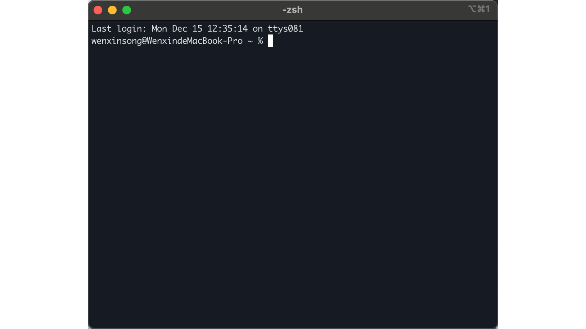
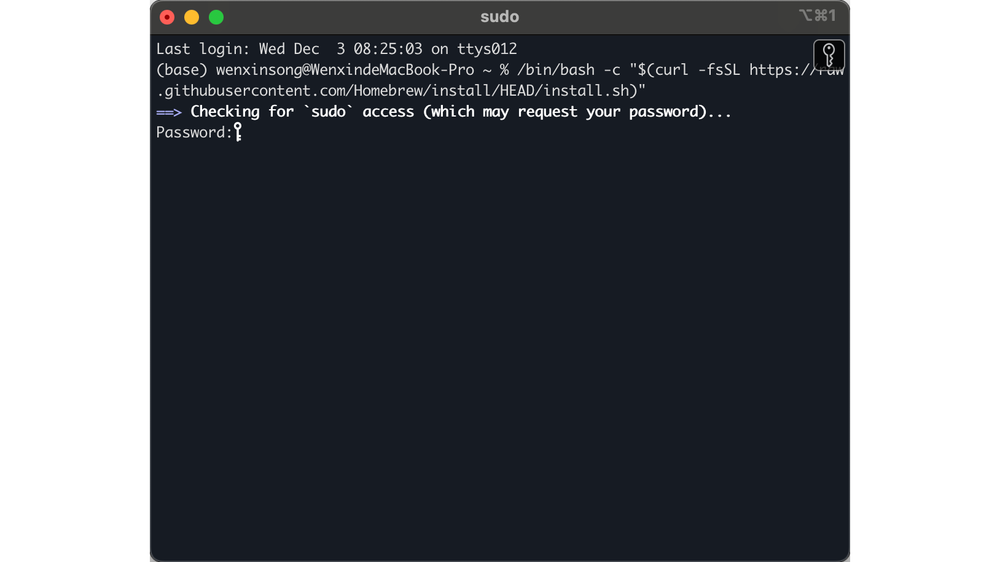

# Homebrew Installation & Basics

## What is Homebrew?

Imagine if the Mac App Store lived in your terminal — no clicking, no dragging apps to folders, just type a command and boom, software installed. That's **Homebrew** (or just `brew` for short). It's the missing package manager for macOS, and it's absolutely essential for any developer workflow.

| What It Does | Why You Care |
|--------------|--------------|
| Installs software via command line | No more DMG files and drag-to-Applications |
| Manages dependencies automatically | Things just work |
| Keeps software updated | One command to update everything |
| Uninstalls cleanly | No leftover files scattered around |

---

## Step 1: Get the Installation Command

Head over to the official Homebrew website: [https://brew.sh](https://brew.sh/)


You'll see a prominent installation command on the homepage. This is your golden ticket. Click the copy button to grab it.

---

## Step 2: Open Your Terminal

Press `Command + Space`, type "Terminal", and hit Enter.



If you need a refresher on terminal basics, check out [Terminal Basics](../../../Basic-tools/01-terminal-basics/en/) first.

---

## Step 3: Run the Magic Spell

Copy and paste this entire command into your terminal:

```bash
/bin/bash -c "$(curl -fsSL https://raw.githubusercontent.com/Homebrew/install/HEAD/install.sh)"
```

> **What this does**:
> - `curl -fsSL`: Downloads a script from the internet (silently, securely)
> - `/bin/bash -c`: Runs that script using Bash
> - The script handles everything else — downloading, installing, configuring


Press Enter and let the magic happen.

---

## Step 4: Enter Your Password

When prompted, enter your Mac login password.



⚠️ **Important**: As you type your password, **nothing will appear on screen** — no asterisks, no dots, nothing. This is a security feature, not a bug. Just type your password and press Enter.

Press Enter when done.


---

## Step 5: Wait Patiently

Homebrew will now download and install a bunch of stuff. This can take anywhere from a few minutes to longer depending on your internet connection. Go grab a coffee, stretch your legs, or contemplate the meaning of life.


💡 **Pro Tip**: If the installation seems stuck, don't panic. It's probably just downloading something large. Give it time.

---

## Step 6: Verify Installation

Once the installation completes, verify everything worked by running:

```bash
brew --version
```

You should see something like:

```
Homebrew 4.x.x
```

If you see a version number, congratulations — Homebrew is ready to serve!

---

## Common Homebrew Commands

Now that Homebrew is installed, here are the commands you'll use most often:

| Command | What It Does | Example |
|---------|--------------|---------|
| `brew search <name>` | Find a package | `brew search node` |
| `brew install <name>` | Install a package | `brew install node` |
| `brew list` | Show installed packages | `brew list` |
| `brew upgrade` | Update all packages | `brew upgrade` |
| `brew update` | Update Homebrew itself | `brew update` |
| `brew uninstall <name>` | Remove a package | `brew uninstall node` |
| `brew info <name>` | Show package details | `brew info node` |

---

## Summary

1. **Homebrew** = the missing package manager for macOS
2. **Get the command** from [brew.sh](https://brew.sh)
3. **Paste into terminal** and run
4. **Enter password** (it won't show on screen — that's normal)
5. **Wait** for installation to complete
6. **Verify** with `brew --version`
7. **Start installing** software with `brew install <name>`

---

*Your Mac just got a whole lot more powerful. Welcome to the command-line lifestyle — there's no going back.*
