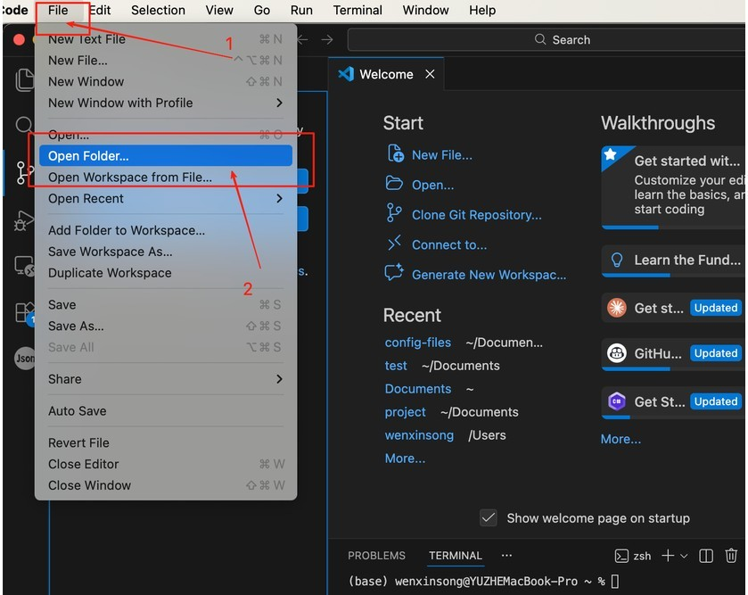
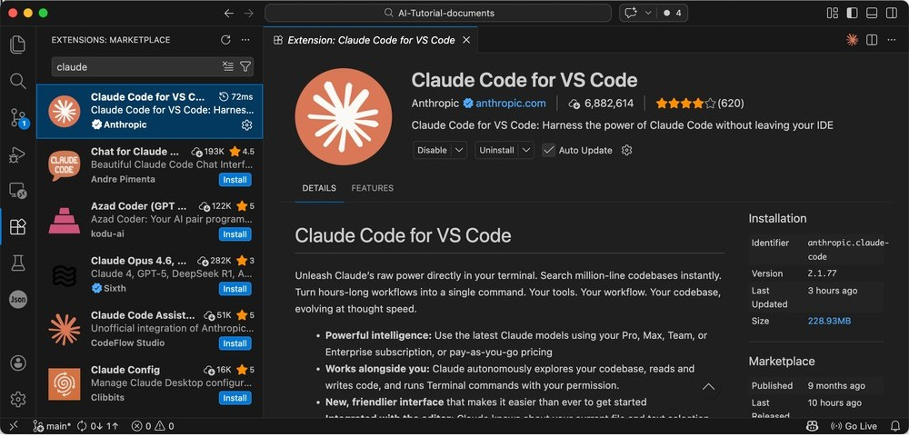

# Set Up Your AI Workspace (macOS)

## Chatbot vs agent

Chatting with AI in the browser is quick, but when you need to change projects on disk, batch-edit files, and keep the assistant aligned with what is in the current folder, you want a **local-folder-first** workflow: files live on disk, and the editor’s assistant reads and writes them by path instead of endless copy-paste.

---

### Web AI vs a local AI workspace: what’s the difference?

| Aspect | Web chat AI | Local workspace (VS Code + agent) |
| ----------- | --------------- | ---------------------- |
| **Reading your project** | Usually manual copy-paste or repeated uploads | Open the folder; the agent reads/writes by path |
| **Batch edits** | Hard to change a whole tree reliably and reviewably | Suited to multi-file refactors, renames, scaffolding |
| **“Project memory”** | Context often breaks when the session ends | The workspace is the boundary; instructions align with the tree |
| **Repeatable flows** | Depends on you re-describing the environment each time | Terminal, Git, and extensions can be scripted and shared |
| **Learning curve** | Low | Slightly higher, but pays off once set up |

VS Code is a common entry point for this kind of workspace. After you install a coding-assistant extension, you can edit files and work with the assistant in one window and keep day-to-day writing and collaboration in one place.

---

### What is VS Code? Why VS Code?

Visual Studio Code is a **workspace for viewing, editing, and managing files** on your computer, not where the files are actually stored. Think of the computer as a room: files sit in a filing cabinet. VS Code is more like a desk; when you open it, you lay out the files you need and work on them there. Edits, saves, and deletes on the desk change the originals in the cabinet.

From that angle, VS Code bundles browsing, search, and editing so you hop between apps less. Extensions add capabilities, for example, the Claude coding assistant can run inside VS Code so coding and AI-assisted edits stay in one environment.

---

## Part 1: Installing VS Code

### Install VS Code

Open the VS Code site [https://code.visualstudio.com/](https://code.visualstudio.com/) and download the installer.


Double-click the installer and follow the wizard.


When installation finishes, open VS Code from Spotlight.


---

## Part 2: Managing your workspace on disk

### Basic file habits

Many beginners struggle not with menus but with messy trees, forgotten paths, and mixing different projects. A few habits prevent most of that.

Carve out a dedicated work area, for example a top folder called `Workspace` with two children: **global rules** vs **concrete projects**. Use `system` for conventions every project should follow (style guides, task workflows), a long-lived “briefing” for your assistant. Use `project` for separate tasks, each in its own subfolder, with notes or config as needed. The tree might look like this; names are up to you as long as the layout is obvious.

```
Workspace/  
├── system/  
├── project/  
│ ├── subproject1/  
│ ├── subproject2/  
│ └── subproject3/
```

Stick to **one folder per project** so unrelated tasks do not share a directory level (search and cleanup get expensive otherwise). Prefer descriptive names like `report.md` over throwaways like `test1` or `aaa`.

**Sync and backups:** The assistant reads files in the **current workspace on local disk**. If material lives only in a web drive and is not synced locally, it cannot be opened like a normal folder. If you use Git for `Workspace`, do not push folders that contain secrets, tokens, or private config to public repos. With cloud sync, watch for conflicts and permissions so you do not overwrite or leak data.

Once these habits stick, finding and maintaining files gets easier. The structure does not need to be perfect on day one; some order beats a flat pile.

> [!TIP]
> 
> VS Code is a tool for working with files; the files stay on your disk. A clear tree saves a lot of time later.

---

### Open your workspace

Choose **File → Open Folder** and select your workspace or project root.



In the Explorer you can expand or collapse folders and use the toolbar to create files, create folders, and refresh.


### Create folders and files

#### New folder

Select `project` (or whichever folder holds projects), use **New Folder** on the toolbar, and create a subfolder for your first project.


#### New file

Use **New File** in the target folder the same way.


New files start empty; when saving, use an extension such as `test.md`.


Click the file in the sidebar to open it.


### Rename and delete

#### Rename a file

Right-click the file → **Rename**, type the new name.

> [!TIP]
>
> On Mac you can also select the file and press **Enter** to rename quickly.


#### Rename a folder

Same as files: **Rename** from the context menu, or select and press **Enter**.


#### Delete files or folders

Right-click → **Delete**.


### Search

Search runs across the workspace (including subfolders), highlights matches, and lets you jump from results.


### Extensions

The Extensions view is the marketplace. Search for `claude`, install **Claude Code for VS Code**.



After install, a Claude icon appears on the activity bar; open it for the Claude Code panel.


To start a new session, use **New Session** in the panel or the Claude Code icon in the editor title bar, either works.


---

## Part 3: Important hidden files and folders

Besides obvious files, hidden folders and config files often decide whether the environment stays stable. Knowing what they do speeds up troubleshooting. Choose **Go → Home** to open your home folder.


By default Finder shows common folders like Desktop, Documents, Downloads.


Press `Command + Shift + .` to show hidden items. Coding assistants often store login state, preferences, shared instructions, and external tool wiring under hidden folders in your home directory; manifest-style files may register capabilities. Shell startup files or project `.env` files often hold aliases or secret references. Treat these as sensitive, do not post screenshots publicly or commit them to open repos.


---

## Part 4: CLI Claude Code (optional)

Press `Command + Space`, search for **Terminal**, and open it.


Run the command below and press **Enter**. When the script finishes, the CLI coding assistant is installed (it can coexist with the VS Code extension, use whichever fits).

```bash
curl -fsSL https://claude.ai/install.sh | bash
```


---
