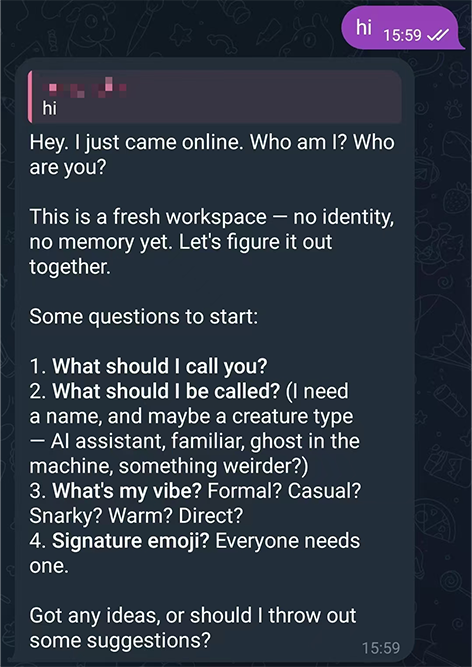

# 在 VS Code 中使用 Claude Code

## 第一部分：Claude Code 授权登录

初次在 VS Code 中打开该扩展时，一般会看到授权页面。常见入口可以粗分三类，便于你对照自己手头的账号类型：
- **Claude.ai Subscription**：面向个人、在官网按月或按年购买的会员订阅；
- **Anthropic Console**：面向开发者、在官网控制台里按调用量计费、自己管额度的 API 账单；
- **Bedrock, Foundry, or Vertex**：企业或学校已经采购的云服务里托管的官方接口。

不同入口对应不同的计费规则与合规要求；走按量计费时如果调用很频繁，账单可能上升较快，是否划算要结合用量评估。第三方或镜像类订阅不在本文展开。下面以个人会员订阅为例走通登录：在插件界面点击对应按钮开始授权。


在提示中选择 **Open**，跳转到浏览器中的 Claude 页面完成授权。


在网页中点击 **Authorize** 完成确认。


返回 VS Code 后，扩展应显示已登录状态，即可在侧边栏或面板中正常使用 Claude Code。


## 第二部分：一个简单的示例

下面用一段英文提示词演示如何让扩展在 `project` 下新建子目录 `news_task`，收集近三天内五条新闻的标题、来源、日期与链接，并写入 `news.md`（示例要求不编写或运行额外脚本，仅利用内置能力整理结果）。你可将类似结构改成自己的项目路径与输出要求。

```
Create a new subfolder under the @project directory called "news_task".

In this folder, perform the following task using only your built-in capabilities:

- Search for news from the past 3 days
- Select a reasonable set of recent and relevant articles
- Extract for each article:
  - title
  - source
  - published date
  - URL

Output requirements:
- Save the results as a file named "news.md" inside the "news_task" folder

Constraints:
- Do not generate or run any code
- Do not create scripts; directly produce the final output file
- Ensure the data is from the last 3 days only
- Keep the structure simple and clear
- Search for 5 news articles only

Also briefly describe what you created.
```


任务跑完后，左侧 `project` 下应出现 `news_task` 文件夹，其中包含 `news.md`。打开即可查看整理后的条目，便于快速浏览近期要闻（实际效果依赖当时模型是否具备可用的检索能力，若失败可缩小时间范围或改用手动提供的链接）。


## 第三部分：使用小贴士

### 强制授权模式

默认情况下，扩展在执行部分操作前会反复请求确认，交互次数一多容易打断思路。


依次点击左侧扩展视图中的 **Claude Code for VS Code**、齿轮状的 **Settings**，进入扩展设置。


勾选 **Allow Dangerously Skip Permissions**（名称以你安装的扩展版本为准）。


回到侧边面板后，可选用 **Bypass permissions** 一类模式以减少逐项确认。注意：该模式会让助手在授权边界内更激进地执行终端与文件操作，存在误操作或安全风险，仅在可信项目与个人设备上按需开启，用毕可关回安全模式。


### 上传文件

若希望助手针对仓库内某一文件作答或修改，可点击面板中的工具按钮，选择 **Mention file from this project**，用方向键与 **Tab** 选定目标文件。


若只需局部上下文，可在 VS Code 中打开对应文件并选中一段文本。


回到侧边面板时，界面会提示已选行数（例如 **6 lines selected**）。此时下达指令，模型会优先围绕选中内容回应或改写。


## 第四部分：远程控制 Claude Code

该扩展还支持通过即时通讯机器人或自动化回调接口接入外部消息（常见名称包括 Telegram、Discord、Webhook 等）。配置完成后，可在已登录对应账号的手机或平板上向会话发指令，由本机上的客户端执行并返回结果，相当于在受控前提下把使用场景延伸到移动端。若需了解官方支持的通道与配置步骤，请参阅 [https://code.claude.com/docs/en/channels](https://code.claude.com/docs/en/channels)。




