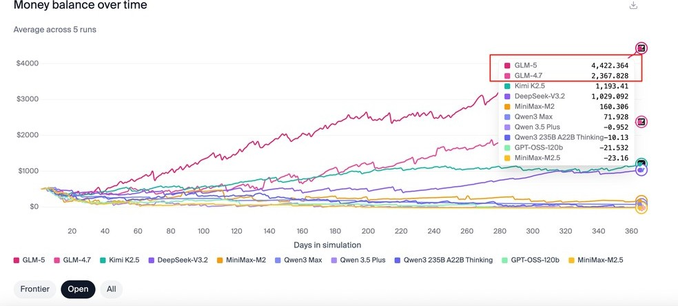
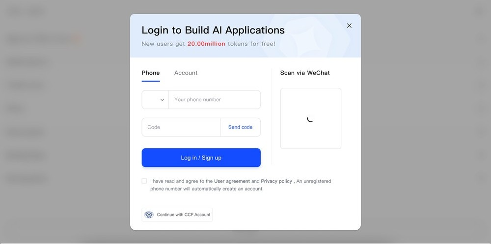
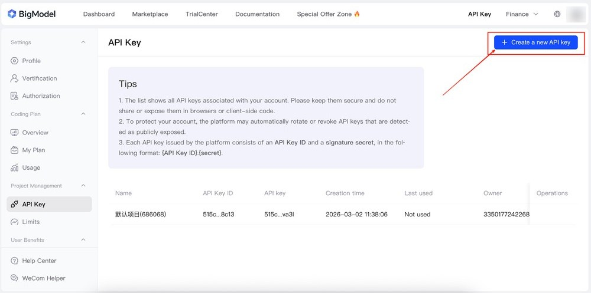
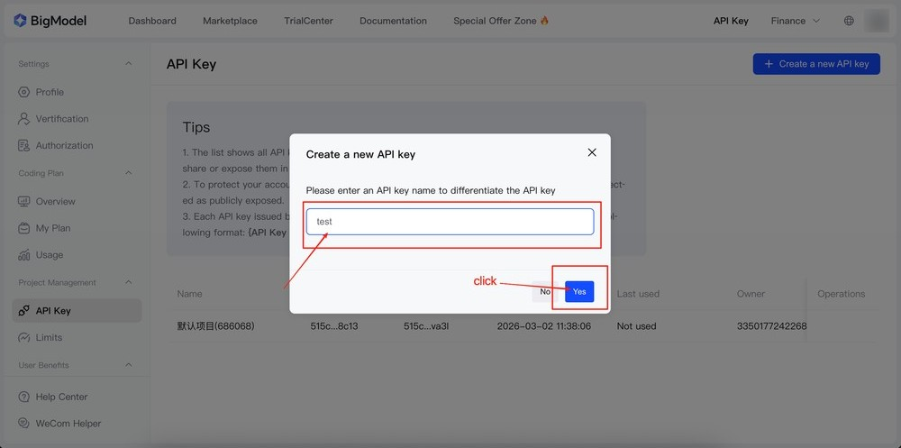
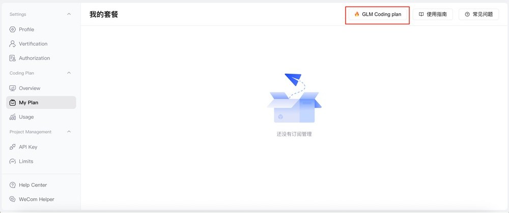
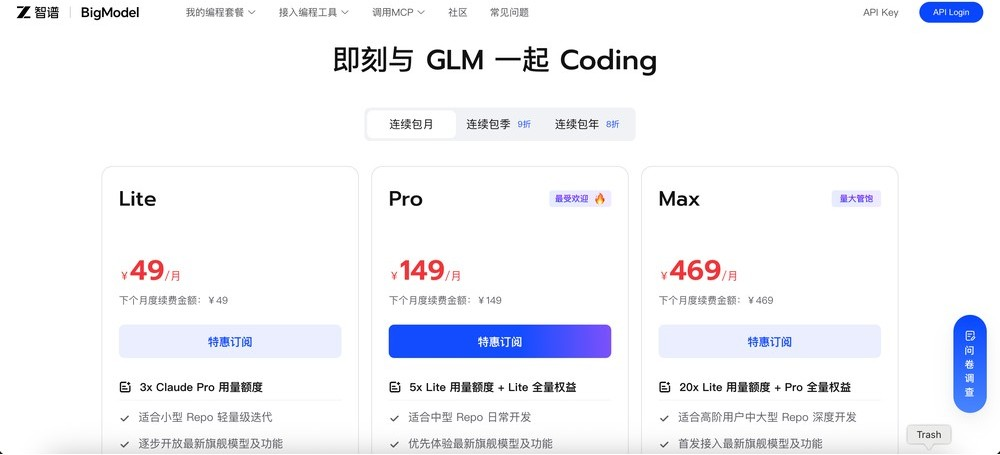
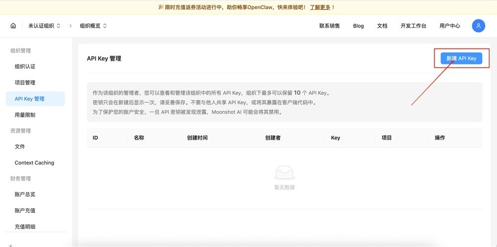
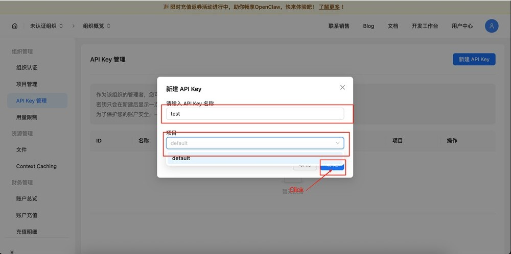
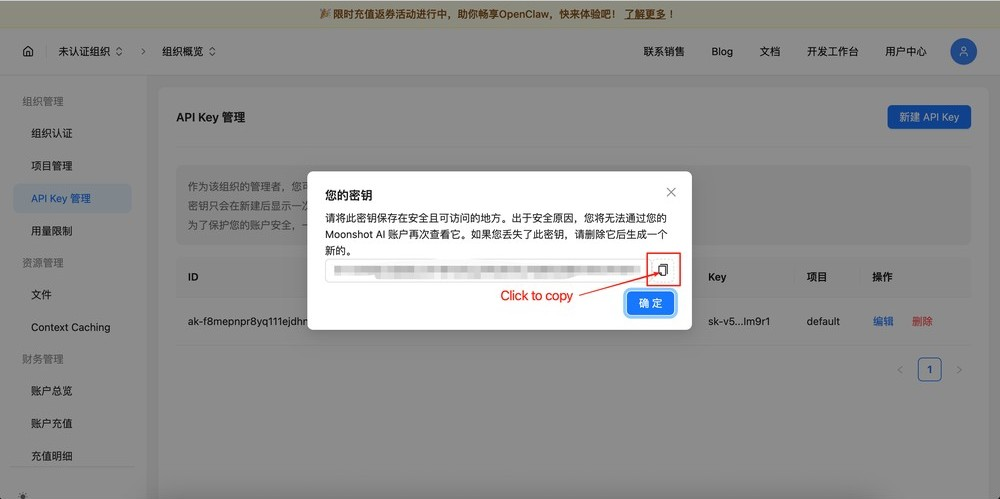
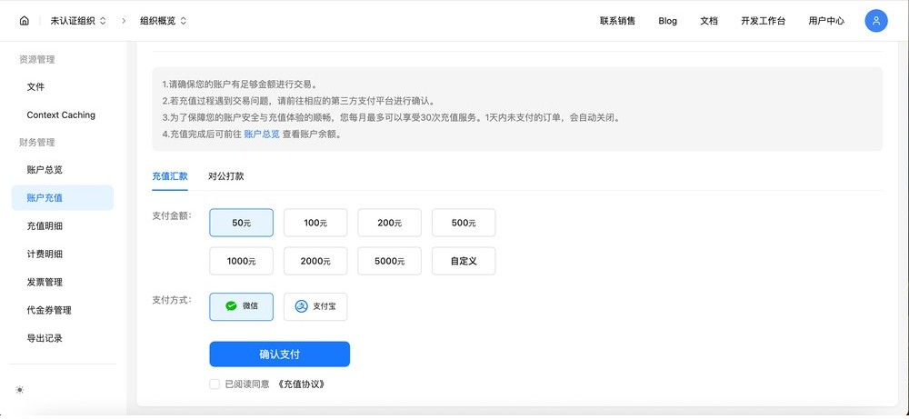

# Point Claude Code at GLM / KIMI and other alternate APIs (Windows)

## Why wire the client to GLM / KIMI?

Many people discover after installing the coding-assistant client that steady use often needs an official model subscription or usage-based billing, with constraints on payment and account region. If the primary path is awkward for you, or you want an extra **model backend** that is easier to use from China, vendors such as Zhipu (GLM) and Moonshot (KIMI) expose endpoints compatible with the same client conventions, so you can keep one UI while switching the inference service behind it.

### Client ≠ model

Think in two layers: a **local execution** side that edits files and runs commands, and a **remote inference** service that understands your words and decides what to change. The execution side does not invent patches on its own—it must send prompts to a service and get answers back. Point URL and credentials at the right service and the same client can use different backends. The “thinking” role can be the official model, GLM, KIMI, or another compatible route, depending on how you configure it.


### Why GLM and KIMI?

For many users in China, payments and account setup are simpler: common bank cards and domestic payment rails often work without juggling foreign cards. If you worry about rate limits or policy, each domestic vendor publishes its own compliance and quota rules—different from using the overseas site directly. On capability, public leaderboards often place multiple GLM and KIMI models near the top; they are usually fine for everyday coding and docs, but you should still try your own tasks before committing.

If you already have a stable official subscription, you can keep it; otherwise GLM and KIMI are reasonable alternate routes to try in parallel.

### How capable are they?

In one public, decision-heavy third-party benchmark ([Vending-Bench 2](https://andonlabs.com/evals/vending-bench-2)), several GLM and Moonshot models ranked strongly in the open-weight cohort. Rankings move with time and task type—validate on your own workload.


### What the workflow looks like

```
You ask → model thinks → writes code → done
```

The flow is the same on every OS: after keys and service URL are set, the client still drives local files and the terminal the same way.

---

If you already rely on an official account, treat this page as optional; if you need GLM or KIMI, jump to the matching sections below.

---


## GLM setup
### Step 1: Get your API key

Everything starts with an API key.

Open [https://bigmodel.cn/usercenter/proj-mgmt/apikeys](https://bigmodel.cn/usercenter/proj-mgmt/apikeys)



Click **Create a new API Key**.



Pick a memorable name (e.g. `claude-code-key`), then **Yes**.



Click **Copy** and store it somewhere safe. **Important:** this is often the only time you see the full secret.


---

### Step 2: Subscribe or not?

Without a paid plan you still get free quota and a more basic model tier—enough to learn your usage. If you use it heavily every day and need higher limits or flagship models, consider the **GLM Coding Plan**. Start with free quota, then upgrade if needed; subscription UI is under **GLM Coding Plan details** below.

---

### Step 3: Apply configuration

Open `C:\Users\<YourUsername>\.claude` (replace with your Windows user name), then edit or create **settings.json**.


Replace `your_zhipu_api_key` with your key, merge the JSON into `settings.json`, and save (if other keys exist, merge the `env` block carefully—do not wipe unrelated settings).

```
{
  "env": {
    "ANTHROPIC_AUTH_TOKEN": "your_zhipu_api_key",
    "ANTHROPIC_BASE_URL": "https://open.bigmodel.cn/api/anthropic",
    "API_TIMEOUT_MS": "3000000",
    "CLAUDE_CODE_DISABLE_NONESSENTIAL_TRAFFIC": 1
  }
}
```


In **PowerShell** or another terminal run `claude`; the client should start against the Zhipu backend (if the command is missing, add the install location to `PATH`).


#### Enabling GLM-5 (subscribers only)

If you subscribe to GLM Coding Plan, replace `env` in `settings.json` with the structure below (same key placeholder). That points default models at GLM-5; field names should match Zhipu’s current docs.

```json
{
  "env": {
    "ANTHROPIC_AUTH_TOKEN": "your_zhipu_api_key",
    "ANTHROPIC_BASE_URL": "https://open.bigmodel.cn/api/anthropic",
    "ANTHROPIC_MODEL": "glm-5",
    "ANTHROPIC_DEFAULT_HAIKU_MODEL": "glm-5",
    "ANTHROPIC_DEFAULT_OPUS_MODEL": "glm-5",
    "ANTHROPIC_DEFAULT_SONNET_MODEL": "glm-5"
  },
  "hasCompletedOnboarding": true
}
```


---

### Advanced: `glm` command

To type `glm` and load a dedicated profile, copy `settings.json` to **glm-settings.json** in the same `.claude` folder.


In **PowerShell** run:

```
New-Item -Path $PROFILE -ItemType File -Force
notepad $PROFILE
```


Append this function (`$HOME` is your user profile in PowerShell):

```
function glm {  
claude --settings $HOME/.claude/glm-settings.json $args  
}
```


Back in PowerShell run `. $PROFILE` to load it.


In new PowerShell windows, `glm` starts the client with `glm-settings.json`.


### GLM Coding Plan details

Click **My Plan**.


Click **GLM Coding plan** for the subscription screen.



Scroll to the plans and pick what fits.



## KIMI setup


### Step 1: Get your API key

Everything starts with an API key.

Open [https://platform.moonshot.cn/console/api-keys](https://platform.moonshot.cn/console/api-keys) and sign in.


Click **新建 API Key** (New API key).



Choose a name, project **default**, then **确定** (OK).



Click **复制** (Copy) and store it safely. **Important:** this is often the only time you see the full secret.



---

### Step 2: Top up balance

A KIMI API key needs account balance. In the console open **财务管理**, then **账户充值**, choose an amount, and pay.



---

### Step 3: Apply configuration


Open `C:\Users\<YourUsername>\.claude` and edit **settings.json** (use your real user name).


Replace `your_kimi_api_key` with your key. Keep `hasCompletedOnboarding` **sibling** to `env`, not inside `env`, or the client may ignore it.

```json
{
  "env": {
    "ANTHROPIC_AUTH_TOKEN": "your_kimi_api_key",
    "ANTHROPIC_BASE_URL": "https://api.moonshot.cn/anthropic/"
  },
  "hasCompletedOnboarding": true
}
```


Run `claude` in PowerShell and confirm you want to use the custom key from the environment when prompted.


---

### Advanced: `kimi` command

Save your KIMI `settings.json` as **kimi-settings.json** beside it—the same pattern as GLM for multiple routes.


In PowerShell:

```
New-Item -Path $PROFILE -ItemType File -Force
notepad $PROFILE
```


Append:

```
function kimi {  
claude --settings $HOME/.claude/kimi-settings.json $args  
}
```


Run `. $PROFILE` to load.


Then `kimi` starts the client on the Moonshot profile.


